# Software Requirements Specification (SRS) - CAB System

## 1. Stakeholder List & Roles (Danh sách & Vai trò Bên liên quan)

| STT | Stakeholder | Vai trò | Mối quan tâm / Trách nhiệm chính |
|---|---|---|---|
| 1 | **Khách hàng (Customer)** | Người sử dụng dịch vụ đặt xe | Đăng ký, đăng nhập, đặt xe, theo dõi chuyến đi, thanh toán và xem lịch sử chuyến |
| 2 | **Tài xế (Driver)** | Người cung cấp dịch vụ vận chuyển | Nhận/từ chối chuyến, cập nhật trạng thái chuyến và thông tin phương tiện |
| 3 | **Nhân viên vận hành (Operation Staff)** | Quản lý hoạt động vận hành | Theo dõi chuyến đi, tài xế; phân công tài xế và xử lý các chuyến gặp sự cố |
| 4 | **Quản trị viên (Administrator)** | Quản trị hệ thống | Quản lý tài khoản, phân quyền và cấu hình hệ thống |
| 5 | **Ban giám đốc (Management)** | Người quản lý và ra quyết định | Theo dõi doanh thu, số lượng chuyến, tỷ lệ hoàn thành, tỷ lệ hủy và hiệu quả hoạt động |
| 6 | **Nhà cung cấp thanh toán (Payment Provider)** | Hệ thống bên ngoài | Xử lý thanh toán điện tử và trả kết quả giao dịch thành công hoặc thất bại |

---

## 2. Stakeholder Matrix (Ma trận Bên liên quan)

### 2.1. Power - Interest Matrix

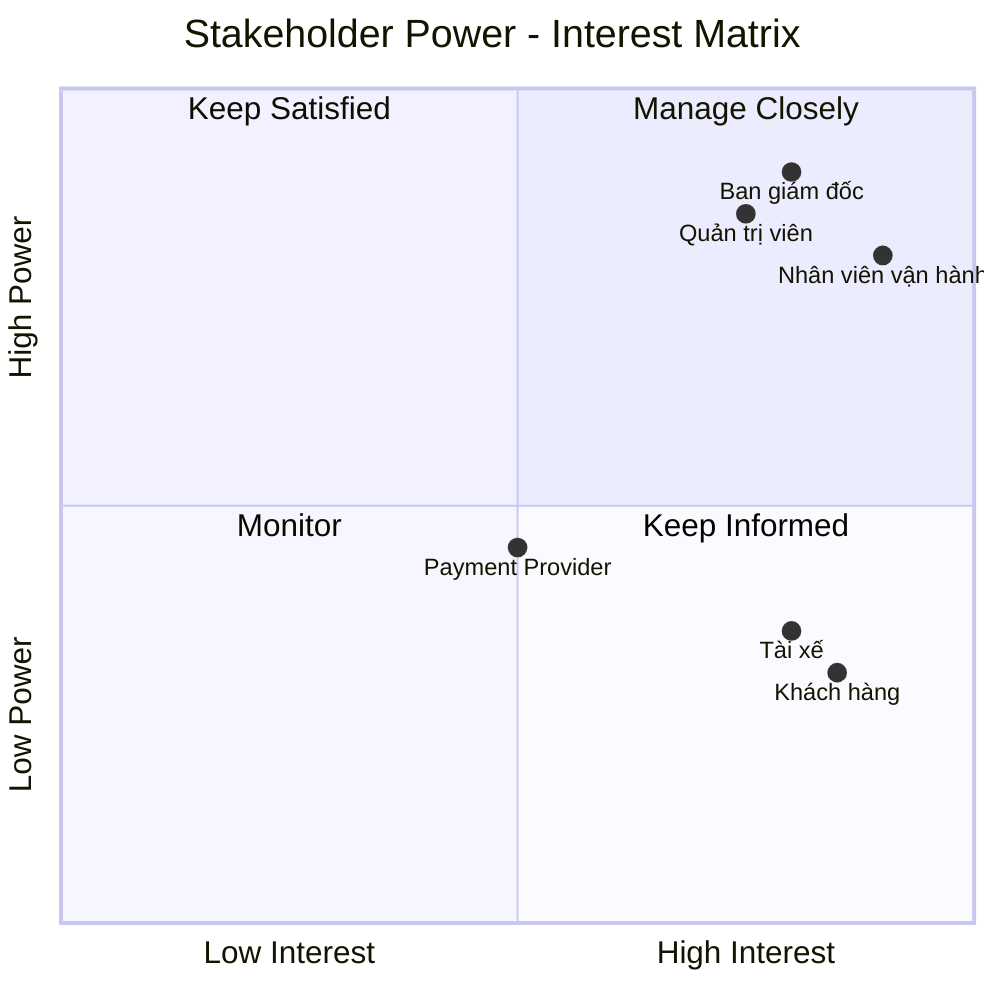
## 3. Business Goals (Mục tiêu Kinh doanh)

Các mục tiêu kinh doanh của **CAB System** tập trung vào việc số hóa quy trình đặt xe, hỗ trợ điều phối tài xế, nâng cao trải nghiệm khách hàng và giúp nhân viên vận hành quản lý chuyến xe hiệu quả.

| ID    | Business Goal                       | Mục tiêu                                                                                                          |
| ----- | ----------------------------------- | ----------------------------------------------------------------------------------------------------------------- |
| BG-01 | **Tự động hóa đặt xe**              | Cho phép khách hàng tạo yêu cầu đặt xe nhanh chóng và giảm sự phụ thuộc vào quy trình đặt xe thủ công.            |
| BG-02 | **Nâng cao trải nghiệm khách hàng** | Cho phép khách hàng đặt xe, theo dõi trạng thái chuyến và xem thông tin chuyến đi thuận tiện.                     |
| BG-03 | **Tăng hiệu quả vận hành**          | Hỗ trợ nhân viên vận hành quản lý khách hàng, tài xế và chuyến xe trên một hệ thống tập trung.                    |
| BG-04 | **Tối ưu hóa điều phối tài xế**     | Hỗ trợ nhân viên vận hành lựa chọn và phân công tài xế phù hợp, đồng thời xử lý trường hợp tài xế từ chối chuyến. |
| BG-05 | **Quản lý thanh toán**              | Quản lý cước phí và trạng thái thanh toán của chuyến xe một cách tập trung.                                       |
| BG-06 | **Hỗ trợ quản lý và báo cáo**       | Cung cấp các báo cáo cơ bản về số lượng chuyến, trạng thái chuyến và doanh thu để hỗ trợ theo dõi hoạt động.      |

### 3.1. Business Goal Summary

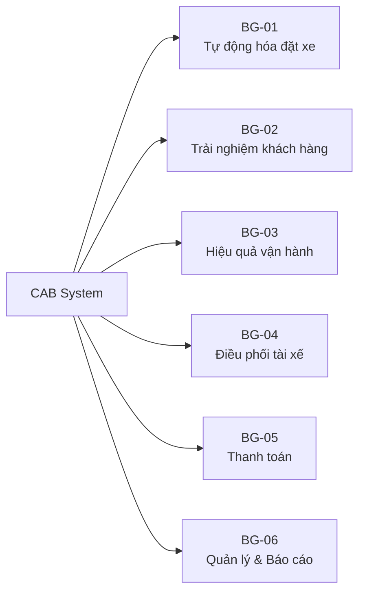

### 3.2. Business Goal Success Indicators

Để đánh giá mức độ đáp ứng các mục tiêu kinh doanh, hệ thống có thể sử dụng một số chỉ số cơ bản:

| Business Goal | Success Indicator                                  |
| ------------- | -------------------------------------------------- |
| BG-01         | Booking được tạo thành công trên hệ thống          |
| BG-02         | Customer có thể theo dõi trạng thái chuyến         |
| BG-03         | Operation Staff quản lý chuyến và tài xế tập trung |
| BG-04         | Trip được phân công cho Driver khả dụng            |
| BG-05         | Payment được ghi nhận với trạng thái rõ ràng       |
| BG-06         | Management có thể xem các chỉ số vận hành cơ bản   |

## 4. Minimum Viable Product (MVP) Modules (Các Module của Sản phẩm Khả dụng Tối thiểu)

Mục tiêu của MVP là xây dựng được quy trình nghiệp vụ chính:

**Đặt xe → Tìm tài xế → Phân công → Thực hiện chuyến → Hoàn thành → Tính cước → Thanh toán → Lưu lịch sử**

### 4.1. Danh sách các Module MVP

| ID     | Module                         | Chức năng chính                                                           | Ưu tiên     |
| ------ | ------------------------------ | ------------------------------------------------------------------------- | ----------- |
| MVP-01 | **Quản lý tài khoản**          | Đăng ký, đăng nhập, đăng xuất, quản lý thông tin và phân quyền người dùng | Cao         |
| MVP-02 | **Đặt xe**                     | Nhập thông tin chuyến và tạo yêu cầu đặt xe                               | Cao         |
| MVP-03 | **Quản lý tài xế**             | Quản lý thông tin tài xế, phương tiện và trạng thái hoạt động             | Cao         |
| MVP-04 | **Điều phối & Quản lý chuyến** | Phân công tài xế và quản lý trạng thái chuyến                             | **Rất cao** |
| MVP-05 | **Tính cước & Thanh toán**     | Tính cước và ghi nhận trạng thái thanh toán                               | Cao         |
| MVP-06 | **Theo dõi & Báo cáo**         | Theo dõi chuyến và cung cấp báo cáo cơ bản                                | Trung bình  |

---

### 4.2. Mô tả các Module MVP

#### 4.2.1. MVP-01: Quản lý tài khoản

Module hỗ trợ người dùng quản lý tài khoản và quyền truy cập hệ thống.

**Chức năng:**

* Đăng ký tài khoản.
* Đăng nhập.
* Đăng xuất.
* Cập nhật thông tin cá nhân.
* Kiểm tra thông tin đăng nhập.
* Phân quyền theo vai trò:

  * Customer.
  * Driver.
  * Operation Staff.
  * Administrator.

---

#### 4.2.2. MVP-02: Đặt xe

Module cho phép Customer tạo yêu cầu đặt xe.

**Chức năng:**

* Nhập điểm đón.
* Nhập điểm đến.
* Lựa chọn loại xe.
* Tạo yêu cầu đặt xe.
* Xem thông tin yêu cầu.
* Xem trạng thái yêu cầu.
* Hủy yêu cầu khi đáp ứng điều kiện cho phép.

**Kết quả:**

Sau khi tạo thành công, hệ thống sinh một **Booking** duy nhất và chuyển yêu cầu sang bước tìm tài xế.

---

#### 4.2.3. MVP-03: Quản lý tài xế

Module quản lý thông tin cơ bản của Driver và Vehicle.

**Chức năng:**

* Quản lý thông tin tài xế.
* Quản lý thông tin phương tiện.
* Cập nhật trạng thái tài xế.
* Hiển thị trạng thái:

  * Available.
  * Offline.
  * Busy.

Trong MVP, trạng thái Driver được sử dụng để xác định tài xế có thể được phân công hay không.

---

#### 4.2.4. MVP-04: Điều phối & Quản lý chuyến

Đây là **module trọng tâm** của CAB System. Module hỗ trợ Operation Staff quản lý việc phân công Driver và theo dõi quá trình thực hiện Trip.

**Chức năng điều phối:**

* Xem danh sách Driver khả dụng.
* Kiểm tra loại xe phù hợp.
* Chọn Driver để phân công.
* Gửi yêu cầu nhận chuyến.
* Ghi nhận Driver chấp nhận hoặc từ chối chuyến.
* Phân công lại Driver khi cần.
* Ghi nhận trường hợp không có Driver phù hợp.

**Chức năng quản lý chuyến:**

* Tạo Trip từ Booking hợp lệ.
* Theo dõi trạng thái Trip.
* Cập nhật trạng thái Trip.
* Lưu lịch sử thay đổi trạng thái.
* Cho phép Customer xem trạng thái chuyến.
* Cho phép Operation Staff theo dõi các chuyến đang hoạt động.

---

#### 4.2.5. MVP-05: Tính cước & Thanh toán

Module xử lý cước phí và trạng thái thanh toán của Trip.

**Chức năng:**

* Tính cước chuyến xe.
* Hiển thị số tiền cần thanh toán.
* Hỗ trợ thanh toán tiền mặt.
* Mô phỏng thanh toán điện tử.
* Ghi nhận trạng thái thanh toán.
* Hiển thị kết quả thanh toán.
* Cho phép thực hiện lại thanh toán khi giao dịch thất bại.

**Trạng thái thanh toán:**

```text
Unpaid
   ↓
Processing
   ↓
 ┌───────────────┐
 ↓               ↓
Paid           Failed
                 ↓
                Retry
                 ↓
             Processing
```

---

#### 4.2.6. MVP-06: Theo dõi & Báo cáo

Module cung cấp thông tin theo dõi và báo cáo cơ bản.

**Đối với Customer:**

* Xem chuyến đang thực hiện.
* Xem trạng thái chuyến.
* Xem thông tin tài xế.
* Xem lịch sử chuyến.
* Xem trạng thái thanh toán.

**Đối với Operation Staff:**

* Xem danh sách chuyến.
* Lọc chuyến theo trạng thái.
* Xem tài xế khả dụng.
* Xem các chuyến đang thực hiện.
* Xem lịch sử chuyến.

**Đối với Management:**

* Xem tổng số chuyến.
* Xem số chuyến hoàn thành.
* Xem số chuyến bị hủy.
* Xem doanh thu cơ bản.

---

### 4.3. Chức năng thông báo trong MVP

Thông báo không được xây dựng thành một module riêng nhằm giảm phạm vi phát triển.

Các thông báo cơ bản được tích hợp trực tiếp vào các module liên quan.

| Sự kiện                        | Người nhận |
| ------------------------------ | ---------- |
| Tạo yêu cầu đặt xe thành công  | Customer   |
| Tài xế được phân công          | Customer   |
| Có yêu cầu nhận chuyến         | Driver     |
| Tài xế nhận chuyến             | Customer   |
| Tài xế cập nhật trạng thái     | Customer   |
| Chuyến hoàn thành              | Customer   |
| Thanh toán thành công/thất bại | Customer   |

---

### 4.4. Quy trình hoạt động chính của MVP

Quy trình nghiệp vụ chính của CAB System:

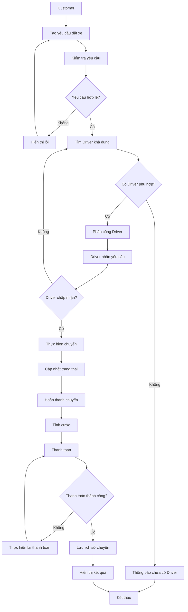

### 4.4.1. Các bước chính

| Bước | Actor           | Hoạt động                               |
| ---: | --------------- | --------------------------------------- |
|    1 | Customer        | Tạo yêu cầu đặt xe                      |
|    2 | System          | Kiểm tra yêu cầu                        |
|    3 | System          | Tìm Driver khả dụng                     |
|    4 | Operation Staff | Phân công Driver                        |
|    5 | Driver          | Nhận hoặc từ chối chuyến                |
|    6 | Driver          | Thực hiện và cập nhật trạng thái chuyến |
|    7 | System          | Xác nhận chuyến hoàn thành              |
|    8 | System          | Tính cước                               |
|    9 | Customer        | Thực hiện thanh toán                    |
|   10 | System          | Lưu lịch sử chuyến                      |

---

# 5. Business Requirements – CAB System MVP (Yêu cầu nghiệp vụ)

Các Business Requirements (BR) được xây dựng dựa trên **Business Goals** và phạm vi **MVP** đã xác định.

## 5.1. Quy trình nghiệp vụ chính

```text
Khách hàng đặt xe
       ↓
Tìm tài xế phù hợp
       ↓
Phân công tài xế
       ↓
Tài xế nhận / từ chối
       ↓
Thực hiện chuyến
       ↓
Hoàn thành chuyến
       ↓
Tính cước
       ↓
Thanh toán
       ↓
Lưu lịch sử
```

---

## 5.2. Danh sách Business Requirements

| ID    | Business Requirement         | Mô tả                                                                          | Ưu tiên  |
| ----- | ---------------------------- | ------------------------------------------------------------------------------ | -------- |
| BR-01 | Quản lý tài khoản khách hàng | Cho phép Customer đăng ký, đăng nhập, đăng xuất và cập nhật thông tin cá nhân. | High     |
| BR-02 | Quản lý tài khoản tài xế     | Quản lý thông tin Driver, phương tiện và trạng thái hoạt động.                 | High     |
| BR-03 | Đặt xe                       | Cho phép Customer tạo yêu cầu bằng điểm đón, điểm đến và loại xe.              | High     |
| BR-04 | Tìm tài xế                   | Xác định Driver phù hợp dựa trên trạng thái và loại xe.                        | Critical |
| BR-05 | Phân công tài xế             | Hỗ trợ phân công Driver và xử lý trường hợp Driver từ chối.                    | Critical |
| BR-06 | Quản lý chuyến đi            | Quản lý trạng thái chuyến từ lúc tạo yêu cầu đến khi hoàn thành.               | Critical |
| BR-07 | Tính cước                    | Xác định số tiền cần thanh toán dựa trên loại xe và thông tin chuyến.          | High     |
| BR-08 | Thanh toán                   | Hỗ trợ tiền mặt và mô phỏng thanh toán điện tử.                                | High     |
| BR-09 | Thông báo                    | Hiển thị thông báo cho Customer và Driver khi có sự kiện quan trọng.           | Medium   |
| BR-10 | Quản lý vận hành             | Cho phép Operation Staff theo dõi chuyến và trạng thái Driver.                 | Medium   |
| BR-11 | Lưu lịch sử                  | Lưu thông tin chuyến đi và thanh toán để tra cứu.                              | High     |
| BR-12 | Bảo mật và phân quyền        | Xác thực người dùng và kiểm soát quyền theo vai trò.                           | High     |

---

## 5.3. Chi tiết Business Requirements

### BR-01. Quản lý tài khoản khách hàng

Hệ thống phải:

* Cho phép Customer đăng ký tài khoản.
* Yêu cầu Customer đăng nhập trước khi đặt xe.
* Xác thực thông tin đăng nhập.
* Cho phép Customer cập nhật thông tin cá nhân.
* Cho phép Customer đăng xuất.
* Đảm bảo thông tin định danh tài khoản là duy nhất.

### BR-02. Quản lý tài khoản tài xế

Hệ thống phải:

* Cho phép Operation Staff quản lý thông tin Driver.
* Lưu thông tin phương tiện của Driver.
* Cho phép Driver cập nhật trạng thái hoạt động.
* Quản lý ba trạng thái cơ bản:

| Status      | Ý nghĩa               |
| ----------- | --------------------- |
| `Available` | Sẵn sàng nhận chuyến  |
| `Offline`   | Không sẵn sàng        |
| `Busy`      | Đang thực hiện chuyến |

* Chỉ Driver có trạng thái `Available` mới được xem xét để phân công.

---

### BR-03. Đặt xe

Customer phải:

* Nhập điểm đón.
* Nhập điểm đến.
* Chọn loại xe.
* Gửi yêu cầu đặt xe.

Hệ thống phải:

* Kiểm tra các thông tin bắt buộc.
* Tạo mã chuyến duy nhất.
* Đưa yêu cầu mới về trạng thái `Pending`.
* Thông báo yêu cầu đã được tiếp nhận.

---

### BR-04. Tìm tài xế

Sau khi nhận yêu cầu đặt xe, hệ thống phải:

* Tìm các Driver có trạng thái `Available`.
* Lọc Driver theo loại xe phù hợp.
* Không lựa chọn Driver đang ở trạng thái `Busy`.
* Hiển thị danh sách Driver phù hợp cho Operation Staff.
* Hỗ trợ lựa chọn Driver để phân công.

**Giới hạn MVP:**

* Không tích hợp GPS thời gian thực.
* Không tích hợp bản đồ.
* Không yêu cầu thuật toán định tuyến thực tế.
* Vị trí Driver có thể được lưu hoặc cập nhật thủ công để phục vụ mô phỏng.

---

### BR-05. Phân công tài xế

Hệ thống phải:

* Cho phép Operation Staff chọn Driver phù hợp.
* Gửi yêu cầu nhận chuyến đến Driver.
* Cho phép Driver chấp nhận hoặc từ chối.
* Khi Driver chấp nhận, hệ thống gán Driver cho chuyến.
* Khi Driver từ chối, hệ thống cho phép Operation Staff chọn Driver khác.
* Không cho phép một chuyến được gán đồng thời cho nhiều Driver.

**Giới hạn MVP:**

Việc xử lý Driver không phản hồi có thể được mô phỏng bằng thao tác của Operation Staff thay vì triển khai cơ chế timeout tự động.

---

### BR-06. Quản lý chuyến đi

Chuyến đi được quản lý theo chuỗi trạng thái:

```text
Pending
   ↓
Searching Driver
   ↓
Driver Assigned
   ↓
Driver Accepted
   ↓
Arriving
   ↓
Picked Up
   ↓
In Progress
   ↓
Completed
```

Hệ thống phải:

* Tạo chuyến ở trạng thái `Pending`.
* Chuyển sang `Searching Driver` khi bắt đầu tìm Driver.
* Chuyển sang `Driver Assigned` khi Driver được phân công.
* Chuyển sang `Driver Accepted` khi Driver chấp nhận.
* Cho phép Driver cập nhật `Arriving`.
* Cập nhật `Picked Up` khi Driver đón Customer.
* Cập nhật `In Progress` khi chuyến bắt đầu.
* Cập nhật `Completed` khi chuyến kết thúc.
* Không cho phép chuyến `Completed` quay lại trạng thái trước đó.

---

### BR-07. Tính cước

Hệ thống phải:

* Tính cước sau khi chuyến hoàn thành.
* Sử dụng loại xe và thông tin chuyến làm cơ sở tính cước.
* Hiển thị số tiền cần thanh toán.
* Lưu số tiền của chuyến.
* Sử dụng số tiền đã xác nhận làm cơ sở cho thanh toán.

**Giới hạn MVP:** Công thức tính cước được đơn giản hóa và không bao gồm Dynamic Pricing.

---

### BR-08. Thanh toán

Hệ thống phải:

* Cho phép Customer lựa chọn thanh toán tiền mặt.
* Hỗ trợ mô phỏng thanh toán điện tử.
* Lưu trạng thái thanh toán.

Các trạng thái thanh toán:

```text
Unpaid
   ↓
Processing
   ↓
Paid / Failed
   ↓
Retry
   ↓
Processing
```

Nếu thanh toán thất bại, Customer có thể thực hiện thanh toán lại.

**Giới hạn MVP:** Không tích hợp cổng thanh toán thực tế.

---

### BR-09. Thông báo

Hệ thống phải hiển thị thông báo trên giao diện khi xảy ra các sự kiện quan trọng:

| Sự kiện                          | Người nhận |
| -------------------------------- | ---------- |
| Tạo yêu cầu thành công           | Customer   |
| Driver được phân công            | Customer   |
| Có yêu cầu nhận chuyến           | Driver     |
| Driver nhận chuyến               | Customer   |
| Chuyến hoàn thành                | Customer   |
| Thanh toán thành công / thất bại | Customer   |

**Giới hạn MVP:** Chỉ sử dụng thông báo trực tiếp trên giao diện.

---

### BR-10. Quản lý vận hành

Operation Staff phải có thể:

* Xem danh sách chuyến.
* Lọc chuyến theo trạng thái.
* Xem danh sách Driver.
* Xem Driver đang `Available`.
* Theo dõi các chuyến đang thực hiện.
* Thực hiện phân công hoặc phân công lại Driver.
* Hỗ trợ xử lý trường hợp chưa có Driver phù hợp.
* Tra cứu lịch sử chuyến.

---

### BR-11. Lưu lịch sử

Hệ thống phải lưu:

* Thông tin Customer.
* Thông tin Driver.
* Thông tin chuyến.
* Trạng thái chuyến.
* Thông tin cước phí.
* Trạng thái thanh toán.
* Kết quả thanh toán.

Customer có thể xem lịch sử chuyến của mình.

Operation Staff có thể tra cứu lịch sử chuyến phục vụ quản lý vận hành.

---

### BR-12. Bảo mật và phân quyền

Hệ thống phải kiểm soát quyền truy cập theo vai trò:

| Role            | Quyền chính                                           |
| --------------- | ----------------------------------------------------- |
| Customer        | Đặt xe, xem chuyến, thanh toán, xem lịch sử           |
| Driver          | Xem yêu cầu, nhận/từ chối chuyến, cập nhật trạng thái |
| Operation Staff | Quản lý chuyến, điều phối Driver, theo dõi hoạt động  |
| Administrator   | Quản lý tài khoản và phân quyền                       |
| Management      | Xem báo cáo và thống kê                               |

Các yêu cầu bảo mật cơ bản:

* Người dùng phải đăng nhập để sử dụng chức năng yêu cầu xác thực.
* Người dùng chỉ được truy cập chức năng phù hợp với Role.
* Mật khẩu không được lưu dưới dạng plaintext.
* Tài khoản bị khóa không được phép đăng nhập.
* Hệ thống phải kiểm tra quyền trước các thao tác quan trọng.

---

## 5.4. Quy trình nghiệp vụ tổng quát

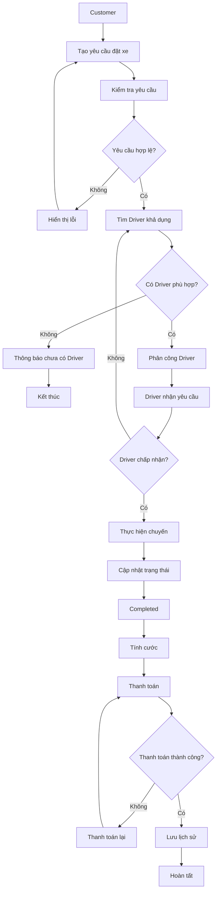

---

# 6. Business Process Modeling (Mô hình hóa Quy trình Nghiệp vụ)

Business Process Modeling được sử dụng để mô tả cách **CAB System MVP** xử lý một yêu cầu đặt xe từ khi Customer tạo yêu cầu đến khi chuyến đi hoàn thành, thanh toán và lưu lịch sử.

Quy trình được tập trung vào luồng nghiệp vụ cốt lõi:

```text
Đặt xe
  ↓
Tìm Driver
  ↓
Phân công Driver
  ↓
Driver nhận / từ chối
  ↓
Thực hiện Trip
  ↓
Completed
  ↓
Tính cước
  ↓
Thanh toán
  ↓
Lưu lịch sử
```

---

## 6.1. Quy trình nghiệp vụ tổng thể

Quy trình chính của CAB System MVP gồm:

1. Customer đăng nhập.
2. Customer nhập thông tin chuyến đi.
3. Hệ thống kiểm tra và tạo yêu cầu đặt xe.
4. Hệ thống tìm Driver phù hợp.
5. Operation Staff lựa chọn Driver để phân công.
6. Driver nhận hoặc từ chối chuyến.
7. Nếu Driver từ chối, Operation Staff có thể chọn Driver khác.
8. Nếu Driver chấp nhận, chuyến được xác nhận.
9. Driver thực hiện chuyến và cập nhật trạng thái.
10. Chuyến chuyển sang `Completed`.
11. Hệ thống tính cước.
12. Customer thực hiện thanh toán.
13. Hệ thống ghi nhận kết quả thanh toán.
14. Hệ thống lưu lịch sử chuyến.
15. Quy trình kết thúc.

---

## 6.2. Quy trình đặt xe

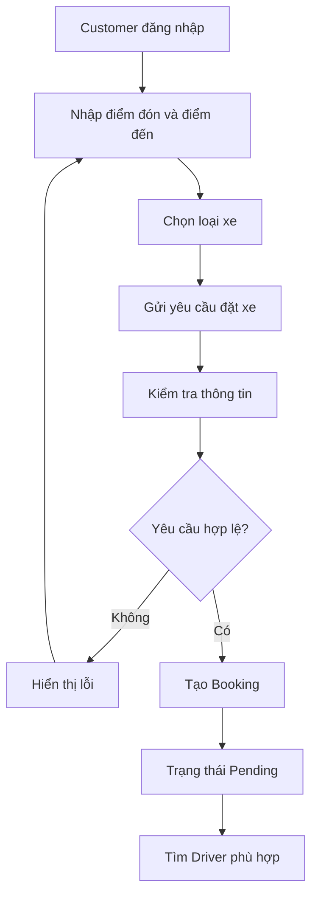

### Mô tả

| Bước | Actor    | Hoạt động                     |
| ---- | -------- | ----------------------------- |
| 1    | Customer | Đăng nhập                     |
| 2    | Customer | Nhập điểm đón, điểm đến       |
| 3    | Customer | Chọn loại xe                  |
| 4    | Customer | Gửi yêu cầu                   |
| 5    | System   | Kiểm tra dữ liệu              |
| 6    | System   | Tạo Booking                   |
| 7    | System   | Chuyển Booking sang `Pending` |
| 8    | System   | Bắt đầu tìm Driver            |

---

## 6.3. Quy trình tìm kiếm và phân công Driver

Sau khi Booking được tạo, hệ thống xác định các Driver có thể nhận chuyến.

Các điều kiện cơ bản:

* Driver có trạng thái `Available`.
* Driver không đang thực hiện chuyến khác.
* Loại xe phù hợp với yêu cầu.
* Thông tin Driver và phương tiện hợp lệ.

Trong MVP, Operation Staff là người hỗ trợ lựa chọn Driver từ danh sách phù hợp.

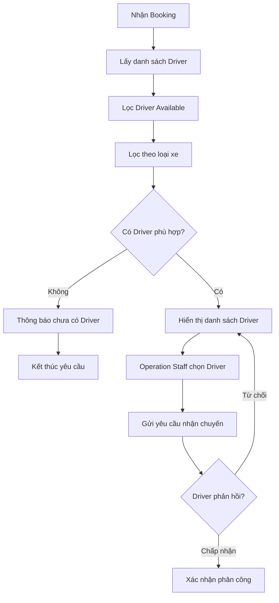

### Giới hạn MVP

Việc lựa chọn Driver trong MVP không yêu cầu:

* GPS thời gian thực.
* Bản đồ trực tuyến.
* Tính khoảng cách theo dữ liệu GPS thực tế.
* Thuật toán AI/ML.
* Thuật toán tối ưu điều phối phức tạp.

Thông tin vị trí Driver nếu có chỉ được sử dụng ở mức **dữ liệu mô phỏng hoặc dữ liệu được cập nhật thủ công**.

---

## 6.4. Quy trình thực hiện chuyến đi

Sau khi Driver chấp nhận yêu cầu, chuyến đi được thực hiện theo chuỗi trạng thái:

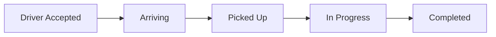

| Trạng thái        | Ý nghĩa                    |
| ----------------- | -------------------------- |
| `Driver Accepted` | Driver đã chấp nhận chuyến |
| `Arriving`        | Driver đang đến điểm đón   |
| `Picked Up`       | Driver đã đón Customer     |
| `In Progress`     | Chuyến đang được thực hiện |
| `Completed`       | Chuyến đã hoàn thành       |

### Quy tắc chuyển trạng thái

```text
Driver Accepted
      ↓
Arriving
      ↓
Picked Up
      ↓
In Progress
      ↓
Completed
```

Hệ thống không cho phép chuyển chuyến từ `Completed` quay lại trạng thái trước đó.

---

## 6.5. Quy trình tính cước và thanh toán

Sau khi Trip chuyển sang `Completed`, hệ thống thực hiện tính cước và thanh toán.

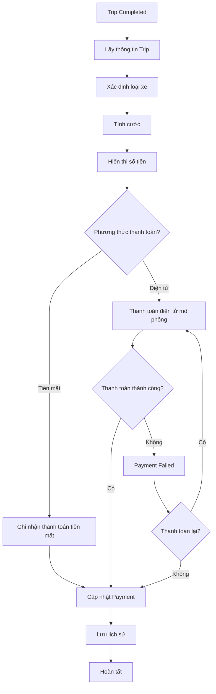

### Trạng thái Payment

```text
Unpaid
   ↓
Processing
   ↓
Paid / Failed
```

Nếu thanh toán điện tử thất bại:

```text
Failed
   ↓
Retry
   ↓
Processing
   ↓
Paid / Failed
```

### Giới hạn MVP

* Thanh toán tiền mặt được ghi nhận trực tiếp trên hệ thống.
* Thanh toán điện tử chỉ được **mô phỏng**.
* Không tích hợp cổng thanh toán thật.
* Không triển khai Dynamic Pricing.

---

## 6.6. Quy trình thông báo

Thông báo được sử dụng để cung cấp thông tin cho Customer và Driver tại các sự kiện chính.

| STT | Sự kiện                 | Người nhận |
| --- | ----------------------- | ---------- |
| 1   | Booking được tạo        | Customer   |
| 2   | Có yêu cầu nhận chuyến  | Driver     |
| 3   | Driver được xác nhận    | Customer   |
| 4   | Driver đến điểm đón     | Customer   |
| 5   | Trip hoàn thành         | Customer   |
| 6   | Thanh toán thành công   | Customer   |
| 7   | Thanh toán thất bại     | Customer   |
| 8   | Không có Driver phù hợp | Customer   |

---

## 6.7. Quy trình xử lý ngoại lệ

CAB System MVP tập trung xử lý các ngoại lệ trực tiếp ảnh hưởng đến quy trình đặt xe:

| Trường hợp                  | Cách xử lý                             |
| --------------------------- | -------------------------------------- |
| Không có Driver phù hợp     | Thông báo Customer và kết thúc yêu cầu |
| Driver từ chối              | Cho phép tìm/chọn Driver khác          |
| Thanh toán điện tử thất bại | Ghi nhận `Failed` và cho phép Retry    |
| Booking không hợp lệ        | Hiển thị lỗi và yêu cầu nhập lại       |
| Driver không còn Available  | Không cho phép phân công               |

### Nguyên tắc

* Không làm mất dữ liệu Booking/Trip đã tạo.
* Trạng thái Trip phải được lưu sau mỗi bước quan trọng.
* Không cho phép thực hiện thao tác trái với trạng thái hiện tại.
* Lỗi thanh toán không làm mất thông tin Trip.
* Operation Staff có thể kiểm tra và hỗ trợ các trường hợp bất thường.

---

## 6.8. Quy trình nghiệp vụ tổng quát

Sơ đồ dưới đây thể hiện **end-to-end business flow** của CAB System MVP:

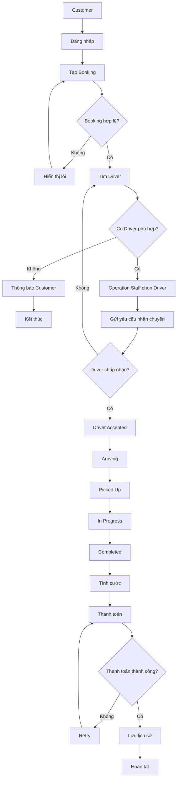

---

## 6.9. Phạm vi quy trình trong MVP

| STT | Quy trình                      | Module liên quan | Ưu tiên  |
| --- | ------------------------------ | ---------------- | -------- |
| 1   | Đăng nhập và quản lý tài khoản | MVP-01           | High     |
| 2   | Tạo Booking                    | MVP-02           | High     |
| 3   | Tìm Driver                     | MVP-04           | Critical |
| 4   | Phân công Driver               | MVP-04           | Critical |
| 5   | Thực hiện Trip                 | MVP-04           | Critical |
| 6   | Cập nhật trạng thái Trip       | MVP-04           | Critical |
| 7   | Tính cước                      | MVP-05           | High     |
| 8   | Thanh toán                     | MVP-05           | High     |
| 9   | Lưu lịch sử                    | MVP-06           | High     |
| 10  | Thông báo giao diện            | MVP-06           | Medium   |

### Quy trình trọng tâm

Quy trình cần được phân tích sâu nhất là:

```text
Booking
   ↓
Tìm Driver
   ↓
Phân công Driver
   ↓
Driver Accept / Reject
   ↓
Quản lý Trip
   ↓
Completed
```

Đây chính là phạm vi trọng tâm của **MVP-04 – Dispatch & Trip Management**.

---

## 6.10. Giới hạn triển khai

CAB System MVP **không bắt buộc** triển khai:

* GPS thời gian thực.
* Bản đồ thời gian thực.
* Google Maps hoặc dịch vụ bản đồ bên ngoài.
* Thanh toán điện tử thực tế.
* SMS/Email/Push Notification.
* AI/ML Driver Dispatch.
* Dynamic Pricing.
* Tối ưu tuyến đường.
* Hệ thống phân tán hoặc Microservices.

Các chức năng trên được xác định là **Future Scope**.

### Kết luận phạm vi

Mục tiêu của Business Process Modeling trong MVP là chứng minh rằng hệ thống có thể xử lý thành công quy trình:

```text
Customer
   ↓
Booking
   ↓
Find Driver
   ↓
Dispatch
   ↓
Accept / Reject
   ↓
Trip
   ↓
Completed
   ↓
Fare
   ↓
Payment
   ↓
History
```

Trong đó, **Dispatch & Trip Management** là quy trình trung tâm và là trọng tâm phân tích của dự án.


# 7. Functional Requirements (Yêu cầu Chức năng)

Functional Requirements (FR) mô tả các chức năng mà **CAB System MVP** phải cung cấp nhằm đáp ứng các Business Requirements (BR) đã xác định.

Functional Requirements được giới hạn ở mức cần thiết để hoàn thành quy trình nghiệp vụ chính:

```text
Quản lý tài khoản
       ↓
Đặt xe
       ↓
Tìm kiếm & phân công Driver
       ↓
Quản lý Trip
       ↓
Tính cước
       ↓
Thanh toán
       ↓
Lưu lịch sử & Báo cáo
```

Trong đó, **MVP-04 – Dispatch & Trip Management** là module trọng tâm.

---

## 7.1. MVP-01 – Quản lý Tài khoản

### FR-01 – Đăng ký tài khoản

Hệ thống phải:

* Cho phép Customer đăng ký tài khoản.
* Yêu cầu nhập họ tên, số điện thoại, email và mật khẩu.
* Kiểm tra các thông tin bắt buộc.
* Không cho phép đăng ký email hoặc số điện thoại đã tồn tại.
* Không lưu mật khẩu dưới dạng plaintext.

### FR-02 – Đăng nhập và đăng xuất

Hệ thống phải:

* Cho phép Customer, Driver và Operation Staff đăng nhập.
* Kiểm tra thông tin đăng nhập.
* Xác định Role của người dùng sau khi đăng nhập.
* Cho phép người dùng đăng xuất.
* Không cho phép tài khoản bị khóa đăng nhập.

### FR-03 – Quản lý hồ sơ

Hệ thống phải:

* Cho phép Customer xem và cập nhật thông tin cá nhân.
* Cho phép Driver xem và cập nhật thông tin cá nhân theo quyền.
* Cho phép Operation Staff quản lý thông tin Customer và Driver.
* Lưu thông tin phương tiện của Driver.

---

## 7.2. MVP-02 – Đặt xe

### FR-04 – Tạo yêu cầu đặt xe

Customer phải có thể:

* Nhập điểm đón.
* Nhập điểm đến.
* Chọn loại xe.
* Gửi yêu cầu đặt xe.

Hệ thống phải:

* Kiểm tra thông tin bắt buộc.
* Tạo mã Booking/Trip duy nhất.
* Đặt trạng thái ban đầu là `Pending`.
* Hiển thị thông báo xác nhận yêu cầu.

### FR-05 – Xem và hủy yêu cầu

Customer phải có thể:

* Xem thông tin Booking.
* Xem trạng thái Trip.
* Xem Driver được phân công nếu có.
* Hủy Trip khi trạng thái cho phép.

Hệ thống phải:

* Không cho phép hủy Trip đã `Completed`.
* Lưu trạng thái hủy.
* Lưu lý do hủy nếu có.

---

## 7.3. MVP-03 – Quản lý Tài xế

### FR-06 – Quản lý trạng thái Driver

Driver có thể cập nhật:

| Status      | Ý nghĩa               |
| ----------- | --------------------- |
| `Available` | Sẵn sàng nhận chuyến  |
| `Offline`   | Không sẵn sàng        |
| `Busy`      | Đang thực hiện chuyến |

Hệ thống phải:

* Lưu trạng thái hiện tại của Driver.
* Chỉ Driver `Available` mới được xem xét phân công.
* Chuyển Driver sang `Busy` khi đang thực hiện Trip.
* Không cho phép Driver nhận đồng thời nhiều Trip đang hoạt động.

### FR-07 – Quản lý thông tin Driver và phương tiện

Operation Staff có thể:

* Thêm Driver.
* Cập nhật thông tin Driver.
* Cập nhật thông tin phương tiện.
* Cập nhật trạng thái tài khoản Driver.

Hệ thống phải lưu tối thiểu:

* Thông tin Driver.
* Loại phương tiện.
* Biển số phương tiện.
* Trạng thái hoạt động.

---

## 7.4. MVP-04 – Điều phối & Quản lý Chuyến

> **Đây là module trọng tâm của CAB System MVP.**

Module này chịu trách nhiệm xử lý chuỗi nghiệp vụ:

```text
Booking
   ↓
Tìm Driver
   ↓
Phân công
   ↓
Accept / Reject
   ↓
Thực hiện Trip
   ↓
Completed
```

### FR-08 – Tìm kiếm Driver phù hợp

Hệ thống phải:

* Tìm các Driver có trạng thái `Available`.
* Lọc Driver theo loại xe Customer yêu cầu.
* Loại bỏ Driver đang `Busy`.
* Hiển thị danh sách Driver phù hợp cho Operation Staff.

Trong MVP, hệ thống có thể sử dụng thông tin vị trí Driver được lưu trong hệ thống để hỗ trợ lựa chọn.

**Giới hạn MVP:**

* Không yêu cầu GPS thời gian thực.
* Không yêu cầu bản đồ.
* Không yêu cầu Google Maps.
* Không yêu cầu thuật toán AI/ML.
* Không bắt buộc tính khoảng cách theo tọa độ GPS thực tế.

### FR-09 – Gửi yêu cầu và phân công Driver

Hệ thống phải:

* Cho phép Operation Staff lựa chọn Driver phù hợp.
* Gửi yêu cầu nhận Trip đến Driver.
* Cho phép Driver `Accept` hoặc `Reject`.
* Khi Driver `Accept`, hệ thống xác nhận Driver cho Trip.
* Khi Driver `Reject`, Operation Staff có thể chọn Driver khác.
* Không cho phép một Trip được xác nhận cho nhiều Driver cùng lúc.

### FR-10 – Xử lý trường hợp không có Driver

Hệ thống phải:

* Xác định khi không có Driver phù hợp.
* Hiển thị thông báo cho Customer.
* Lưu kết quả xử lý của Booking.
* Cho phép Operation Staff kiểm tra và xử lý yêu cầu.

Customer không phải tạo lại Booking trong trường hợp Driver đầu tiên từ chối.

---

## 7.5. Quản lý trạng thái Trip

### FR-11 – Cập nhật trạng thái Trip

Trip được quản lý theo chuỗi trạng thái:

```text
Pending
   ↓
Searching Driver
   ↓
Driver Assigned
   ↓
Driver Accepted
   ↓
Arriving
   ↓
Picked Up
   ↓
In Progress
   ↓
Completed
```

Hệ thống phải:

* Kiểm tra trạng thái hiện tại trước khi chuyển trạng thái.
* Chỉ cho phép thao tác hợp lệ theo trạng thái hiện tại.
* Chỉ Driver được phân công mới được cập nhật trạng thái thực hiện Trip.
* Lưu thời điểm thay đổi trạng thái.
* Không cho phép Trip `Completed` quay lại trạng thái trước đó.

### FR-12 – Theo dõi thông tin Trip

Customer có thể xem:

* Mã Trip.
* Điểm đón.
* Điểm đến.
* Loại xe.
* Driver được phân công.
* Thông tin phương tiện.
* Trạng thái Trip.
* Cước phí khi đã hoàn thành.

Operation Staff có thể:

* Xem danh sách Trip.
* Lọc Trip theo trạng thái.
* Xem Trip đang thực hiện.
* Xem Driver được phân công cho từng Trip.

### FR-13 – Hoàn thành Trip

Driver phải có thể xác nhận hoàn thành Trip.

Hệ thống phải:

* Kiểm tra trạng thái hiện tại.
* Chỉ cho phép hoàn thành Trip từ trạng thái hợp lệ.
* Chuyển Trip sang `Completed`.
* Lưu thời điểm hoàn thành.
* Chuyển quy trình sang bước tính cước.

---

## 7.6. MVP-05 – Tính cước & Thanh toán

### FR-14 – Tính cước

Sau khi Trip hoàn thành, hệ thống phải:

* Xác định loại xe.
* Lấy thông tin cần thiết của Trip.
* Áp dụng quy tắc tính cước.
* Xác định số tiền cần thanh toán.
* Hiển thị số tiền cho Customer.
* Lưu số tiền vào Trip.

**Giới hạn MVP:** Công thức tính cước được đơn giản hóa và không bao gồm Dynamic Pricing.

### FR-15 – Thanh toán

Customer có thể lựa chọn:

| Payment Method | Mô tả                       |
| -------------- | --------------------------- |
| `Cash`         | Thanh toán tiền mặt         |
| `Electronic`   | Thanh toán điện tử mô phỏng |

Hệ thống phải:

* Hiển thị số tiền cần thanh toán.
* Ghi nhận phương thức thanh toán.
* Cập nhật trạng thái Payment.

Các trạng thái:

```text
Unpaid
   ↓
Processing
   ↓
Paid / Failed
```

### FR-16 – Xử lý kết quả thanh toán

Hệ thống phải:

* Ghi nhận kết quả Payment.
* Cho phép Customer thanh toán lại khi Payment bị `Failed`.
* Lưu mã giao dịch mô phỏng.
* Lưu mã Trip.
* Lưu số tiền.
* Lưu phương thức thanh toán.
* Lưu trạng thái Payment.

**Giới hạn MVP:** Không lưu thông tin thẻ hoặc thông tin thanh toán nhạy cảm và không tích hợp cổng thanh toán thực tế.

---

## 7.7. Chức năng Thông báo

Thông báo được tích hợp vào các module liên quan thay vì xây dựng thành một module riêng.

### FR-17 – Hiển thị thông báo

Hệ thống phải hiển thị thông báo khi:

| Sự kiện                 | Người nhận |
| ----------------------- | ---------- |
| Booking được tạo        | Customer   |
| Có yêu cầu nhận Trip    | Driver     |
| Driver được xác nhận    | Customer   |
| Driver nhận Trip        | Customer   |
| Driver đến điểm đón     | Customer   |
| Trip hoàn thành         | Customer   |
| Payment thành công      | Customer   |
| Payment thất bại        | Customer   |
| Không có Driver phù hợp | Customer   |

**Giới hạn MVP:** Chỉ hiển thị thông báo trực tiếp trên giao diện.

SMS, Email và Push Notification thuộc **Future Scope**.

---

## 7.8. MVP-06 – Theo dõi & Báo cáo

### FR-18 – Quản lý vận hành

Operation Staff có thể:

* Xem danh sách Trip.
* Xem trạng thái Trip.
* Lọc Trip theo trạng thái.
* Xem danh sách Driver.
* Xem Driver `Available`.
* Xem Driver `Busy`.
* Hỗ trợ phân công lại Driver.
* Tra cứu lịch sử Trip.

### FR-19 – Tra cứu lịch sử

Customer có thể:

* Xem lịch sử Trip của mình.
* Xem trạng thái Trip.
* Xem Driver.
* Xem cước phí.
* Xem trạng thái Payment.

Operation Staff có thể:

* Tra cứu lịch sử Trip.
* Lọc lịch sử theo trạng thái.
* Tra cứu thông tin Payment liên quan.

### FR-20 – Báo cáo cơ bản

Management có thể xem:

* Tổng số Trip.
* Số Trip `Completed`.
* Số Trip `Cancelled`.
* Số Trip không tìm được Driver.
* Doanh thu.
* Số Trip theo trạng thái.

Báo cáo có thể được lọc theo khoảng thời gian.

---

## 7.9. Phân quyền Functional Requirements

| Role             | Quyền chính                                          |
| ---------------- | ---------------------------------------------------- |
| Customer         | Đặt xe, xem Trip, hủy Trip, thanh toán, xem lịch sử  |
| Driver           | Xem yêu cầu, Accept/Reject Trip, cập nhật trạng thái |
| Operation Staff  | Quản lý Driver, điều phối và theo dõi Trip           |
| Administrator    | Quản lý tài khoản và Role                            |
| Management       | Xem báo cáo và thống kê                              |
| Payment Provider | Mô phỏng kết quả thanh toán                          |

### FR-21 – Kiểm soát quyền truy cập

Hệ thống phải:

* Yêu cầu đăng nhập đối với chức năng cần xác thực.
* Kiểm tra Role trước khi thực hiện chức năng.
* Không cho Customer truy cập chức năng quản trị.
* Chỉ cho Driver thao tác trên Trip được phân công.
* Cho phép Operation Staff thực hiện các chức năng vận hành.
* Cho phép Administrator quản lý tài khoản và Role.
* Cho phép Management truy cập báo cáo.

---

## 7.10. FR trọng tâm của dự án

Do dự án được thực hiện bởi **một người trong 7 tuần**, Functional Requirements được phân thành ba nhóm:

| Nhóm           | FR                           | Mục đích                     |
| -------------- | ---------------------------- | ---------------------------- |
| **Core**       | FR-08 → FR-13                | Phân tích sâu MVP-04         |
| **Supporting** | FR-01 → FR-07, FR-14 → FR-16 | Đảm bảo quy trình end-to-end |
| **Secondary**  | FR-17 → FR-21                | Hỗ trợ vận hành và quản lý   |

### Core Flow

```text
FR-04 Tạo Booking
       ↓
FR-08 Tìm Driver
       ↓
FR-09 Phân công Driver
       ↓
FR-10 Xử lý Reject / Không có Driver
       ↓
FR-11 Cập nhật trạng thái Trip
       ↓
FR-13 Completed
       ↓
FR-14 Tính cước
       ↓
FR-15/FR-16 Thanh toán
```

---

## 7.11. Mapping Business Requirements → Functional Requirements

| Business Requirement               | Functional Requirements    |
| ---------------------------------- | -------------------------- |
| BR-01 – Quản lý tài khoản Customer | FR-01, FR-02, FR-03        |
| BR-02 – Quản lý tài khoản Driver   | FR-02, FR-03, FR-06, FR-07 |
| BR-03 – Đặt xe                     | FR-04, FR-05               |
| BR-04 – Tìm kiếm Driver            | FR-08                      |
| BR-05 – Phân công Driver           | FR-09, FR-10               |
| BR-06 – Quản lý Trip               | FR-11, FR-12, FR-13        |
| BR-07 – Tính cước                  | FR-14                      |
| BR-08 – Thanh toán                 | FR-15, FR-16               |
| BR-09 – Thông báo                  | FR-17                      |
| BR-10 – Quản lý vận hành           | FR-18                      |
| BR-11 – Lưu lịch sử                | FR-13, FR-19               |
| BR-12 – Bảo mật & phân quyền       | FR-21                      |

---

## 7.12. Ma trận Functional Requirements theo Module

| Module                                | Functional Requirements | Priority     |
| ------------------------------------- | ----------------------- | ------------ |
| MVP-01 – Quản lý tài khoản            | FR-01 → FR-03           | High         |
| MVP-02 – Đặt xe                       | FR-04 → FR-05           | High         |
| MVP-03 – Quản lý Driver               | FR-06 → FR-07           | High         |
| **MVP-04 – Điều phối & Quản lý Trip** | **FR-08 → FR-13**       | **Critical** |
| MVP-05 – Tính cước & Thanh toán       | FR-14 → FR-16           | High         |
| Thông báo tích hợp                    | FR-17                   | Medium       |
| MVP-06 – Theo dõi & Báo cáo           | FR-18 → FR-20           | Medium       |
| Phân quyền                            | FR-21                   | High         |

> **Kết luận:** FR-08 đến FR-13 là nhóm Functional Requirements trọng tâm của dự án. Các FR còn lại đóng vai trò hỗ trợ để hoàn thiện quy trình nghiệp vụ end-to-end của CAB System MVP.

# 8. Business Rules (Quy tắc Nghiệp vụ)

Business Rules xác định các quy tắc mà hệ thống phải tuân thủ trong quá trình quản lý tài khoản, đặt xe, phân công tài xế, thực hiện chuyến đi và thanh toán. Các quy tắc được giới hạn trong phạm vi MVP để phù hợp với dự án cá nhân

## 8.1. Quy tắc Quản lý Tài khoản

| ID      | Business Rule      | Mô tả                                                                                  |
| ------- | ------------------ | -------------------------------------------------------------------------------------- |
| BRULE01 | Tài khoản duy nhất | Mỗi tài khoản phải có thông tin định danh duy nhất trong hệ thống.                     |
| BRULE02 | Vai trò người dùng | Mỗi tài khoản thuộc một vai trò: Customer, Driver, Operation Staff hoặc Administrator. |
| BRULE03 | Kiểm soát quyền    | Người dùng chỉ được thực hiện các chức năng phù hợp với vai trò được cấp.              |
| BRULE04 | Tài khoản hợp lệ   | Tài khoản bị khóa không được phép đăng nhập và sử dụng hệ thống.                       |
| BRULE05 | Hồ sơ Tài xế       | Tài xế phải có hồ sơ và thông tin phương tiện hợp lệ trước khi được phân công chuyến.  |

## 8.2. Quy tắc Đặt xe và Phân công Tài xế

| ID      | Business Rule             | Mô tả                                                                                                        |
| ------- | ------------------------- | ------------------------------------------------------------------------------------------------------------ |
| BRULE06 | Thông tin đặt xe          | Yêu cầu đặt xe phải có điểm đón, điểm đến và loại xe.                                                        |
| BRULE07 | Một chuyến đang thực hiện | Khách hàng không được tạo chuyến mới khi đang có chuyến chưa hoàn thành theo chính sách MVP.                 |
| BRULE08 | Tài xế phù hợp            | Chỉ Tài xế có trạng thái Available, không có chuyến đang thực hiện và có loại xe phù hợp mới được phân công. |
| BRULE09 | Chọn Tài xế               | Nhân viên vận hành lựa chọn Tài xế từ danh sách Tài xế phù hợp dựa trên thông tin được lưu trong hệ thống.   |
| BRULE10 | Từ chối phân công         | Khi Tài xế từ chối, Nhân viên vận hành có thể lựa chọn Tài xế phù hợp khác.                                  |
| BRULE11 | Không có Tài xế           | Khi không có Tài xế phù hợp, hệ thống ghi nhận trạng thái không phân công được và thông báo cho Khách hàng.  |

> **Phạm vi MVP:** Hệ thống không bắt buộc phải xác định Tài xế gần nhất bằng GPS thực tế. Vị trí được lưu chỉ có thể được sử dụng như thông tin hỗ trợ cho Nhân viên vận hành.

## 8.3. Quy tắc Chuyến đi

| ID      | Business Rule         | Mô tả                                                                                             |
| ------- | --------------------- | ------------------------------------------------------------------------------------------------- |
| BRULE12 | Trình tự trạng thái   | Trạng thái chuyến phải được cập nhật theo đúng trình tự nghiệp vụ đã định nghĩa.                  |
| BRULE13 | Quyền cập nhật chuyến | Chỉ Tài xế được phân công mới có quyền cập nhật trạng thái thực hiện chuyến.                      |
| BRULE14 | Hoàn thành chuyến     | Chỉ chuyến đang ở trạng thái hợp lệ mới được chuyển sang `Completed`.                             |
| BRULE15 | Không hoàn tác        | Chuyến đã `Completed` không được chuyển ngược về trạng thái thực hiện trước đó.                   |
| BRULE16 | Lưu lịch sử chuyến    | Thông tin chuyến hoàn thành phải được lưu để Khách hàng và Nhân viên vận hành tra cứu theo quyền. |

### Trình tự trạng thái chính

```text
Pending
   ↓
Searching Driver
   ↓
Driver Assigned
   ↓
Driver Accepted
   ↓
Arriving
   ↓
Picked Up
   ↓
In Progress
   ↓
Completed
```

Trong đó:

* `Driver Assigned`: Tài xế đã được Nhân viên vận hành lựa chọn và gửi yêu cầu, nhưng chưa xác nhận nhận chuyến.
* `Driver Accepted`: Tài xế đã xác nhận nhận chuyến và được xem là Tài xế thực hiện chuyến.

## 8.4. Quy tắc Tính cước và Thanh toán

| ID      | Business Rule             | Mô tả                                                                                   |
| ------- | ------------------------- | --------------------------------------------------------------------------------------- |
| BRULE17 | Tính cước                 | Hệ thống chỉ tính cước sau khi chuyến đi hoàn thành.                                    |
| BRULE18 | Phương thức thanh toán    | MVP hỗ trợ thanh toán tiền mặt và thanh toán điện tử mô phỏng.                          |
| BRULE19 | Xác nhận thanh toán       | Thanh toán chỉ được chuyển sang `Paid` khi hệ thống ghi nhận kết quả thanh toán hợp lệ. |
| BRULE20 | Thanh toán thất bại       | Giao dịch thất bại phải được ghi nhận và cho phép thực hiện lại theo chính sách MVP.    |
| BRULE21 | Bảo vệ dữ liệu thanh toán | Hệ thống không lưu thông tin thẻ hoặc thông tin thanh toán nhạy cảm.                    |

## 8.5. Quy tắc Thông báo

| ID      | Business Rule     | Mô tả                                                                                                                                      |
| ------- | ----------------- | ------------------------------------------------------------------------------------------------------------------------------------------ |
| BRULE22 | Thông báo sự kiện | Hệ thống hiển thị thông báo khi xảy ra các sự kiện quan trọng như tạo booking, phân công tài xế, thay đổi trạng thái chuyến và thanh toán. |
| BRULE23 | Thông báo Tài xế  | Tài xế phải nhận được thông báo trên hệ thống khi có yêu cầu chuyến mới hoặc thay đổi liên quan đến chuyến được phân công.                 |

> **Phạm vi MVP:** Thông báo chỉ được thực hiện trong giao diện hệ thống. SMS, Email và Push Notification thuộc Future Scope.

## 8.6. Quy tắc Vận hành và Bảo mật

| ID      | Business Rule                    | Mô tả                                                                                                        |
| ------- | -------------------------------- | ------------------------------------------------------------------------------------------------------------ |
| BRULE24 | Quyền vận hành                   | Nhân viên vận hành chỉ được quản lý Khách hàng, Tài xế và chuyến đi trong phạm vi quyền được cấp.            |
| BRULE25 | Xử lý trường hợp không phân công | Khi không thể phân công Tài xế, Nhân viên vận hành phải có khả năng kiểm tra và xử lý yêu cầu trên hệ thống. |
| BRULE26 | Dữ liệu lịch sử                  | Thông tin chuyến đi và thanh toán phải được lưu để tra cứu và đối soát.                                      |
| BRULE27 | Nhật ký thao tác quan trọng      | Các thao tác quản trị hoặc can thiệp quan trọng phải được ghi nhận để phục vụ kiểm tra khi cần.              |

## 8.7. Tổng hợp Business Rules

| Nhóm                   | Business Rules        | Số lượng |
| ---------------------- | --------------------- | -------: |
| Quản lý Tài khoản      | BRULE01 – BRULE05     |        5 |
| Đặt xe & Phân công     | BRULE06 – BRULE11     |        6 |
| Chuyến đi              | BRULE12 – BRULE16     |        5 |
| Tính cước & Thanh toán | BRULE17 – BRULE21     |        5 |
| Thông báo              | BRULE22 – BRULE23     |        2 |
| Vận hành & Bảo mật     | BRULE24 – BRULE27     |        4 |
| **Tổng cộng**          | **BRULE01 – BRULE27** |   **27** |

## 8.8. Phạm vi Business Rules của MVP

Các Business Rules trên tập trung vào quy trình chính của CAB System:

```text
Customer
   ↓
Create Booking
   ↓
Find Suitable Driver
   ↓
Operation Staff Selects Driver
   ↓
Driver Accept / Reject
   ↓
Manage Trip
   ↓
Complete Trip
   ↓
Calculate Fare
   ↓
Payment
   ↓
Trip History
```

Các quy tắc liên quan đến **GPS thời gian thực, bản đồ, thanh toán online thực tế, thông báo SMS/Email/Push, định giá động, tự động phân công bằng AI và đánh giá tài xế** không được xem là Business Rules bắt buộc của MVP và được đưa vào Future Scope.

# 9. Non-Functional Requirements (Yêu cầu Phi chức năng)

Non-Functional Requirements xác định các tiêu chí về hiệu năng, bảo mật, độ tin cậy, khả năng sử dụng, bảo trì và kiểm thử của CAB System. Các yêu cầu được giới hạn ở mức phù hợp với MVP và thời gian phát triển cá nhân 7 tuần.

## 9.1. Hiệu năng (Performance)

| ID        | Requirement        | Mô tả                                                                                                                              |
| --------- | ------------------ | ---------------------------------------------------------------------------------------------------------------------------------- |
| **NFR01** | Thời gian phản hồi | Các thao tác thông thường phải phản hồi trong không quá 3 giây trong điều kiện tải bình thường.                                    |
| **NFR02** | Xử lý đặt xe       | Sau khi tạo booking thành công, hệ thống phải chuyển chuyến sang trạng thái `Searching Driver` và hiển thị kết quả cho người dùng. |

> **Phạm vi MVP:** Không yêu cầu kiểm thử tải ở quy mô lớn hoặc khả năng xử lý hàng nghìn yêu cầu đồng thời.

## 9.2. Tính tin cậy và Toàn vẹn dữ liệu

| ID        | Requirement               | Mô tả                                                                                                 |
| --------- | ------------------------- | ----------------------------------------------------------------------------------------------------- |
| **NFR03** | Xử lý lỗi                 | Lỗi của một chức năng không được làm dừng toàn bộ hệ thống và phải hiển thị thông báo phù hợp.        |
| **NFR04** | Toàn vẹn dữ liệu          | Dữ liệu Booking, Trip, Driver, Fare và Payment phải được lưu chính xác và nhất quán.                  |
| **NFR05** | Tính nhất quán trạng thái | Hệ thống phải ngăn chặn việc cập nhật trạng thái chuyến không hợp lệ hoặc bỏ qua trạng thái bắt buộc. |

## 9.3. Bảo mật (Security)

| ID        | Requirement               | Mô tả                                                                                         |
| --------- | ------------------------- | --------------------------------------------------------------------------------------------- |
| **NFR06** | Xác thực và phân quyền    | Người dùng phải đăng nhập và được kiểm tra quyền trước khi truy cập chức năng.                |
| **NFR07** | Bảo vệ mật khẩu           | Mật khẩu phải được lưu dưới dạng băm an toàn và không được lưu dưới dạng văn bản thuần.       |
| **NFR08** | Bảo vệ dữ liệu            | Thông tin cá nhân, thông tin Tài xế và phương tiện phải được bảo vệ khỏi truy cập trái phép.  |
| **NFR09** | Bảo vệ dữ liệu thanh toán | Hệ thống không được lưu thông tin thẻ hoặc dữ liệu thanh toán nhạy cảm.                       |
| **NFR10** | Nhật ký hoạt động         | Các thao tác quản trị và can thiệp quan trọng phải được ghi nhận để phục vụ kiểm tra khi cần. |

## 9.4. Khả năng Bảo trì (Maintainability)

| ID        | Requirement      | Mô tả                                                                                   |
| --------- | ---------------- | --------------------------------------------------------------------------------------- |
| **NFR11** | Cấu trúc module  | Mã nguồn được tổ chức theo các module rõ ràng, phù hợp với các module MVP của hệ thống. |
| **NFR12** | Khả năng bảo trì | Tên biến, hàm và cấu trúc mã nguồn phải thống nhất, dễ đọc và dễ chỉnh sửa.             |
| **NFR13** | Xử lý lỗi        | Các lỗi phát sinh phải được xử lý rõ ràng và hỗ trợ quá trình kiểm tra, sửa lỗi.        |

## 9.5. Khả năng sử dụng (Usability)

| ID        | Requirement          | Mô tả                                                                                                 |
| --------- | -------------------- | ----------------------------------------------------------------------------------------------------- |
| **NFR14** | Giao diện dễ sử dụng | Giao diện phải đơn giản và dễ hiểu đối với Customer, Driver và Operation Staff.                       |
| **NFR15** | Responsive           | Giao diện phải hiển thị phù hợp trên máy tính và thiết bị di động.                                    |
| **NFR16** | Thông báo rõ ràng    | Hệ thống phải hiển thị thông báo rõ ràng khi thao tác thành công, thất bại hoặc cần người dùng xử lý. |

## 9.6. Tương thích (Compatibility)

| ID        | Requirement   | Mô tả                                                                                                       |
| --------- | ------------- | ----------------------------------------------------------------------------------------------------------- |
| **NFR17** | Trình duyệt   | Hệ thống phải hoạt động trên các trình duyệt phổ biến như Google Chrome, Microsoft Edge và Mozilla Firefox. |
| **NFR18** | Cơ sở dữ liệu | Cơ sở dữ liệu phải hỗ trợ lưu trữ và truy xuất ổn định các dữ liệu của hệ thống.                            |

## 9.7. Sao lưu và Khôi phục

| ID        | Requirement       | Mô tả                                                                |
| --------- | ----------------- | -------------------------------------------------------------------- |
| **NFR19** | Sao lưu dữ liệu   | Dữ liệu quan trọng phải có bản sao lưu để phục vụ khôi phục khi cần. |
| **NFR20** | Khôi phục dữ liệu | Dữ liệu có thể được khôi phục từ bản sao lưu khi xảy ra sự cố.       |

> Trong phạm vi bài cá nhân, việc sao lưu có thể được thực hiện thủ công hoặc theo cơ chế đơn giản của môi trường phát triển, không yêu cầu hệ thống backup production tự động.

## 9.8. Khả năng kiểm thử (Testability)

| ID        | Requirement        | Mô tả                                                                                  |
| --------- | ------------------ | -------------------------------------------------------------------------------------- |
| **NFR21** | Kiểm thử chức năng | Các chức năng chính phải có thể kiểm thử độc lập.                                      |
| **NFR22** | Kiểm thử quy trình | Có thể kiểm thử toàn bộ quy trình `Booking → Dispatch → Trip → Fare → Payment`.        |
| **NFR23** | Kiểm thử ngoại lệ  | Có thể kiểm thử các trường hợp Tài xế từ chối, không có Tài xế và thanh toán thất bại. |

## 9.9. Phạm vi NFR trong MVP

Các NFR được áp dụng ở mức phù hợp với quy mô dự án cá nhân 7 tuần.

### MVP yêu cầu

* Thời gian phản hồi thao tác thông thường ≤ 3 giây trong điều kiện tải bình thường.
* Có xác thực và phân quyền theo vai trò.
* Bảo vệ mật khẩu và dữ liệu thanh toán.
* Đảm bảo tính nhất quán của trạng thái chuyến.
* Giao diện dễ sử dụng và responsive.
* Hỗ trợ các trình duyệt phổ biến.
* Có khả năng sao lưu và khôi phục dữ liệu.
* Các chức năng chính có thể kiểm thử độc lập và kiểm thử theo quy trình end-to-end.

### Không yêu cầu trong MVP

* Xử lý tải ở quy mô hàng nghìn người dùng đồng thời.
* High Availability ở mức production.
* Auto Scaling.
* Kiến trúc Microservices hoặc Distributed System.
* Giám sát hạ tầng phức tạp.
* Backup tự động theo mô hình doanh nghiệp.
* Mã hóa và xử lý dữ liệu thẻ thực tế.
* SLA/SLO ở mức hệ thống thương mại.

## 9.10. Tổng hợp Non-Functional Requirements

| Nhóm                       | Requirements  |
| -------------------------- | ------------- |
| Hiệu năng                  | NFR01 – NFR02 |
| Tin cậy & Toàn vẹn dữ liệu | NFR03 – NFR05 |
| Bảo mật                    | NFR06 – NFR10 |
| Khả năng bảo trì           | NFR11 – NFR13 |
| Khả năng sử dụng           | NFR14 – NFR16 |
| Tương thích                | NFR17 – NFR18 |
| Sao lưu & Khôi phục        | NFR19 – NFR20 |
| Khả năng kiểm thử          | NFR21 – NFR23 |
| **Tổng cộng**              | **23 NFR**    |


# 10. Entity Relationship Diagram (Mô hình Dữ liệu ERD)

## 10.1. Tổng quan mô hình dữ liệu

CAB System sử dụng mô hình dữ liệu quan hệ để quản lý tài khoản, khách hàng, tài xế, phương tiện, chuyến đi, phân công tài xế, thanh toán và thông báo.

Các Entity chính trong MVP:

* **USER**: Quản lý tài khoản, vai trò và trạng thái người dùng.
* **CUSTOMER**: Thông tin riêng của khách hàng.
* **DRIVER**: Thông tin tài xế và trạng thái hoạt động.
* **VEHICLE**: Thông tin phương tiện.
* **RIDE**: Thông tin yêu cầu đặt xe và chuyến đi.
* **DRIVER_ASSIGNMENT**: Lưu quá trình phân công tài xế.
* **PAYMENT**: Thông tin và trạng thái thanh toán.
* **NOTIFICATION**: Thông báo trong hệ thống.
* **AUDIT_LOG**: Lưu các thao tác quan trọng phục vụ kiểm tra.

> **Future Scope:** `RATING` không thuộc phạm vi MVP và có thể được bổ sung ở giai đoạn phát triển sau.

---

## 10.2. Entity Relationship Diagram

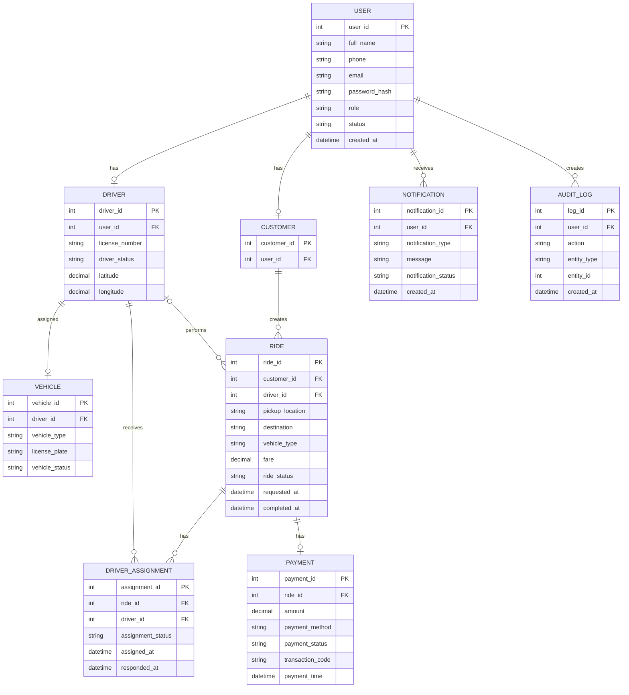

## 10.3. Mô tả các Entity

| Entity                | Mô tả                                                                 | Phạm vi      |
| --------------------- | --------------------------------------------------------------------- | ------------ |
| **USER**              | Lưu tài khoản, thông tin đăng nhập, vai trò và trạng thái người dùng. | MVP          |
| **CUSTOMER**          | Lưu thông tin riêng của khách hàng.                                   | MVP          |
| **DRIVER**            | Lưu thông tin tài xế, trạng thái hoạt động và vị trí mô phỏng.        | MVP          |
| **VEHICLE**           | Lưu thông tin phương tiện của tài xế.                                 | MVP          |
| **RIDE**              | Lưu yêu cầu đặt xe và thông tin chuyến đi.                            | MVP          |
| **DRIVER_ASSIGNMENT** | Lưu lịch sử lựa chọn, phân công và phản hồi của tài xế.               | MVP          |
| **PAYMENT**           | Lưu số tiền, phương thức và trạng thái thanh toán.                    | MVP          |
| **NOTIFICATION**      | Lưu các thông báo được hiển thị trong hệ thống.                       | MVP          |
| **AUDIT_LOG**         | Lưu các thao tác quản trị và can thiệp quan trọng.                    | MVP          |
| **RATING**            | Lưu đánh giá của khách hàng đối với chuyến đi/tài xế.                 | Future Scope |

---

## 10.4. Quy tắc quan hệ chính

| Quan hệ                    | Cardinality | Mô tả                                                     |
| -------------------------- | ----------- | --------------------------------------------------------- |
| USER – CUSTOMER            | 1 : 0..1    | Một tài khoản có thể có tối đa một hồ sơ khách hàng.      |
| USER – DRIVER              | 1 : 0..1    | Một tài khoản có thể có tối đa một hồ sơ tài xế.          |
| DRIVER – VEHICLE           | 1 : 0..1    | Một tài xế có tối đa một phương tiện trong MVP.           |
| CUSTOMER – RIDE            | 1 : N       | Một khách hàng có thể tạo nhiều chuyến theo thời gian.    |
| DRIVER – RIDE              | 1 : N       | Một tài xế có thể thực hiện nhiều chuyến theo thời gian.  |
| RIDE – DRIVER_ASSIGNMENT   | 1 : N       | Một chuyến có thể có nhiều lần phân công tài xế.          |
| DRIVER – DRIVER_ASSIGNMENT | 1 : N       | Một tài xế có thể nhận nhiều yêu cầu theo thời gian.      |
| RIDE – PAYMENT             | 1 : 0..1    | Một chuyến có tối đa một thanh toán chính thức trong MVP. |
| USER – NOTIFICATION        | 1 : N       | Một người dùng có thể nhận nhiều thông báo.               |
| USER – AUDIT_LOG           | 1 : N       | Một người dùng có thể tạo nhiều nhật ký hoạt động.        |

### Quy tắc đối với `RIDE.driver_id`

`RIDE.driver_id` lưu **Tài xế được xác nhận cuối cùng để thực hiện chuyến**.

Trong quá trình tìm kiếm và phân công:

```text
RIDE
  ↓
DRIVER_ASSIGNMENT
  ├── Driver A → Rejected
  ├── Driver B → Rejected
  └── Driver C → Accepted
                    ↓
              RIDE.driver_id = Driver C
```

Như vậy:

* `DRIVER_ASSIGNMENT` lưu **lịch sử quá trình phân công**.
* `RIDE.driver_id` lưu **Tài xế thực hiện chuyến cuối cùng**.

Cách thiết kế này giúp hệ thống vừa biết tài xế hiện tại, vừa có thể tra cứu lịch sử phân công.

---

## 10.5. Mapping Entity với Functional Requirements

Mapping được xây dựng theo **21 Functional Requirements** đã xác định ở Section 7.

| Entity                | Functional Requirements                                                     |
| --------------------- | --------------------------------------------------------------------------- |
| **USER**              | FR-01, FR-02, FR-03, FR-21                                                  |
| **CUSTOMER**          | FR-01, FR-03, FR-04, FR-05, FR-12, FR-19                                    |
| **DRIVER**            | FR-02, FR-03, FR-06, FR-07, FR-08, FR-09, FR-11, FR-12, FR-13               |
| **VEHICLE**           | FR-03, FR-07, FR-08, FR-12                                                  |
| **RIDE**              | FR-04, FR-05, FR-08, FR-09, FR-10, FR-11, FR-12, FR-13, FR-14, FR-15, FR-19 |
| **DRIVER_ASSIGNMENT** | FR-08, FR-09, FR-10                                                         |
| **PAYMENT**           | FR-14, FR-15, FR-16                                                         |
| **NOTIFICATION**      | FR-17                                                                       |
| **AUDIT_LOG**         | FR-21                                                                       |

> `RATING` chưa được mapping với Functional Requirements của MVP vì chức năng đánh giá được đưa vào Future Scope.

---

## 10.6. Nguyên tắc thiết kế dữ liệu

* Mỗi Entity có một **Primary Key (PK)** duy nhất.
* Các quan hệ giữa Entity được thực hiện thông qua **Foreign Key (FK)**.
* `USER.role` được sử dụng để phân biệt Customer, Driver, Operation Staff, Administrator và Management.
* Mật khẩu phải được lưu dưới dạng **băm**, không lưu dạng văn bản thuần.
* Không lưu thông tin thẻ hoặc dữ liệu thanh toán nhạy cảm.
* `DRIVER_ASSIGNMENT` được sử dụng để lưu lịch sử phân công tài xế.
* `RIDE.driver_id` chỉ xác định tài xế thực hiện chuyến sau khi được xác nhận.
* Dữ liệu chuyến đi và thanh toán phải được lưu để phục vụ tra cứu và đối soát.
* Các thao tác quản trị và can thiệp quan trọng được lưu trong `AUDIT_LOG`.
* Dữ liệu phải đảm bảo tính toàn vẹn và hạn chế trùng lặp.
* Vị trí của Driver trong MVP chỉ là **dữ liệu vị trí được lưu/cập nhật mô phỏng**, không yêu cầu GPS thời gian thực.
* Không thiết kế riêng bảng cho GPS, Map, Payment Gateway hoặc Notification Service trong MVP.

## 10.7. Phạm vi dữ liệu MVP

### Các Entity bắt buộc

```text
USER
 ├── CUSTOMER
 └── DRIVER
       └── VEHICLE

CUSTOMER
   └── RIDE
          ├── DRIVER_ASSIGNMENT
          └── PAYMENT

USER
 ├── NOTIFICATION
 └── AUDIT_LOG
```

### Entity Future Scope

```text
RATING
GPS / DRIVER_LOCATION_HISTORY
PROMOTION
PAYMENT_GATEWAY
```

Các Entity Future Scope không cần triển khai trong phiên bản MVP của bài cá nhân 7 tuần.

## 10.8. Data Flow chính

```text
CUSTOMER
   ↓
RIDE
   ↓
DRIVER_ASSIGNMENT
   ↓
DRIVER
   ↓
VEHICLE
   ↓
RIDE Completed
   ↓
PAYMENT
   ↓
NOTIFICATION / HISTORY
```

Mô hình dữ liệu tập trung vào quy trình nghiệp vụ cốt lõi:

**Booking → Find Driver → Assignment → Trip → Fare → Payment → History**

Điều này giúp ERD phù hợp với phạm vi dự án cá nhân và hỗ trợ trực tiếp cho module trọng tâm **MVP-04 Dispatch & Trip Management**.

# 11. Use Case Diagram (Mô hình Use Case)

## 11.1. Tổng quan Actor

CAB System có các Actor chính sau:

| Actor               | Vai trò                                                                                                             |
| ------------------- | ------------------------------------------------------------------------------------------------------------------- |
| **Customer**        | Đăng ký, đăng nhập, đặt xe, theo dõi chuyến, thanh toán và xem lịch sử.                                             |
| **Driver**          | Đăng nhập, quản lý trạng thái, nhận/từ chối chuyến và cập nhật trạng thái chuyến.                                   |
| **Operation Staff** | Theo dõi chuyến, lựa chọn và phân công Tài xế, quản lý thông tin vận hành và xử lý trường hợp không phân công được. |
| **Administrator**   | Quản lý tài khoản, vai trò và quyền truy cập hệ thống.                                                              |
| **Management**      | Xem các báo cáo vận hành cơ bản.                                                                                    |

> **Lưu ý:** `Management` chỉ tham gia chức năng báo cáo, không cần tạo tài khoản nghiệp vụ riêng trong phạm vi mô hình dữ liệu nếu hệ thống sử dụng `USER.role`.

---

## 11.2. Use Case Diagram

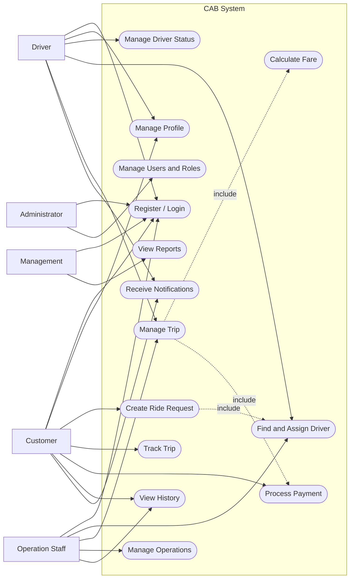

### Quy ước

* `Create Ride Request` bao gồm quá trình tìm và phân công Tài xế.
* `Manage Trip` bao gồm hoàn thành chuyến và tính cước.
* `Find and Assign Driver` xử lý các trường hợp Tài xế từ chối hoặc không có Tài xế phù hợp trong **Exception Flow**, không tách thành Use Case riêng.
* `Payment` được thực hiện sau khi chuyến hoàn thành và cước được tính.
* `Receive Notifications` là chức năng thông báo trong hệ thống, không bao gồm SMS/Email/Push.

---

## 11.3. Danh sách Use Case

| ID       | Use Case               | Actor chính                                                  | Mô tả                                                         | Priority     |
| -------- | ---------------------- | ------------------------------------------------------------ | ------------------------------------------------------------- | ------------ |
| **UC01** | Register / Login       | Customer, Driver, Operation Staff, Administrator, Management | Đăng ký, đăng nhập và đăng xuất hệ thống.                     | High         |
| **UC02** | Manage Profile         | Customer / Driver                                            | Xem và cập nhật thông tin cá nhân.                            | High         |
| **UC03** | Manage Driver Status   | Driver                                                       | Cập nhật trạng thái Available, Offline hoặc Busy.             | High         |
| **UC04** | Create Ride Request    | Customer                                                     | Nhập thông tin và tạo yêu cầu đặt xe.                         | High         |
| **UC05** | Find and Assign Driver | Operation Staff                                              | Tìm Tài xế phù hợp, lựa chọn và gửi yêu cầu nhận chuyến.      | **Critical** |
| **UC06** | Manage Trip            | Driver                                                       | Nhận chuyến và cập nhật trạng thái từ bắt đầu đến hoàn thành. | **Critical** |
| **UC07** | Track Trip             | Customer                                                     | Theo dõi thông tin Tài xế và trạng thái chuyến.               | High         |
| **UC08** | Calculate Fare         | System Process                                               | Tính cước dựa trên thông tin chuyến và quy tắc cước.          | High         |
| **UC09** | Process Payment        | Customer                                                     | Thanh toán bằng tiền mặt hoặc thanh toán điện tử mô phỏng.    | High         |
| **UC10** | View History           | Customer / Operation Staff                                   | Tra cứu lịch sử chuyến và thông tin thanh toán.               | High         |
| **UC11** | Receive Notifications  | Customer / Driver                                            | Nhận thông báo về các sự kiện quan trọng của chuyến.          | Medium       |
| **UC12** | Manage Operations      | Operation Staff                                              | Theo dõi chuyến, Tài xế và xử lý các trường hợp vận hành.     | Medium       |
| **UC13** | Manage Users and Roles | Administrator                                                | Quản lý tài khoản, vai trò và quyền truy cập.                 | High         |
| **UC14** | View Reports           | Management                                                   | Xem các báo cáo cơ bản về chuyến đi và doanh thu.             | Medium       |

---

## 11.4. Exception Flow chính

Các trường hợp ngoại lệ được mô hình hóa bên trong Use Case thay vì tạo quá nhiều Use Case nhỏ.

### UC05 – Find and Assign Driver

```text
Find suitable Driver
        ↓
Driver selected
        ↓
Send trip request
        ↓
Driver accepts?
   ┌────┴────┐
  Yes        No
   ↓          ↓
Assigned   Select another Driver
              ↓
        No suitable Driver?
              ↓
        Notify Customer
```

Các trường hợp:

* Tài xế từ chối → Operation Staff lựa chọn Tài xế khác.
* Không còn Tài xế phù hợp → ghi nhận không phân công được và thông báo Customer.
* Không yêu cầu hệ thống tự động timeout trong MVP.

### UC06 – Manage Trip

```text
Driver Accepted
      ↓
Arriving
      ↓
Picked Up
      ↓
In Progress
      ↓
Completed
```

Chỉ Tài xế được phân công mới có quyền cập nhật trạng thái thực hiện chuyến.

### UC09 – Process Payment

```text
Trip Completed
      ↓
Calculate Fare
      ↓
Payment
   ┌──┴──┐
 Cash  Electronic
       (Simulated)
      ↓
Payment Result
   ┌──┴──┐
 Paid  Failed
        ↓
      Retry
```

---

## 11.5. Mapping Use Case với Functional Requirements

Mapping được xây dựng theo **21 Functional Requirements** tại Section 7.

| Use Case                          | Functional Requirements |
| --------------------------------- | ----------------------- |
| **UC01 – Register / Login**       | FR-01, FR-02            |
| **UC02 – Manage Profile**         | FR-03                   |
| **UC03 – Manage Driver Status**   | FR-06                   |
| **UC04 – Create Ride Request**    | FR-04, FR-05            |
| **UC05 – Find and Assign Driver** | FR-08, FR-09, FR-10     |
| **UC06 – Manage Trip**            | FR-11, FR-13            |
| **UC07 – Track Trip**             | FR-12                   |
| **UC08 – Calculate Fare**         | FR-14                   |
| **UC09 – Process Payment**        | FR-15, FR-16            |
| **UC10 – View History**           | FR-19                   |
| **UC11 – Receive Notifications**  | FR-17                   |
| **UC12 – Manage Operations**      | FR-07, FR-18            |
| **UC13 – Manage Users and Roles** | FR-03, FR-21            |
| **UC14 – View Reports**           | FR-20                   |

### Coverage Check

| FR    | Use Case   |
| ----- | ---------- |
| FR-01 | UC01       |
| FR-02 | UC01       |
| FR-03 | UC02, UC13 |
| FR-04 | UC04       |
| FR-05 | UC04       |
| FR-06 | UC03       |
| FR-07 | UC12       |
| FR-08 | UC05       |
| FR-09 | UC05       |
| FR-10 | UC05       |
| FR-11 | UC06       |
| FR-12 | UC07       |
| FR-13 | UC06       |
| FR-14 | UC08       |
| FR-15 | UC09       |
| FR-16 | UC09       |
| FR-17 | UC11       |
| FR-18 | UC12       |
| FR-19 | UC10       |
| FR-20 | UC14       |
| FR-21 | UC13       |

> Tất cả **21 Functional Requirements** đều có ít nhất một Use Case tương ứng.

---

## 11.6. Use Case trọng tâm của dự án

Do dự án được thực hiện cá nhân trong 7 tuần, ba Use Case sau được xác định là trọng tâm:

| Use Case                          | Mức độ   | Lý do                                                     |
| --------------------------------- | -------- | --------------------------------------------------------- |
| **UC05 – Find and Assign Driver** | Critical | Là nghiệp vụ cốt lõi của Dispatch Management.             |
| **UC06 – Manage Trip**            | Critical | Quản lý toàn bộ trạng thái và quá trình thực hiện chuyến. |
| **UC04 – Create Ride Request**    | High     | Điểm bắt đầu của toàn bộ quy trình CAB.                   |

### Quy trình nghiệp vụ trọng tâm

```text
Customer
   ↓
UC04 Create Ride Request
   ↓
UC05 Find and Assign Driver
   ↓
UC06 Manage Trip
   ↓
UC08 Calculate Fare
   ↓
UC09 Process Payment
   ↓
UC10 View History
```

---

## 11.7. Phạm vi Use Case trong MVP

### Bao gồm

* Đăng ký và đăng nhập.
* Quản lý hồ sơ.
* Quản lý trạng thái Driver.
* Tạo Booking.
* Tìm và phân công Driver.
* Driver nhận/từ chối chuyến.
* Cập nhật trạng thái Trip.
* Hoàn thành Trip.
* Tính cước.
* Thanh toán mô phỏng.
* Theo dõi Trip.
* Thông báo trong hệ thống.
* Lịch sử chuyến.
* Quản lý vận hành.
* Quản lý tài khoản và quyền.
* Báo cáo cơ bản.

### Không bao gồm

* GPS thời gian thực.
* Tích hợp bản đồ.
* Tự động tìm Driver bằng AI/ML.
* Smart Dispatch.
* Dynamic Pricing.
* Payment Gateway thực tế.
* SMS/Email/Push Notification.
* Rating/Review.
* Promotion.
* Route Optimization.

Các chức năng trên thuộc **Future Scope** của CAB System.

# 12. Acceptance Criteria (Tiêu chí Chấp nhận)

Acceptance Criteria xác định các điều kiện để xác nhận Functional Requirements của CAB System đã được triển khai đúng và có thể nghiệm thu. Các tiêu chí tập trung vào phạm vi MVP của dự án cá nhân 7 tuần.

## 12.1. Quản lý Tài khoản

| ID       | Functional Requirement | Acceptance Criteria                                                              |
| -------- | ---------------------- | -------------------------------------------------------------------------------- |
| **AC01** | FR-01                  | Customer có thể đăng ký tài khoản khi nhập đầy đủ thông tin hợp lệ.              |
| **AC02** | FR-01                  | Hệ thống từ chối đăng ký nếu email hoặc số điện thoại đã tồn tại.                |
| **AC03** | FR-02                  | Người dùng đăng nhập thành công khi cung cấp thông tin xác thực hợp lệ.          |
| **AC04** | FR-02                  | Hệ thống từ chối thông tin đăng nhập không hợp lệ và hiển thị thông báo phù hợp. |
| **AC05** | FR-02                  | Tài khoản bị khóa không thể đăng nhập vào hệ thống.                              |
| **AC06** | FR-03                  | Customer và Driver có thể xem, cập nhật thông tin cá nhân theo quyền.            |
| **AC07** | FR-21                  | Người dùng không thể truy cập chức năng ngoài quyền được cấp.                    |

## 12.2. Quản lý Tài xế và Phương tiện

| ID       | Functional Requirement | Acceptance Criteria                                                    |
| -------- | ---------------------- | ---------------------------------------------------------------------- |
| **AC08** | FR-06                  | Driver có thể cập nhật trạng thái `Available`, `Offline` hoặc `Busy`.  |
| **AC09** | FR-06                  | Driver đang có chuyến thực hiện không được đồng thời nhận chuyến khác. |
| **AC10** | FR-07                  | Operation Staff có thể tạo và cập nhật thông tin Driver và Vehicle.    |
| **AC11** | FR-07                  | Chỉ Driver có hồ sơ và phương tiện hợp lệ mới được xem xét phân công.  |

## 12.3. Đặt xe

| ID       | Functional Requirement | Acceptance Criteria                                                                        |
| -------- | ---------------------- | ------------------------------------------------------------------------------------------ |
| **AC12** | FR-04                  | Customer có thể tạo Booking khi nhập đầy đủ điểm đón, điểm đến và loại xe.                 |
| **AC13** | FR-04                  | Booking được tạo thành công với mã chuyến duy nhất và trạng thái `Pending`.                |
| **AC14** | FR-04                  | Hệ thống không tạo Booking khi thiếu thông tin bắt buộc.                                   |
| **AC15** | FR-05                  | Customer có thể xem thông tin Booking và hủy chuyến khi vẫn còn trong trạng thái cho phép. |
| **AC16** | FR-05                  | Chuyến đã `Completed` không thể bị Customer hủy.                                           |

## 12.4. Tìm kiếm và Phân công Tài xế

| ID       | Functional Requirement | Acceptance Criteria                                                                                    |
| -------- | ---------------------- | ------------------------------------------------------------------------------------------------------ |
| **AC17** | FR-08                  | Hệ thống chỉ hiển thị Driver có trạng thái `Available` và loại xe phù hợp.                             |
| **AC18** | FR-08                  | Driver đang `Busy` không xuất hiện trong danh sách Driver có thể phân công.                            |
| **AC19** | FR-09                  | Operation Staff có thể lựa chọn Driver phù hợp và gửi yêu cầu chuyến.                                  |
| **AC20** | FR-09                  | Khi Driver chấp nhận, hệ thống ghi nhận Driver được xác nhận cho chuyến.                               |
| **AC21** | FR-09                  | Khi Driver từ chối, Operation Staff có thể lựa chọn Driver phù hợp khác.                               |
| **AC22** | FR-10                  | Khi không còn Driver phù hợp, hệ thống ghi nhận trường hợp không phân công được và thông báo Customer. |
| **AC23** | FR-10                  | Customer không cần tạo lại Booking chỉ vì Driver đầu tiên từ chối.                                     |

> **Lưu ý:** MVP không yêu cầu hệ thống tự động chọn Driver gần nhất bằng GPS. Dữ liệu vị trí chỉ được sử dụng như thông tin hỗ trợ nếu cần.

## 12.5. Quản lý Chuyến đi

| ID       | Functional Requirement | Acceptance Criteria                                                                      |
| -------- | ---------------------- | ---------------------------------------------------------------------------------------- |
| **AC24** | FR-11                  | Trip phải tuân thủ trình tự trạng thái đã định nghĩa trong SRS.                          |
| **AC25** | FR-11                  | Hệ thống từ chối việc chuyển Trip sang trạng thái không hợp lệ.                          |
| **AC26** | FR-11                  | Chỉ Driver được phân công mới có quyền cập nhật trạng thái thực hiện Trip.               |
| **AC27** | FR-12                  | Customer có thể xem mã Trip, điểm đón, điểm đến, Driver, Vehicle và trạng thái hiện tại. |
| **AC28** | FR-13                  | Driver được phân công có thể xác nhận hoàn thành khi Trip đang ở trạng thái hợp lệ.      |
| **AC29** | FR-13                  | Khi Trip hoàn thành, hệ thống lưu thời gian hoàn thành và chuyển sang bước tính cước.    |
| **AC30** | FR-13                  | Trip đã `Completed` không thể chuyển ngược về trạng thái thực hiện.                      |

### Trình tự trạng thái nghiệm thu

```text
Pending
   ↓
Searching Driver
   ↓
Driver Assigned
   ↓
Driver Accepted
   ↓
Arriving
   ↓
Picked Up
   ↓
In Progress
   ↓
Completed
```

## 12.6. Tính cước và Thanh toán

| ID       | Functional Requirement | Acceptance Criteria                                                                |
| -------- | ---------------------- | ---------------------------------------------------------------------------------- |
| **AC31** | FR-14                  | Hệ thống chỉ tính cước sau khi Trip ở trạng thái `Completed`.                      |
| **AC32** | FR-14                  | Số tiền cước được tính theo quy tắc cước đã định nghĩa và được lưu với Trip.       |
| **AC33** | FR-15                  | Customer có thể lựa chọn `Cash` hoặc `Electronic` (mô phỏng).                      |
| **AC34** | FR-15                  | Thanh toán thành công được cập nhật trạng thái `Paid`.                             |
| **AC35** | FR-16                  | Giao dịch thất bại được ghi nhận với trạng thái `Failed`.                          |
| **AC36** | FR-16                  | Customer có thể thực hiện lại giao dịch điện tử khi thanh toán thất bại.           |
| **AC37** | FR-16                  | Hệ thống lưu mã giao dịch mô phỏng, số tiền, phương thức và trạng thái thanh toán. |
| **AC38** | FR-16                  | Hệ thống không lưu thông tin thẻ hoặc dữ liệu thanh toán nhạy cảm.                 |

## 12.7. Thông báo

| ID       | Functional Requirement | Acceptance Criteria                                                                     |
| -------- | ---------------------- | --------------------------------------------------------------------------------------- |
| **AC39** | FR-17                  | Customer nhận được thông báo khi Booking được tạo thành công.                           |
| **AC40** | FR-17                  | Driver nhận được thông báo khi có yêu cầu chuyến mới.                                   |
| **AC41** | FR-17                  | Customer nhận được thông báo khi Driver được xác nhận hoặc Trip có thay đổi quan trọng. |
| **AC42** | FR-17                  | Customer nhận được thông báo về kết quả thanh toán.                                     |
| **AC43** | FR-17                  | Khi không có Driver phù hợp, Customer nhận được thông báo tương ứng.                    |

> Thông báo trong MVP chỉ được hiển thị trong hệ thống; SMS, Email và Push Notification thuộc Future Scope.

## 12.8. Quản lý Vận hành và Lịch sử

| ID       | Functional Requirement | Acceptance Criteria                                                               |
| -------- | ---------------------- | --------------------------------------------------------------------------------- |
| **AC44** | FR-18                  | Operation Staff có thể xem danh sách Trip và lọc theo trạng thái.                 |
| **AC45** | FR-18                  | Operation Staff có thể xem trạng thái Driver và xử lý việc phân công lại khi cần. |
| **AC46** | FR-19                  | Customer có thể xem lịch sử các Trip của chính mình.                              |
| **AC47** | FR-19                  | Lịch sử hiển thị các thông tin chính như Trip, Driver, Fare và Payment Status.    |
| **AC48** | FR-19                  | Operation Staff có thể tìm kiếm và tra cứu lịch sử Trip theo quyền.               |

## 12.9. Báo cáo

| ID       | Functional Requirement | Acceptance Criteria                                                                               |
| -------- | ---------------------- | ------------------------------------------------------------------------------------------------- |
| **AC49** | FR-20                  | Management có thể xem tổng số Trip và số Trip `Completed`, `Cancelled` hoặc không phân công được. |
| **AC50** | FR-20                  | Báo cáo hiển thị doanh thu dựa trên các giao dịch đã ghi nhận.                                    |
| **AC51** | FR-20                  | Management có thể lọc báo cáo theo khoảng thời gian.                                              |

## 12.10. Phi chức năng

| ID       | NFR         | Acceptance Criteria                                                                                        |
| -------- | ----------- | ---------------------------------------------------------------------------------------------------------- |
| **AC52** | NFR01       | Các thao tác thông thường có thời gian phản hồi mục tiêu không quá 3 giây trong điều kiện tải bình thường. |
| **AC53** | NFR06–NFR07 | Người dùng phải đăng nhập và được kiểm tra quyền; mật khẩu không được lưu dạng văn bản thuần.              |
| **AC54** | NFR03–NFR05 | Hệ thống xử lý lỗi rõ ràng và không cho phép dữ liệu hoặc trạng thái Trip bị sai lệch.                     |
| **AC55** | NFR14–NFR16 | Giao diện dễ sử dụng, responsive và hiển thị thông báo rõ ràng.                                            |
| **AC56** | NFR17       | Hệ thống hoạt động trên Chrome, Edge và Firefox.                                                           |
| **AC57** | NFR19–NFR20 | Dữ liệu quan trọng có thể được sao lưu và khôi phục khi cần.                                               |
| **AC58** | NFR21–NFR23 | Các chức năng chính có thể được kiểm thử độc lập và theo luồng nghiệp vụ hoàn chỉnh.                       |

## 12.11. Điều kiện nghiệm thu MVP

CAB System được xem là đạt nghiệm thu MVP khi:

1. Các Functional Requirements **FR-01 đến FR-21** được triển khai trong phạm vi MVP.
2. Các Acceptance Criteria liên quan được kiểm thử và đáp ứng.
3. Người dùng chỉ truy cập được các chức năng phù hợp với vai trò.
4. Quy trình nghiệp vụ chính hoạt động hoàn chỉnh:

```text
Create Booking
      ↓
Find Driver
      ↓
Assign Driver
      ↓
Driver Accept
      ↓
Manage Trip
      ↓
Complete Trip
      ↓
Calculate Fare
      ↓
Payment
      ↓
Save History
```

5. Các trường hợp ngoại lệ chính được xử lý:

   * Driver từ chối.
   * Không có Driver phù hợp.
   * Customer hủy chuyến trong trạng thái cho phép.
   * Thanh toán thất bại.
   * Cập nhật Trip sai trạng thái.
   * Người dùng truy cập chức năng không có quyền.

6. Các chức năng **GPS realtime, Map Integration, Online Payment thực tế, Notification Service, Smart Dispatch, Dynamic Pricing, Promotion và Rating** không phải điều kiện nghiệm thu của MVP.
# 13. Traceability Matrix (Bảng Truy vết Nghiệp vụ & Kỹ thuật)

## 13.1. Mục đích

Traceability Matrix được sử dụng để đảm bảo các yêu cầu của hệ thống được liên kết xuyên suốt từ mục tiêu nghiệp vụ đến chức năng và kiểm thử.

Ma trận truy vết chính của CAB System liên kết:

* Business Goal (BG).
* Business Requirement (BR).
* Functional Requirement (FR).
* Business Rule (BRULE).
* Use Case (UC).
* Acceptance Criteria (AC).

Đối với dự án cá nhân trong 7 tuần, Traceability Matrix được xây dựng ở mức vừa đủ để:

* Kiểm tra yêu cầu có bị bỏ sót hay không.
* Đảm bảo Business Requirement được triển khai thành Functional Requirement.
* Đảm bảo Functional Requirement có Use Case và Acceptance Criteria tương ứng.
* Hỗ trợ kiểm thử và nghiệm thu.
* Kiểm soát phạm vi MVP, tránh phát sinh yêu cầu ngoài khả năng triển khai.

---

## 13.2. Traceability Matrix Tổng thể

| Business Goal                               | Business Requirement                     | Functional Requirement                                 | Use Case                           | Acceptance Criteria                        |
| ------------------------------------------- | ---------------------------------------- | ------------------------------------------------------ | ---------------------------------- | ------------------------------------------ |
| **BG-01 – Tự động hóa đặt và điều phối**    | BR-03, BR-04, BR-05, BR-06               | FR-04, FR-08, FR-09, FR-10, FR-11, FR-13               | UC04, UC05, UC06                   | AC12–AC30                                  |
| **BG-02 – Nâng cao trải nghiệm khách hàng** | BR-01, BR-03, BR-06, BR-08, BR-09, BR-11 | FR-01, FR-02, FR-04, FR-05, FR-12, FR-13, FR-17, FR-19 | UC01, UC04, UC06, UC07, UC10, UC11 | AC01–AC06, AC12–AC16, AC27–AC30, AC39–AC48 |
| **BG-03 – Nâng cao hiệu quả vận hành**      | BR-02, BR-04, BR-05, BR-06, BR-10        | FR-03, FR-06, FR-07, FR-08, FR-09, FR-11, FR-18        | UC03, UC05, UC06, UC12             | AC08–AC11, AC17–AC30, AC44–AC45            |
| **BG-04 – Tối ưu hóa phân công Tài xế**     | BR-04, BR-05                             | FR-06, FR-07, FR-08, FR-09, FR-10                      | UC05, UC12                         | AC17–AC23, AC44–AC45                       |
| **BG-05 – Quản lý cước và thanh toán**      | BR-07, BR-08                             | FR-14, FR-15, FR-16                                    | UC08, UC09                         | AC31–AC38                                  |
| **BG-06 – Hỗ trợ quản lý và kiểm soát**     | BR-10, BR-11, BR-12                      | FR-18, FR-19, FR-20, FR-21                             | UC10, UC12, UC13, UC14             | AC44–AC58                                  |

> **Lưu ý:** Một yêu cầu có thể phục vụ nhiều Business Goal. Điều này là bình thường trong Traceability Matrix.

---

## 13.3. Traceability Matrix – Business Requirement → Functional Requirement

| Business Requirement                     | Functional Requirements    | Use Case               |
| ---------------------------------------- | -------------------------- | ---------------------- |
| **BR-01 – Quản lý tài khoản Khách hàng** | FR-01, FR-02, FR-03        | UC01, UC02             |
| **BR-02 – Quản lý Tài xế**               | FR-02, FR-03, FR-06, FR-07 | UC01, UC02, UC03, UC12 |
| **BR-03 – Tạo yêu cầu đặt xe**           | FR-04, FR-05               | UC04                   |
| **BR-04 – Tìm kiếm Tài xế phù hợp**      | FR-08                      | UC05                   |
| **BR-05 – Phân công Tài xế**             | FR-09, FR-10               | UC05                   |
| **BR-06 – Quản lý chuyến đi**            | FR-11, FR-12, FR-13        | UC06, UC07             |
| **BR-07 – Tính cước**                    | FR-14                      | UC08                   |
| **BR-08 – Thanh toán**                   | FR-15, FR-16               | UC09                   |
| **BR-09 – Thông báo trạng thái**         | FR-17                      | UC11                   |
| **BR-10 – Quản lý vận hành**             | FR-18                      | UC12                   |
| **BR-11 – Quản lý lịch sử**              | FR-19                      | UC10                   |
| **BR-12 – Phân quyền và bảo mật**        | FR-21                      | UC13                   |

---

## 13.4. Traceability Matrix – Functional Requirement → Acceptance Criteria

| Functional Requirement                       | Acceptance Criteria          |
| -------------------------------------------- | ---------------------------- |
| **FR-01 – Đăng ký tài khoản**                | AC01, AC02                   |
| **FR-02 – Đăng nhập và đăng xuất**           | AC03, AC04, AC05             |
| **FR-03 – Quản lý hồ sơ**                    | AC06, AC07                   |
| **FR-04 – Tạo yêu cầu đặt xe**               | AC12, AC13, AC14             |
| **FR-05 – Xem và hủy yêu cầu**               | AC15, AC16                   |
| **FR-06 – Quản lý trạng thái Tài xế**        | AC08, AC09                   |
| **FR-07 – Quản lý Tài xế và phương tiện**    | AC10, AC11                   |
| **FR-08 – Tìm Tài xế phù hợp**               | AC17, AC18                   |
| **FR-09 – Gửi yêu cầu và phân công Tài xế**  | AC19, AC20, AC21             |
| **FR-10 – Xử lý không có Tài xế**            | AC22, AC23                   |
| **FR-11 – Cập nhật trạng thái chuyến**       | AC24, AC25, AC26             |
| **FR-12 – Theo dõi thông tin chuyến**        | AC27                         |
| **FR-13 – Hoàn thành chuyến**                | AC28, AC29, AC30             |
| **FR-14 – Tính cước**                        | AC31, AC32                   |
| **FR-15 – Thanh toán**                       | AC33, AC34                   |
| **FR-16 – Xử lý kết quả thanh toán**         | AC35, AC36, AC37, AC38       |
| **FR-17 – Thông báo trong hệ thống**         | AC39, AC40, AC41, AC42, AC43 |
| **FR-18 – Quản lý vận hành**                 | AC44, AC45                   |
| **FR-19 – Quản lý lịch sử**                  | AC46, AC47, AC48             |
| **FR-20 – Báo cáo cơ bản**                   | AC49, AC50, AC51             |
| **FR-21 – Phân quyền và kiểm soát truy cập** | AC07, AC53                   |

---

## 13.5. Traceability Matrix – Business Rule → Functional Requirement

| Business Rule                                                                               | Functional Requirements |
| ------------------------------------------------------------------------------------------- | ----------------------- |
| **BRULE01 – Tài khoản duy nhất**                                                            | FR-01                   |
| **BRULE02 – Vai trò người dùng**                                                            | FR-02, FR-21            |
| **BRULE03 – Kiểm soát quyền theo vai trò**                                                  | FR-21                   |
| **BRULE04 – Tài khoản bị khóa không được đăng nhập**                                        | FR-02, FR-21            |
| **BRULE05 – Hồ sơ Tài xế và phương tiện hợp lệ**                                            | FR-07, FR-08            |
| **BRULE06 – Thông tin đặt xe bắt buộc**                                                     | FR-04                   |
| **BRULE07 – Không tạo chuyến mới khi đang có chuyến chưa hoàn thành**                       | FR-04                   |
| **BRULE08 – Chỉ Tài xế Available mới được xem xét phân công**                               | FR-06, FR-08            |
| **BRULE09 – Operation Staff chọn Tài xế từ danh sách phù hợp**                              | FR-08, FR-09            |
| **BRULE10 – Tài xế từ chối thì có thể chọn Tài xế khác**                                    | FR-09                   |
| **BRULE11 – Không có Tài xế phù hợp**                                                       | FR-10                   |
| **BRULE12 – Chuyến đi phải tuân thủ trình tự trạng thái**                                   | FR-11                   |
| **BRULE13 – Chỉ Tài xế được phân công mới được cập nhật trạng thái chuyến**                 | FR-11                   |
| **BRULE14 – Chỉ chuyến hợp lệ mới được hoàn thành**                                         | FR-13                   |
| **BRULE15 – Chuyến Completed không được quay lại trạng thái trước**                         | FR-11, FR-13            |
| **BRULE16 – Chuyến hoàn thành phải được lưu lịch sử**                                       | FR-13, FR-19            |
| **BRULE17 – Chỉ tính cước sau khi chuyến hoàn thành**                                       | FR-14                   |
| **BRULE18 – Hỗ trợ Cash và Electronic Payment mô phỏng**                                    | FR-15                   |
| **BRULE19 – Thanh toán hợp lệ chuyển sang Paid**                                            | FR-15, FR-16            |
| **BRULE20 – Thanh toán thất bại phải được ghi nhận**                                        | FR-16                   |
| **BRULE21 – Không lưu dữ liệu thanh toán nhạy cảm**                                         | FR-16                   |
| **BRULE22 – Thông báo được hiển thị trong hệ thống**                                        | FR-17                   |
| **BRULE23 – Tài xế nhận thông báo yêu cầu chuyến**                                          | FR-17                   |
| **BRULE24 – Operation Staff được thực hiện nghiệp vụ vận hành**                             | FR-18                   |
| **BRULE25 – Các trường hợp không có Tài xế phải được xử lý**                                | FR-10, FR-18            |
| **BRULE26 – Lịch sử chuyến và thanh toán phải được lưu**                                    | FR-19                   |
| **BRULE27 – Các thao tác quan trọng được ghi nhận khi chức năng Audit Log được triển khai** | FR-21                   |

---

## 13.6. Coverage

| Thành phần                  | Tổng số | Được truy vết | Coverage |
| --------------------------- | ------: | ------------: | -------: |
| Business Goals              |       6 |             6 | **100%** |
| Business Requirements       |      12 |            12 | **100%** |
| Functional Requirements     |      21 |            21 | **100%** |
| Business Rules              |      27 |            27 | **100%** |
| Use Cases                   |      14 |            14 | **100%** |
| Acceptance Criteria         |     58* |           58* | **100%** |
| Non-Functional Requirements |      23 |            23 | **100%** |

* Tổng số 58 Acceptance Criteria (AC01–AC58) đã khớp với danh sách chi tiết tại Section 12.

---

## 13.7. Kiểm soát phạm vi truy vết

Traceability Matrix của CAB System tập trung vào phạm vi MVP và không bắt buộc truy vết các chức năng thuộc Future Scope.

Các chức năng sau được loại khỏi phạm vi MVP:

* GPS thời gian thực.
* Tích hợp bản đồ.
* Smart Dispatch.
* Dynamic Pricing.
* Payment Gateway thực tế.
* SMS/Email/Push Notification.
* Promotion.
* Driver Rating.
* Route Optimization.
* Kiến trúc Microservices hoặc Distributed System.

Việc giới hạn phạm vi giúp đảm bảo các yêu cầu trong Traceability Matrix có khả năng được triển khai, kiểm thử và nghiệm thu trong thời gian **7 tuần của dự án cá nhân**.

---

## 13.8. Kết luận

Traceability Matrix giúp đảm bảo tính nhất quán của SRS thông qua chuỗi:

**Business Goal → Business Requirement → Functional Requirement → Business Rule → Use Case → Acceptance Criteria**

Trong phạm vi CAB System:

* Các Business Goal được chuyển thành các Business Requirement cụ thể.
* Các Business Requirement được triển khai thông qua Functional Requirement.
* Business Rule kiểm soát hành vi và điều kiện nghiệp vụ.
* Use Case mô hình hóa cách Actor tương tác với hệ thống.
* Acceptance Criteria được sử dụng làm cơ sở kiểm thử và nghiệm thu.
* Coverage được sử dụng để phát hiện yêu cầu chưa được truy vết.
* Các chức năng ngoài phạm vi MVP được tách sang Future Scope.

Cấu trúc này phù hợp với một **dự án BA cá nhân trong 7 tuần**, vừa thể hiện được tư duy phân tích và quản lý yêu cầu, vừa tránh mở rộng phạm vi vượt quá khả năng triển khai.

