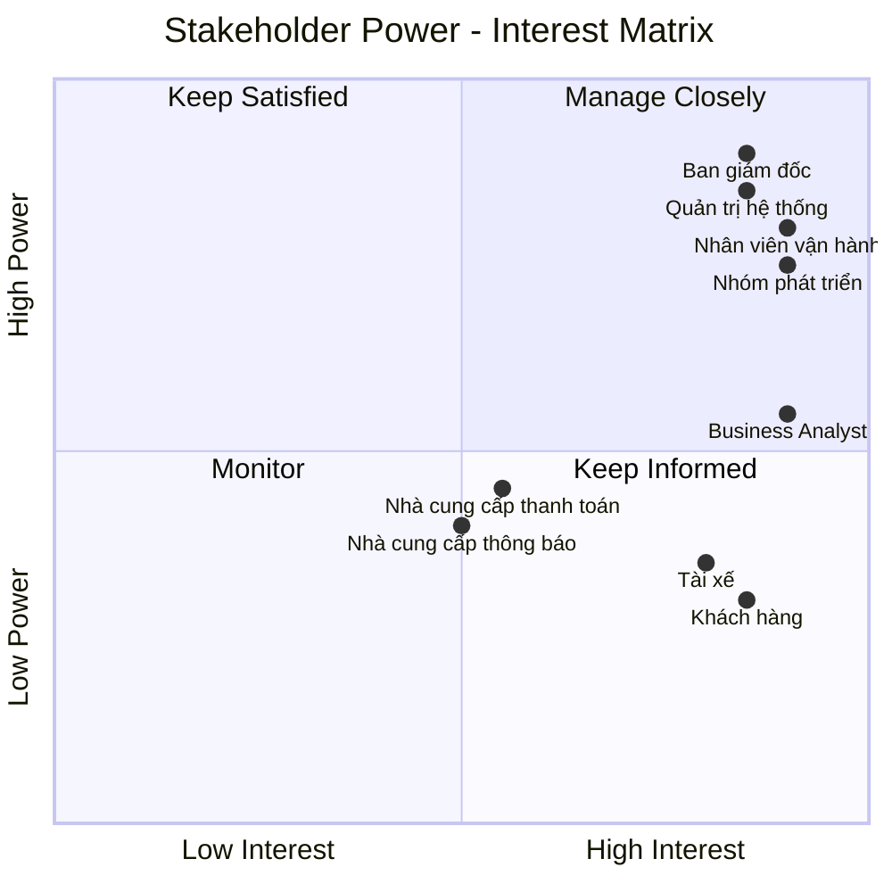
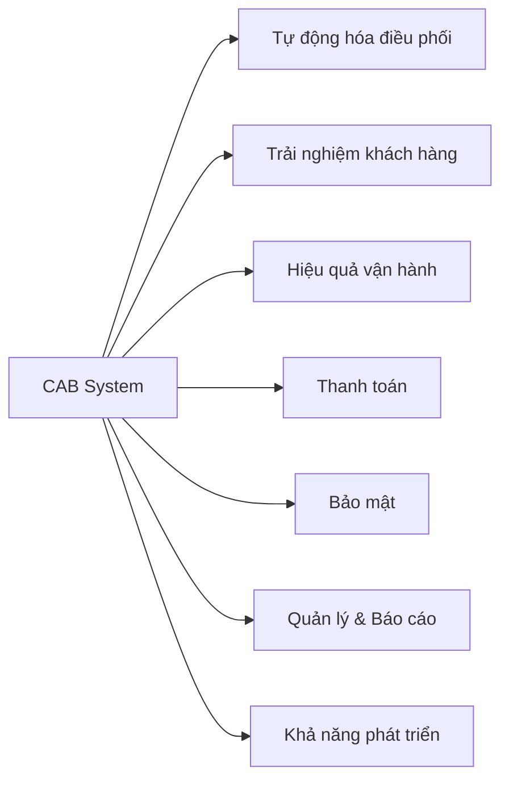
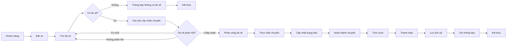
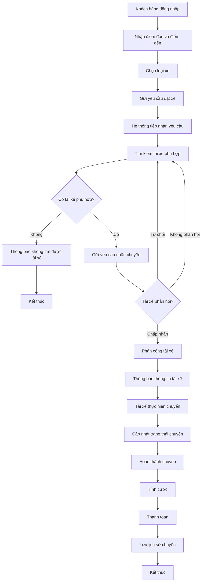
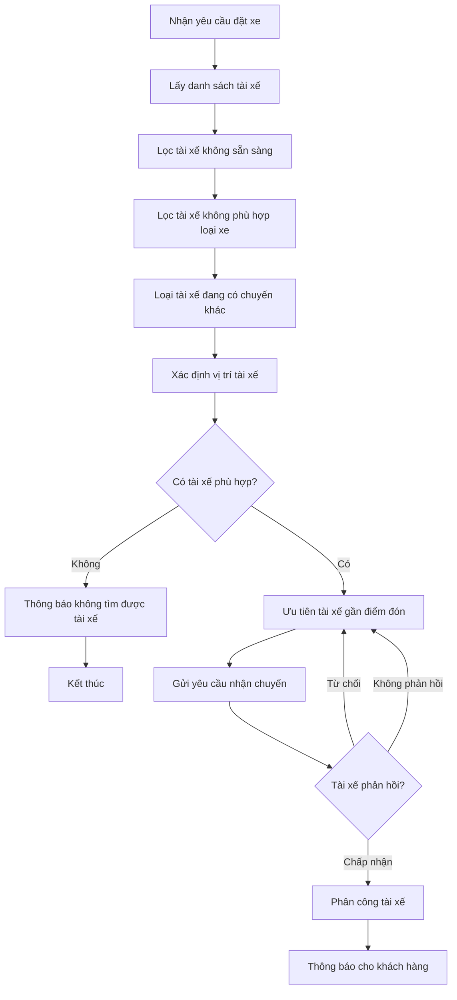
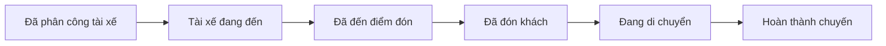
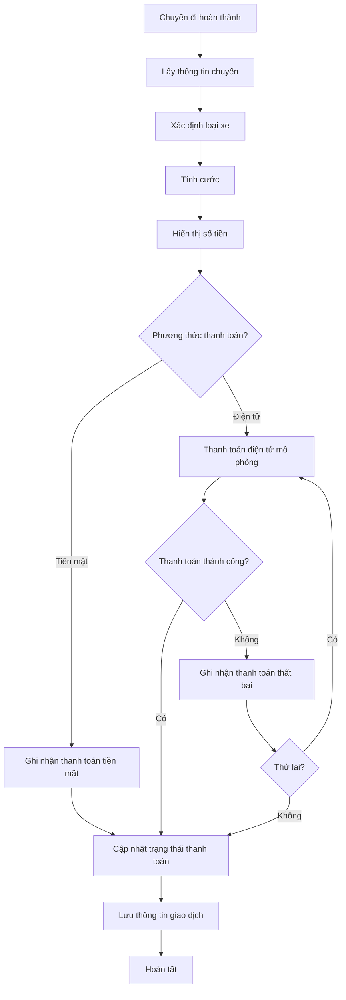
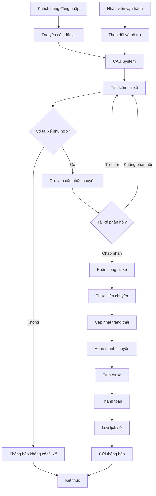
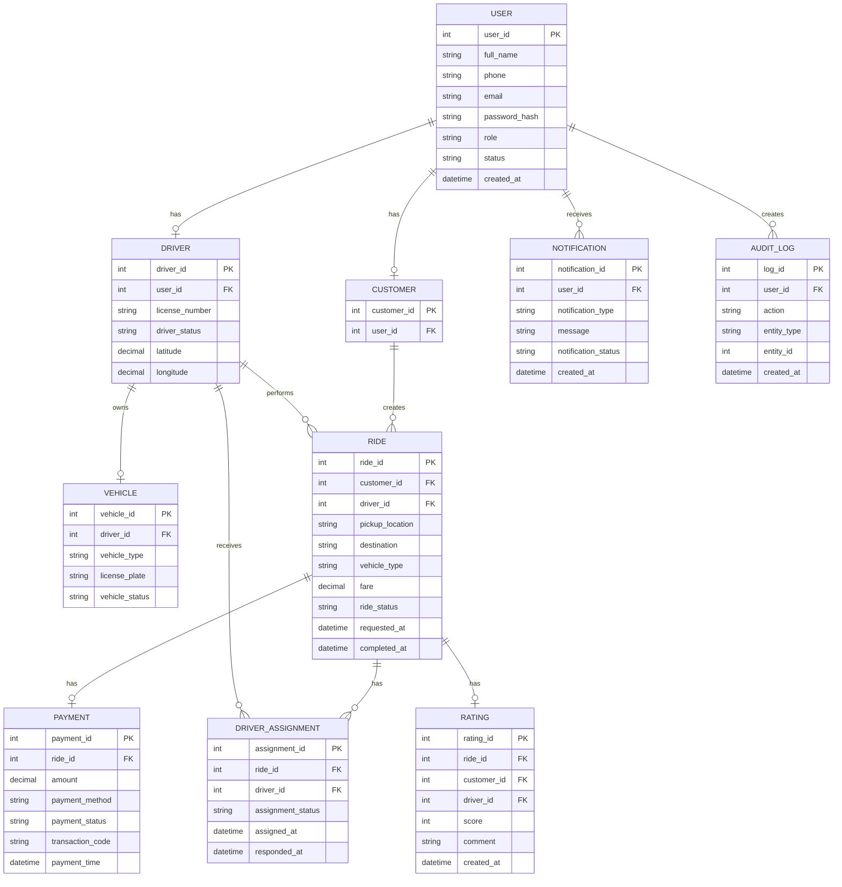
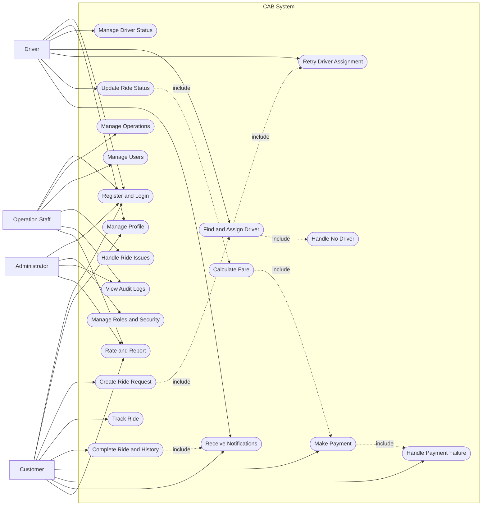

# Software Requirements Specification (SRS) - CAB System
## 1. Stakeholder List & Roles

| STT | Stakeholder | Vai trò | Mối quan tâm / Trách nhiệm chính |
|---|---|---|---|
| 1 | **Khách hàng (Customer)** | Người sử dụng dịch vụ đặt xe | Đăng ký, đăng nhập, đặt xe, theo dõi chuyến đi, thanh toán, xem lịch sử và đánh giá tài xế |
| 2 | **Tài xế (Driver)** | Người cung cấp dịch vụ vận chuyển | Nhận/từ chối chuyến, cập nhật trạng thái chuyến, cập nhật vị trí và thông tin phương tiện |
| 3 | **Nhân viên vận hành (Operation Staff)** | Quản lý hoạt động hằng ngày | Theo dõi chuyến đi, tài xế, khách hàng; hỗ trợ xử lý chuyến lỗi và điều phối khi cần |
| 4 | **Quản trị viên (Administrator)** | Quản trị hệ thống | Quản lý tài khoản, phân quyền, cấu hình hệ thống và kiểm soát các thao tác nhạy cảm |
| 5 | **Ban giám đốc (Management)** | Chủ sở hữu và người ra quyết định | Theo dõi doanh thu, số lượng chuyến, tỷ lệ hoàn thành, tỷ lệ hủy và hiệu quả hoạt động |
| 6 | **Nhà cung cấp thanh toán (Payment Provider)** | Hệ thống bên ngoài | Xử lý thanh toán điện tử và trả kết quả giao dịch thành công hoặc thất bại |
| 7 | **Nhà cung cấp thông báo (Notification Provider)** | Hệ thống bên ngoài | Gửi thông báo cho khách hàng và tài xế qua SMS, Email hoặc Push Notification |
| 8 | **Business Analyst (BA)** | Phân tích nghiệp vụ | Thu thập yêu cầu, xác định phạm vi, quy trình nghiệp vụ, Business Rules và làm rõ các yêu cầu chưa xác định |
| 9 | **Development Team** | Xây dựng hệ thống | Thiết kế, lập trình, kiểm thử và triển khai các chức năng của CAB System |
| 10 | **IT/DevOps Team** | Vận hành hạ tầng kỹ thuật | Đảm bảo hệ thống ổn định, có khả năng mở rộng, giám sát và xử lý sự cố |

## 2. Stakeholder Matrix


## 3. Business Goals (Mục tiêu Kinh doanh)

Các mục tiêu kinh doanh của CAB System được xác định nhằm giải quyết những hạn chế của quy trình đặt xe hiện tại, nâng cao hiệu quả vận hành và cải thiện trải nghiệm của khách hàng. Các mục tiêu được ưu tiên theo phạm vi của phiên bản MVP và khả năng triển khai trong thời gian 7 tuần.

| ID | Business Goal | Mục tiêu |
|---|---|---|
| BG-01 | Tự động hóa điều phối | Giảm công việc phân công tài xế thủ công bằng cách tự động tìm kiếm và lựa chọn tài xế phù hợp cho yêu cầu đặt xe. |
| BG-02 | Nâng cao trải nghiệm khách hàng | Giúp khách hàng đặt xe, theo dõi trạng thái chuyến đi, xem thông tin tài xế và nhận thông báo thuận tiện. |
| BG-03 | Tăng hiệu quả vận hành | Hỗ trợ nhân viên vận hành quản lý khách hàng, tài xế, phương tiện và chuyến đi tập trung trên một hệ thống. |
| BG-04 | Tối ưu hóa phân công tài xế | Ưu tiên tài xế phù hợp và gần điểm đón, đồng thời tự động tìm tài xế khác khi tài xế từ chối hoặc không phản hồi. |
| BG-05 | Quản lý thanh toán tập trung | Quản lý thông tin cước và trạng thái thanh toán của chuyến đi, đồng thời hạn chế lưu trữ dữ liệu thanh toán nhạy cảm. |
| BG-06 | Đảm bảo tính liên tục của hệ thống | Đảm bảo các lỗi tại chức năng thanh toán, thông báo hoặc một thành phần riêng lẻ không làm gián đoạn toàn bộ quy trình đặt xe. |
| BG-07 | Khả năng mở rộng | Thiết kế hệ thống theo hướng có thể bổ sung thêm chức năng, loại xe và phương thức thanh toán trong các phiên bản tiếp theo. |
| BG-08 | Tăng cường bảo mật | Bảo vệ thông tin tài khoản, thông tin khách hàng, tài xế và dữ liệu giao dịch thông qua xác thực và phân quyền truy cập. |
| BG-09 | Hỗ trợ ra quyết định | Cung cấp các báo cáo cơ bản về số lượng chuyến, doanh thu, trạng thái chuyến và hiệu quả hoạt động để hỗ trợ quản lý. |
| BG-10 | Khả năng phát triển lâu dài | Xây dựng hệ thống có cấu trúc rõ ràng để thuận lợi cho việc bảo trì và phát triển thêm chức năng trong tương lai. |
| BG-11 | Nâng cao khả năng kiểm soát | Lưu lại các thông tin và thao tác quan trọng để hỗ trợ tra cứu, kiểm tra và xử lý sự cố. |
| BG-12 | Đảm bảo khả năng triển khai MVP | Tập trung triển khai các chức năng cốt lõi của hệ thống trong thời gian 7 tuần, ưu tiên hoàn thành quy trình đặt xe từ đầu đến cuối. |

### 3.1. Business Goals Prioritization

| Priority | Business Goals | Mô tả |
|---|---|---|
| **High** | BG-01, BG-02, BG-03, BG-04, BG-05, BG-06, BG-08 | Các mục tiêu cốt lõi trực tiếp phục vụ quy trình đặt xe, vận hành, thanh toán và bảo mật. |
| **Medium** | BG-07, BG-09, BG-11 | Các mục tiêu hỗ trợ khả năng quản lý, báo cáo và phát triển hệ thống. |
| **Low** | BG-10, BG-12 | Các mục tiêu định hướng cho khả năng bảo trì, phát triển lâu dài và kiểm soát phạm vi MVP. |

### 3.2. Business Goal Summary


## 4. Các Module của Sản phẩm Khả dụng Tối thiểu (MVP)

Với thời gian thực hiện 7 tuần và chỉ có 1 thành viên, phạm vi MVP của CAB System được giới hạn vào các chức năng cốt lõi. Mục tiêu là xây dựng được quy trình hoàn chỉnh từ khi khách hàng đặt xe, hệ thống tìm kiếm và phân công tài xế, thực hiện chuyến đi, tính cước, thanh toán đến khi lưu lại lịch sử chuyến đi.

### 4.1. Danh sách các Module MVP

| ID | Module | Chức năng chính | Mức độ ưu tiên |
|---|---|---|---|
| MVP-01 | Quản lý khách hàng | Đăng ký, đăng nhập, đăng xuất và cập nhật thông tin khách hàng | Cao |
| MVP-02 | Quản lý tài xế | Quản lý tài khoản, phương tiện và trạng thái hoạt động của tài xế | Cao |
| MVP-03 | Đặt xe | Nhập điểm đón, điểm đến, chọn loại xe và tạo yêu cầu đặt xe | Cao |
| MVP-04 | Tìm kiếm và phân công tài xế | Tìm kiếm và phân công tài xế phù hợp cho chuyến đi | Cao |
| MVP-05 | Quản lý chuyến đi | Cập nhật, theo dõi trạng thái và lưu lịch sử chuyến đi | Cao |
| MVP-06 | Tính cước và thanh toán | Tính cước, ghi nhận phương thức và trạng thái thanh toán | Cao |
| MVP-07 | Thông báo | Thông báo các sự kiện quan trọng trong quá trình đặt và thực hiện chuyến đi | Trung bình |
| MVP-08 | Quản lý vận hành | Theo dõi chuyến đi, tài xế, khách hàng và hỗ trợ xử lý sự cố | Trung bình |

### 4.2. Mô tả các Module MVP

#### MVP-01: Quản lý khách hàng

Module hỗ trợ khách hàng quản lý tài khoản và thông tin cá nhân.

- Đăng ký tài khoản.
- Đăng nhập và đăng xuất.
- Cập nhật thông tin cá nhân.
- Xác thực tài khoản khi đăng nhập.
- Quản lý trạng thái tài khoản.

#### MVP-02: Quản lý tài xế

Module hỗ trợ quản lý thông tin tài xế, phương tiện và trạng thái nhận chuyến.

- Quản lý thông tin tài xế.
- Quản lý thông tin phương tiện.
- Cập nhật trạng thái hoạt động.
- Chuyển trạng thái:
  - Sẵn sàng nhận chuyến.
  - Không sẵn sàng nhận chuyến.
  - Đang thực hiện chuyến.
- Cập nhật vị trí hiện tại của tài xế.

> Trong MVP, vị trí tài xế có thể được lưu và cập nhật trong hệ thống. Không yêu cầu tích hợp GPS hoặc bản đồ thời gian thực.

#### MVP-03: Đặt xe

Module cho phép khách hàng tạo yêu cầu đặt xe.

- Nhập điểm đón.
- Nhập điểm đến.
- Lựa chọn loại xe.
- Tạo yêu cầu đặt xe.
- Xem thông tin chuyến đi.
- Xem trạng thái yêu cầu đặt xe.
- Hủy chuyến khi chuyến đi đang ở trạng thái cho phép hủy.

#### MVP-04: Tìm kiếm và phân công tài xế

Module hỗ trợ hệ thống tự động tìm kiếm và phân công tài xế.

- Tìm các tài xế đang sẵn sàng nhận chuyến.
- Lọc tài xế theo loại xe phù hợp.
- Xác định tài xế phù hợp dựa trên vị trí đã lưu.
- Ưu tiên tài xế gần điểm đón.
- Gửi yêu cầu nhận chuyến cho tài xế.
- Cho phép tài xế chấp nhận hoặc từ chối chuyến.
- Tự động tìm tài xế khác khi tài xế từ chối hoặc không phản hồi.
- Thông báo cho khách hàng khi không tìm được tài xế.

#### MVP-05: Quản lý chuyến đi

Module quản lý toàn bộ trạng thái của chuyến đi từ khi được phân công đến khi hoàn thành.

- Theo dõi trạng thái chuyến đi.
- Tài xế cập nhật trạng thái:
  - Đã nhận chuyến.
  - Đang đến điểm đón.
  - Đã đến điểm đón.
  - Đã đón khách.
  - Đang di chuyển.
  - Hoàn thành chuyến.
- Khách hàng xem trạng thái chuyến đi.
- Cập nhật thông tin chuyến đi theo từng trạng thái.
- Lưu lịch sử chuyến đi.

#### MVP-06: Tính cước và thanh toán

Module xử lý việc tính cước và ghi nhận thanh toán.

- Tính cước dựa trên thông tin chuyến đi và loại xe.
- Hiển thị số tiền khách hàng phải thanh toán.
- Hỗ trợ thanh toán bằng tiền mặt.
- Ghi nhận trạng thái thanh toán.
- Mô phỏng thanh toán điện tử trong phiên bản MVP.
- Xử lý trạng thái thanh toán thất bại.
- Cho phép thực hiện thanh toán lại theo chính sách.
- Không lưu thông tin nhạy cảm của thẻ hoặc tài khoản thanh toán.

> Việc tích hợp trực tiếp với nhà cung cấp thanh toán bên ngoài không thuộc phạm vi bắt buộc của MVP. Trong phiên bản MVP, thanh toán điện tử có thể được mô phỏng để kiểm thử quy trình.

#### MVP-07: Thông báo

Module cung cấp thông báo cho khách hàng và tài xế về các sự kiện quan trọng.

- Thông báo khi yêu cầu đặt xe được tiếp nhận.
- Thông báo khi tài xế được phân công.
- Thông báo khi tài xế nhận chuyến.
- Thông báo khi tài xế đến điểm đón.
- Thông báo khi chuyến đi hoàn thành.
- Thông báo kết quả thanh toán.
- Thông báo khi không tìm được tài xế.

> Trong MVP, thông báo được triển khai ở mức cơ bản trong hệ thống. Các kênh SMS, Email hoặc Push Notification được xem là Future Scope.

#### MVP-08: Quản lý vận hành

Module hỗ trợ nhân viên vận hành theo dõi và xử lý các hoạt động của hệ thống.

- Xem danh sách chuyến đi.
- Xem trạng thái các chuyến đang diễn ra.
- Xem trạng thái hoạt động của tài xế.
- Tra cứu thông tin khách hàng.
- Tra cứu thông tin tài xế.
- Hỗ trợ xử lý các chuyến bị lỗi.
- Xem lịch sử chuyến đi.
- Theo dõi trạng thái thanh toán của chuyến đi.

### 4.3. Quy trình hoạt động chính của MVP


## 5. Business Requirements – CAB System MVP (Yêu cầu nghiệp vụ)

Các yêu cầu nghiệp vụ của CAB System MVP được xây dựng dựa trên mục tiêu kinh doanh và phạm vi MVP đã xác định. Hệ thống phải hỗ trợ quy trình cơ bản từ khi khách hàng tạo yêu cầu đặt xe, tìm kiếm và phân công tài xế, thực hiện chuyến đi, tính cước, thanh toán đến khi lưu lịch sử chuyến đi.

### 5.1. Danh sách yêu cầu nghiệp vụ

| ID | Yêu cầu nghiệp vụ | Mô tả | Ưu tiên |
|---|---|---|---|
| BR-01 | Quản lý tài khoản khách hàng | Hệ thống phải cho phép khách hàng đăng ký, đăng nhập, đăng xuất và cập nhật thông tin cá nhân. | Cao |
| BR-02 | Quản lý tài khoản tài xế | Hệ thống phải quản lý thông tin tài xế, phương tiện và trạng thái hoạt động của tài xế. | Cao |
| BR-03 | Đặt xe | Khách hàng phải có thể tạo yêu cầu đặt xe bằng cách nhập điểm đón, điểm đến và loại xe. | Cao |
| BR-04 | Tìm kiếm tài xế | Hệ thống phải tự động tìm tài xế phù hợp dựa trên trạng thái sẵn sàng, loại xe và vị trí được lưu trong hệ thống. | Cao |
| BR-05 | Phân công tài xế | Hệ thống phải gửi yêu cầu chuyến đi cho tài xế phù hợp và xử lý trường hợp tài xế từ chối hoặc không phản hồi. | Cao |
| BR-06 | Quản lý chuyến đi | Hệ thống phải quản lý và cập nhật trạng thái chuyến đi từ khi tạo yêu cầu đến khi hoàn thành. | Cao |
| BR-07 | Tính cước | Hệ thống phải xác định số tiền khách hàng cần thanh toán dựa trên thông tin chuyến đi và loại xe. | Cao |
| BR-08 | Thanh toán | Hệ thống phải hỗ trợ ghi nhận thanh toán bằng tiền mặt và mô phỏng thanh toán điện tử trong phạm vi MVP. | Cao |
| BR-09 | Thông báo | Hệ thống phải thông báo cho khách hàng và tài xế về các sự kiện quan trọng của chuyến đi. | Trung bình |
| BR-10 | Quản lý vận hành | Nhân viên vận hành phải có thể theo dõi chuyến đi, tài xế, khách hàng và hỗ trợ xử lý các trường hợp bất thường. | Trung bình |
| BR-11 | Lưu lịch sử | Hệ thống phải lưu thông tin chuyến đi và kết quả thanh toán để phục vụ tra cứu. | Cao |
| BR-12 | Bảo mật và phân quyền | Hệ thống phải xác thực người dùng và kiểm soát quyền truy cập theo vai trò. | Cao |

### 5.2. Chi tiết yêu cầu nghiệp vụ

#### BR-01: Quản lý tài khoản khách hàng

- Khách hàng có thể đăng ký tài khoản.
- Khách hàng phải đăng nhập trước khi đặt xe.
- Hệ thống phải xác thực thông tin đăng nhập.
- Khách hàng có thể cập nhật thông tin cá nhân.
- Khách hàng có thể đăng xuất khỏi hệ thống.
- Mỗi tài khoản phải được xác định duy nhất bằng thông tin đăng ký.

#### BR-02: Quản lý tài khoản tài xế

- Nhân viên vận hành có thể tạo và quản lý tài khoản tài xế.
- Tài xế có thể cập nhật thông tin cá nhân theo quyền được cấp.
- Hệ thống phải lưu thông tin phương tiện của tài xế.
- Tài xế có thể cập nhật trạng thái hoạt động.
- Tài xế có thể chuyển sang trạng thái:
  - Sẵn sàng.
  - Không sẵn sàng.
  - Đang thực hiện chuyến.
- Chỉ tài xế ở trạng thái "Sẵn sàng" mới được xem xét để phân công chuyến.

#### BR-03: Đặt xe

- Khách hàng phải nhập điểm đón.
- Khách hàng phải nhập điểm đến.
- Khách hàng phải lựa chọn loại xe.
- Hệ thống phải kiểm tra các thông tin bắt buộc trước khi tạo yêu cầu.
- Hệ thống phải tạo mã chuyến cho yêu cầu đặt xe.
- Sau khi tạo thành công, chuyến đi được chuyển sang trạng thái "Đã tạo yêu cầu".
- Hệ thống phải thông báo cho khách hàng rằng yêu cầu đã được tiếp nhận.

#### BR-04: Tìm kiếm tài xế

- Sau khi nhận yêu cầu đặt xe, hệ thống phải tìm các tài xế đang ở trạng thái "Sẵn sàng".
- Hệ thống phải lọc tài xế theo loại xe phù hợp với yêu cầu.
- Hệ thống không được chọn tài xế đang thực hiện chuyến khác.
- Hệ thống ưu tiên tài xế có vị trí gần điểm đón.
- Việc xác định khoảng cách được thực hiện dựa trên vị trí được lưu hoặc cập nhật trong hệ thống.
- Hệ thống phải cập nhật trạng thái tìm kiếm tài xế.
- Nếu không tìm được tài xế phù hợp, hệ thống phải thông báo cho khách hàng.

> Trong MVP không yêu cầu tích hợp GPS hoặc bản đồ thời gian thực. Vị trí tài xế có thể được mô phỏng hoặc cập nhật thủ công trong hệ thống.

#### BR-05: Phân công tài xế

- Hệ thống phải gửi yêu cầu nhận chuyến đến tài xế được lựa chọn.
- Tài xế có thể chấp nhận hoặc từ chối chuyến.
- Khi tài xế chấp nhận, hệ thống phải gán tài xế cho chuyến đi.
- Khi tài xế từ chối, hệ thống phải tiếp tục tìm tài xế khác.
- Nếu tài xế không phản hồi trong thời gian quy định, hệ thống phải chuyển sang tài xế phù hợp tiếp theo.
- Hệ thống không được gán đồng thời một chuyến cho nhiều tài xế.
- Khách hàng không phải tạo lại yêu cầu khi tài xế đầu tiên từ chối hoặc không phản hồi.

#### BR-06: Quản lý chuyến đi

Chuyến đi phải được quản lý theo các trạng thái cơ bản:

```text
Đã tạo yêu cầu
      ↓
Đang tìm tài xế
      ↓
Đã phân công tài xế
      ↓
Tài xế đang đến
      ↓
Đã đến điểm đón
      ↓
Đã đón khách
      ↓
Đang di chuyển
      ↓
Hoàn thành
```
## 6. Business Process Modeling (Mô hình hóa Quy trình Nghiệp vụ)

Mô hình hóa quy trình nghiệp vụ nhằm mô tả cách CAB System xử lý một yêu cầu đặt xe từ khi khách hàng tạo yêu cầu, hệ thống tìm kiếm và phân công tài xế, thực hiện chuyến đi, tính cước, thanh toán đến khi lưu lịch sử chuyến đi.

### 6.1. Quy trình nghiệp vụ tổng thể

Quy trình chính của CAB System MVP gồm các bước:

1. Khách hàng đăng nhập hệ thống.
2. Khách hàng nhập thông tin chuyến đi.
3. Hệ thống tiếp nhận và tạo yêu cầu đặt xe.
4. Hệ thống tìm kiếm tài xế phù hợp.
5. Hệ thống gửi yêu cầu nhận chuyến cho tài xế.
6. Tài xế chấp nhận hoặc từ chối chuyến.
7. Hệ thống tìm tài xế khác nếu tài xế từ chối hoặc không phản hồi.
8. Hệ thống phân công tài xế cho chuyến đi.
9. Tài xế thực hiện chuyến đi và cập nhật trạng thái.
10. Hệ thống cập nhật trạng thái chuyến đi.
11. Khi chuyến hoàn thành, hệ thống tính cước.
12. Khách hàng thực hiện thanh toán.
13. Hệ thống ghi nhận kết quả thanh toán.
14. Hệ thống lưu thông tin chuyến đi và thanh toán.
15. Hệ thống gửi thông báo và kết thúc quy trình.

### 6.2. Mô hình quy trình đặt xe


### 6.3. Quy trình tìm kiếm và phân công tài xế

Khi khách hàng tạo yêu cầu đặt xe, hệ thống thực hiện tìm kiếm tài xế dựa trên các điều kiện:

- Tài xế đang ở trạng thái "Sẵn sàng".
- Tài xế không đang thực hiện chuyến khác.
- Tài xế có loại phương tiện phù hợp với yêu cầu.
- Tài xế có vị trí được lưu trong hệ thống.
- Ưu tiên tài xế có vị trí gần điểm đón.

Trong phạm vi MVP, việc xác định vị trí tài xế có thể sử dụng dữ liệu vị trí được cập nhật trong hệ thống và không yêu cầu GPS thời gian thực.



---

### 6.4. Quy trình thực hiện chuyến đi

```markdown
### 6.4. Quy trình thực hiện chuyến đi

Sau khi tài xế chấp nhận chuyến, hệ thống chuyển chuyến đi sang trạng thái "Đã phân công tài xế".



---

### 6.5. Quy trình tính cước và thanh toán

```markdown
### 6.5. Quy trình tính cước và thanh toán

Sau khi chuyến đi hoàn thành, hệ thống xác định số tiền khách hàng cần thanh toán dựa trên thông tin chuyến đi và loại phương tiện.



---

### 6.6. Quy trình thông báo

Bảng của bạn đang bị lỗi Markdown do thiếu dấu `|`. Nên thay bằng:

```markdown
### 6.6. Quy trình thông báo

Hệ thống gửi thông báo cho khách hàng và tài xế tại các sự kiện quan trọng.

| STT | Sự kiện | Người nhận | Nội dung thông báo |
|---|---|---|---|
| 1 | Yêu cầu đặt xe được tiếp nhận | Khách hàng | Hệ thống đã tiếp nhận yêu cầu |
| 2 | Có chuyến mới | Tài xế | Thông tin chuyến cần nhận |
| 3 | Tài xế được phân công | Khách hàng | Thông tin tài xế và phương tiện |
| 4 | Tài xế đến điểm đón | Khách hàng | Tài xế đã đến điểm đón |
| 5 | Chuyến hoàn thành | Khách hàng | Chuyến đi đã hoàn thành và số tiền phải trả |
| 6 | Thanh toán thành công | Khách hàng | Xác nhận thanh toán |
| 7 | Thanh toán thất bại | Khách hàng | Thông báo kết quả và hướng xử lý |
| 8 | Không tìm được tài xế | Khách hàng | Thông báo không có tài xế phù hợp |

> Trong MVP, thông báo được triển khai ở mức cơ bản trong hệ thống. SMS, Email và Push Notification không thuộc phạm vi bắt buộc.
```
### 6.7. Quy trình xử lý ngoại lệ

CAB System MVP phải xử lý một số trường hợp ngoại lệ cơ bản:

| STT | Trường hợp | Cách xử lý |
|---|---|---|
| 1 | Không tìm được tài xế | Thông báo cho khách hàng và kết thúc yêu cầu |
| 2 | Tài xế từ chối chuyến | Hệ thống tiếp tục tìm tài xế khác |
| 3 | Tài xế không phản hồi | Hệ thống chờ trong thời gian quy định và tìm tài xế khác |
| 4 | Thanh toán điện tử thất bại | Ghi nhận trạng thái thất bại và cho phép xử lý lại theo chính sách |
| 5 | Tài xế mất kết nối | Giữ dữ liệu chuyến và xử lý theo quy tắc vận hành |
| 6 | Khách hàng mất kết nối | Yêu cầu đã tạo vẫn được lưu và tiếp tục xử lý |
| 7 | Hệ thống gặp lỗi | Ghi nhận lỗi và hạn chế ảnh hưởng đến quy trình đặt xe |

**Nguyên tắc xử lý ngoại lệ:**

- Không làm mất dữ liệu chuyến đi khi xảy ra lỗi.
- Trạng thái chuyến phải được lưu trước khi thực hiện bước xử lý tiếp theo.
- Các lỗi quan trọng phải được ghi nhận trong hệ thống.
- Lỗi thanh toán hoặc thông báo không được làm mất dữ liệu chuyến.
- Nhân viên vận hành có thể kiểm tra và hỗ trợ các trường hợp bất thường.
```
### 6.8. Mô hình quy trình nghiệp vụ tổng quát



---

### 6.9. Phạm vi quy trình trong MVP

```markdown
### 6.9. Phạm vi quy trình trong MVP

| STT | Quy trình | Mức độ ưu tiên |
|---|---|---|
| 1 | Đăng nhập và quản lý tài khoản | Cao |
| 2 | Đặt xe | Cao |
| 3 | Tìm kiếm và phân công tài xế | Cao |
| 4 | Thực hiện và cập nhật trạng thái chuyến | Cao |
| 5 | Tính cước | Cao |
| 6 | Thanh toán | Cao |
| 7 | Thông báo trạng thái | Trung bình |
| 8 | Theo dõi và hỗ trợ vận hành | Trung bình |
```
### 6.10. Phạm vi kỹ thuật của quy trình MVP

Để đảm bảo khả năng hoàn thành trong 7 tuần với 1 thành viên, các chức năng kỹ thuật sau không bắt buộc trong MVP:

- GPS thời gian thực.
- Theo dõi vị trí trên bản đồ thời gian thực.
- Tích hợp Google Maps hoặc dịch vụ bản đồ bên ngoài.
- Tích hợp cổng thanh toán điện tử thực tế.
- SMS, Email hoặc Push Notification thực tế.
- Thuật toán AI/ML để phân công tài xế.
- Dynamic Pricing.
- Tối ưu tuyến đường.
- Kiến trúc Microservices hoặc hệ thống phân tán phức tạp.

Các chức năng trên có thể được xem xét trong phạm vi phát triển trong tương lai.

# 7. Functional Requirements (Yêu cầu Chức năng)

## 7.1. Module Quản lý Tài khoản

### FR01 – Đăng ký và đăng nhập
- Khách hàng có thể đăng ký tài khoản bằng họ tên, số điện thoại, email và mật khẩu.
- Khách hàng, Tài xế và Nhân viên vận hành có thể đăng nhập/đăng xuất.
- Hệ thống kiểm tra thông tin đăng nhập và xác định quyền người dùng.

### FR02 – Quản lý hồ sơ
- Khách hàng và Tài xế có thể xem, cập nhật thông tin cá nhân.
- Nhân viên vận hành có thể quản lý thông tin Khách hàng và Tài xế.
- Hệ thống lưu thông tin phương tiện của Tài xế.

### FR03 – Quản lý trạng thái Tài xế
- Tài xế có thể chuyển trạng thái Sẵn sàng/Không sẵn sàng.
- Hệ thống cập nhật trạng thái Tài xế.
- Chỉ Tài xế sẵn sàng mới được phân công chuyến.

---

## 7.2. Module Đặt xe & Phân công Tài xế

### FR04 – Tạo yêu cầu đặt xe
- Khách hàng nhập điểm đón, điểm đến và loại xe.
- Hệ thống kiểm tra thông tin và tạo yêu cầu đặt xe.
- Yêu cầu được chuyển sang quá trình tìm kiếm Tài xế.

### FR05 – Tìm kiếm và phân công Tài xế
- Hệ thống tìm Tài xế sẵn sàng và phù hợp loại xe.
- Hệ thống ưu tiên Tài xế có vị trí gần điểm đón.
- Hệ thống gửi yêu cầu nhận chuyến cho Tài xế phù hợp.
- Tài xế có thể chấp nhận hoặc từ chối chuyến.

### FR06 – Chuyển tiếp yêu cầu
- Khi Tài xế từ chối hoặc không phản hồi, hệ thống tìm Tài xế khác.
- Khách hàng không cần tạo lại yêu cầu.

### FR07 – Xử lý không tìm được Tài xế
- Hệ thống cập nhật yêu cầu thành `Failed` khi không còn Tài xế phù hợp.
- Hệ thống thông báo cho Khách hàng và lưu kết quả xử lý.

---

## 7.3. Module Quản lý Chuyến đi

### FR08 – Xác nhận và theo dõi chuyến
- Khi Tài xế chấp nhận, hệ thống cập nhật chuyến thành `Assigned`.
- Khách hàng có thể xem thông tin Tài xế, phương tiện và trạng thái chuyến.

### FR09 – Cập nhật trạng thái chuyến
Tài xế cập nhật chuyến theo trình tự:

`Assigned → Driver Arriving → Driver Arrived → Picked Up → In Trip → Completed`

- Hệ thống kiểm tra trạng thái trước khi chuyển.
- Chỉ Tài xế được phân công mới được cập nhật trạng thái.

### FR10 – Hoàn thành và lưu lịch sử
- Tài xế xác nhận hoàn thành chuyến.
- Hệ thống chuyển chuyến sang bước tính cước.
- Hệ thống lưu thông tin chuyến vào lịch sử.

---

## 7.4. Module Tính cước & Thanh toán

### FR11 – Tính cước
- Hệ thống tự động tính cước sau khi chuyến hoàn thành.
- Cước phí dựa trên loại xe và quy tắc tính cước.
- Hệ thống hiển thị số tiền cần thanh toán.

### FR12 – Thanh toán
- Khách hàng có thể thanh toán bằng tiền mặt hoặc điện tử.
- Thanh toán điện tử được mô phỏng trong MVP.
- Hệ thống cập nhật trạng thái thanh toán.

### FR13 – Xử lý và lưu thanh toán
- Hệ thống ghi nhận thanh toán thất bại và cho phép thử lại.
- Hệ thống lưu mã giao dịch, mã chuyến, số tiền, phương thức và trạng thái thanh toán.
- Không lưu thông tin thẻ hoặc tài khoản thanh toán nhạy cảm.

---

## 7.5. Module Thông báo

### FR14 – Thông báo
Hệ thống gửi thông báo cho Khách hàng và Tài xế khi:
- Yêu cầu đặt xe được tiếp nhận.
- Có Tài xế được phân công.
- Có chuyến mới.
- Tài xế đến điểm đón.
- Chuyến hoàn thành.
- Thanh toán thành công hoặc thất bại.

> MVP chỉ yêu cầu thông báo cơ bản trong hệ thống. SMS, Email và Push Notification thuộc Future Scope.

---

## 7.6. Module Quản lý Vận hành

### FR15 – Theo dõi chuyến
- Nhân viên vận hành có thể xem danh sách và trạng thái chuyến.
- Có thể tra cứu Khách hàng, Tài xế và các chuyến gặp sự cố.

### FR16 – Quản lý Khách hàng và Tài xế
- Nhân viên vận hành có thể thêm, xem và cập nhật thông tin Khách hàng, Tài xế.
- Có thể cập nhật trạng thái Tài xế và thông tin phương tiện.
- Có thể khóa/mở khóa tài khoản theo quyền.

### FR17 – Xử lý sự cố
- Nhân viên vận hành có thể tra cứu chuyến gặp lỗi.
- Hệ thống lưu các thao tác xử lý quan trọng.

---

## 7.7. Module Phân quyền & Bảo mật

### FR18 – Phân quyền người dùng

| Vai trò | Chức năng chính |
|---|---|
| Customer | Đặt xe, theo dõi chuyến, thanh toán, xem lịch sử |
| Driver | Nhận chuyến, cập nhật trạng thái |
| Operation Staff | Quản lý Khách hàng, Tài xế và chuyến |
| Administrator | Quản trị hệ thống và quyền |

### FR19 – Kiểm soát truy cập và nhật ký
- Hệ thống kiểm tra quyền trước khi truy cập chức năng.
- Dữ liệu cá nhân và giao dịch được bảo vệ.
- Hệ thống ghi nhận người thực hiện, thời gian và hành động quan trọng.

---

## 7.8. Module Đánh giá & Báo cáo

### FR20 – Đánh giá và báo cáo
- Sau khi hoàn thành chuyến, Khách hàng có thể đánh giá Tài xế và gửi nhận xét.
- Nhân viên vận hành có thể xem đánh giá và phản hồi.
- Hệ thống cung cấp báo cáo cơ bản về số chuyến, chuyến hoàn thành, thất bại và doanh thu.
- Báo cáo có thể lọc theo khoảng thời gian.

---

## 7.9. Mapping Business Requirements và Functional Requirements

| Business Requirement | Functional Requirements |
|---|---|
| BR01 – Đăng ký & Quản lý Khách hàng | FR01, FR02 |
| BR02 – Quản lý Tài xế | FR02, FR03 |
| BR03 – Tạo yêu cầu Đặt xe | FR04 |
| BR04 – Tìm kiếm Tài xế | FR05 |
| BR05 – Phân công Tài xế | FR05, FR06 |
| BR06 – Không tìm thấy Tài xế | FR07 |
| BR07 – Quản lý Chuyến đi | FR08, FR09, FR10 |
| BR08 – Lịch sử Chuyến đi | FR10 |
| BR09 – Tính cước | FR11 |
| BR10 – Thanh toán | FR12 |
| BR11 – Xử lý lỗi Thanh toán | FR13 |
| BR12 – Thông báo | FR14 |
| BR13 – Quản lý Vận hành | FR15, FR16, FR17 |
| BR14 – Phân quyền & Bảo mật | FR18, FR19 |
| BR15 – Đánh giá Dịch vụ | FR20 |
| BR16 – Báo cáo & Thống kê | FR20 |

# 8. Business Rules (Quy tắc Nghiệp vụ)

## 8.1. Quy tắc Quản lý Tài khoản

| ID | Business Rule | Mô tả |
|---|---|---|
| BRULE01 | Tài khoản duy nhất | Mỗi tài khoản phải có thông tin định danh duy nhất trong hệ thống. |
| BRULE02 | Vai trò người dùng | Mỗi tài khoản thuộc một vai trò: Customer, Driver, Operation Staff hoặc Administrator. |
| BRULE03 | Kiểm soát quyền | Người dùng chỉ được thực hiện các chức năng phù hợp với vai trò và quyền được cấp. |
| BRULE04 | Tài khoản hợp lệ | Tài khoản bị khóa không được phép đăng nhập và sử dụng hệ thống. |
| BRULE05 | Hồ sơ Tài xế | Tài xế phải có hồ sơ và thông tin phương tiện hợp lệ trước khi nhận chuyến. |

## 8.2. Quy tắc Đặt xe và Phân công

| ID | Business Rule | Mô tả |
|---|---|---|
| BRULE06 | Thông tin đặt xe | Yêu cầu phải có điểm đón, điểm đến và loại xe. |
| BRULE07 | Một chuyến đang thực hiện | Khách hàng không được tạo chuyến mới khi đang có chuyến chưa hoàn thành. |
| BRULE08 | Tài xế phù hợp | Chỉ Tài xế sẵn sàng, chưa có chuyến khác và có loại xe phù hợp mới được phân công. |
| BRULE09 | Ưu tiên tài xế gần | Hệ thống ưu tiên Tài xế có vị trí gần điểm đón dựa trên dữ liệu vị trí được lưu. |
| BRULE10 | Từ chối hoặc không phản hồi | Khi Tài xế từ chối hoặc không phản hồi, hệ thống tiếp tục tìm Tài xế khác. |
| BRULE11 | Không có Tài xế | Khi không còn Tài xế phù hợp, yêu cầu được chuyển sang `Failed` và thông báo cho Khách hàng. |

## 8.3. Quy tắc Chuyến đi

| ID | Business Rule | Mô tả |
|---|---|---|
| BRULE12 | Trình tự trạng thái | Trạng thái chuyến phải được cập nhật theo đúng trình tự nghiệp vụ. |
| BRULE13 | Quyền cập nhật chuyến | Chỉ Tài xế được phân công mới có quyền cập nhật trạng thái chuyến. |
| BRULE14 | Hoàn thành chuyến | Chỉ chuyến ở trạng thái hợp lệ mới được chuyển sang `Completed` và tính cước. |
| BRULE15 | Lưu lịch sử | Chuyến hoàn thành phải được lưu để Khách hàng và Nhân viên vận hành tra cứu theo quyền. |

## 8.4. Quy tắc Tính cước và Thanh toán

| ID | Business Rule | Mô tả |
|---|---|---|
| BRULE16 | Tính cước | Hệ thống chỉ tính cước sau khi chuyến đi hoàn thành. |
| BRULE17 | Phương thức thanh toán | MVP hỗ trợ thanh toán tiền mặt và thanh toán điện tử mô phỏng. |
| BRULE18 | Xác nhận thanh toán | Thanh toán chỉ được chuyển sang `Success` khi hệ thống xác nhận kết quả hợp lệ. |
| BRULE19 | Thanh toán thất bại | Giao dịch thất bại phải được ghi nhận và có thể thực hiện lại theo chính sách. |
| BRULE20 | Bảo vệ dữ liệu thanh toán | Hệ thống không lưu thông tin thẻ hoặc thông tin thanh toán nhạy cảm. |

## 8.5. Quy tắc Đánh giá

| ID | Business Rule | Mô tả |
|---|---|---|
| BRULE21 | Đánh giá sau chuyến | Khách hàng chỉ được đánh giá sau khi chuyến hoàn thành. |
| BRULE22 | Một đánh giá cho một chuyến | Mỗi chuyến chỉ được Khách hàng gửi một đánh giá và đánh giá phải liên kết với chuyến đó. |

## 8.6. Quy tắc Thông báo

| ID | Business Rule | Mô tả |
|---|---|---|
| BRULE23 | Thông báo sự kiện | Hệ thống phải gửi thông báo khi có các sự kiện quan trọng như đặt xe, phân công, thay đổi trạng thái và thanh toán. |
| BRULE24 | Thông báo Tài xế | Tài xế phải được thông báo khi có chuyến mới hoặc thay đổi liên quan đến chuyến. |

## 8.7. Quy tắc Vận hành và Bảo mật

| ID | Business Rule | Mô tả |
|---|---|---|
| BRULE25 | Quyền vận hành | Nhân viên vận hành chỉ được quản lý Khách hàng, Tài xế và chuyến đi trong phạm vi quyền được cấp. |
| BRULE26 | Xử lý sự cố | Các chuyến gặp sự cố phải được ghi nhận và cho phép Nhân viên vận hành tra cứu, hỗ trợ. |
| BRULE27 | Nhật ký hoạt động | Các thao tác quản trị và can thiệp quan trọng phải được ghi nhận vào nhật ký hệ thống. |
| BRULE28 | Dữ liệu lịch sử | Thông tin chuyến đi, thanh toán và hoạt động quan trọng phải được lưu để tra cứu và đối soát. |

## 8.8. Tổng hợp Business Rules

| Nhóm | Business Rules |
|---|---|
| Quản lý Tài khoản | BRULE01 – BRULE05 |
| Đặt xe & Phân công | BRULE06 – BRULE11 |
| Chuyến đi | BRULE12 – BRULE15 |
| Tính cước & Thanh toán | BRULE16 – BRULE20 |
| Đánh giá | BRULE21 – BRULE22 |
| Thông báo | BRULE23 – BRULE24 |
| Vận hành & Bảo mật | BRULE25 – BRULE28 |

# 9. Non-Functional Requirements (Yêu cầu Phi chức năng)

## 9.1. Hiệu năng (Performance)

| ID | Requirement | Mô tả |
|---|---|---|
| **NFR01** | Thời gian phản hồi | Các thao tác thông thường phải phản hồi trong thời gian không quá 3 giây trong điều kiện tải bình thường. |
| **NFR02** | Xử lý đặt xe | Yêu cầu đặt xe phải được tiếp nhận và chuyển sang quá trình tìm kiếm Tài xế ngay sau khi tạo thành công. |
| **NFR03** | Xử lý đồng thời | Hệ thống phải xử lý nhiều yêu cầu mà không làm gián đoạn các chức năng chính. |

## 9.2. Tính sẵn sàng và Độ tin cậy

| ID | Requirement | Mô tả |
|---|---|---|
| **NFR04** | Tính sẵn sàng | Các chức năng chính phải hoạt động ổn định trong thời gian cung cấp dịch vụ. |
| **NFR05** | Xử lý lỗi | Lỗi của một chức năng không được làm dừng toàn bộ hệ thống. |
| **NFR06** | Toàn vẹn dữ liệu | Dữ liệu chuyến đi, thanh toán và trạng thái người dùng phải được lưu chính xác và không bị mất trong quá trình xử lý. |

## 9.3. Bảo mật (Security)

| ID | Requirement | Mô tả |
|---|---|---|
| **NFR07** | Xác thực và phân quyền | Người dùng phải đăng nhập và được kiểm tra quyền trước khi truy cập chức năng. |
| **NFR08** | Bảo vệ mật khẩu | Mật khẩu phải được lưu dưới dạng băm an toàn và không được lưu dưới dạng văn bản thuần. |
| **NFR09** | Bảo vệ dữ liệu | Thông tin cá nhân, phương tiện và giao dịch phải được bảo vệ khỏi truy cập trái phép. |
| **NFR10** | Bảo vệ dữ liệu thanh toán | Hệ thống không lưu thông tin thẻ hoặc thông tin thanh toán nhạy cảm. |
| **NFR11** | Nhật ký hoạt động | Các thao tác quản trị và can thiệp quan trọng phải được ghi nhận vào nhật ký hệ thống. |

## 9.4. Khả năng mở rộng và Bảo trì

| ID | Requirement | Mô tả |
|---|---|---|
| **NFR12** | Khả năng mở rộng | Hệ thống có thể mở rộng số lượng người dùng và bổ sung chức năng trong tương lai. |
| **NFR13** | Cấu trúc module | Mã nguồn được tổ chức theo các module rõ ràng, hạn chế mã lặp. |
| **NFR14** | Khả năng bảo trì | Mã nguồn phải có cấu trúc rõ ràng, tên biến/hàm thống nhất và dễ chỉnh sửa. |
| **NFR15** | Xử lý lỗi | Các lỗi phát sinh phải được xử lý rõ ràng và hỗ trợ việc kiểm tra, sửa lỗi. |

## 9.5. Khả năng sử dụng (Usability)

| ID | Requirement | Mô tả |
|---|---|---|
| **NFR16** | Giao diện dễ sử dụng | Giao diện phải đơn giản, dễ hiểu đối với Khách hàng, Tài xế và Nhân viên vận hành. |
| **NFR17** | Responsive | Giao diện phải hiển thị phù hợp trên máy tính và thiết bị di động. |
| **NFR18** | Thông báo rõ ràng | Hệ thống phải hiển thị thông báo rõ ràng khi thao tác thành công hoặc thất bại. |

## 9.6. Tương thích (Compatibility)

| ID | Requirement | Mô tả |
|---|---|---|
| **NFR19** | Trình duyệt | Hệ thống phải hoạt động trên các trình duyệt phổ biến như Google Chrome, Microsoft Edge và Mozilla Firefox. |
| **NFR20** | Cơ sở dữ liệu | Hệ thống phải sử dụng cơ sở dữ liệu có khả năng lưu trữ và truy xuất dữ liệu ổn định. |

## 9.7. Sao lưu và Khôi phục

| ID | Requirement | Mô tả |
|---|---|---|
| **NFR21** | Sao lưu dữ liệu | Dữ liệu quan trọng phải được sao lưu định kỳ. |
| **NFR22** | Khôi phục dữ liệu | Hệ thống phải có khả năng khôi phục dữ liệu từ bản sao lưu khi xảy ra sự cố. |

## 9.8. Khả năng kiểm thử (Testability)

| ID | Requirement | Mô tả |
|---|---|---|
| **NFR23** | Kiểm thử chức năng | Các chức năng chính phải có thể kiểm thử độc lập. |
| **NFR24** | Kiểm thử tích hợp | Có thể kiểm thử toàn bộ quy trình từ Đặt xe → Phân công → Chuyến đi → Thanh toán. |
| **NFR25** | Kiểm thử ngoại lệ | Có thể kiểm thử các trường hợp như không có Tài xế, Tài xế từ chối và thanh toán thất bại. |

## 9.9. Phạm vi NFR trong MVP

Các yêu cầu phi chức năng trên được áp dụng ở mức phù hợp với quy mô MVP và thời gian phát triển 7 tuần.

MVP không yêu cầu:

- Khả năng chịu tải ở quy mô sản phẩm thương mại lớn.
- Kiến trúc phân tán hoặc Microservices.
- High Availability ở mức production.
- Giám sát hạ tầng phức tạp.
- Khả năng mở rộng tự động.
- Bảo mật thanh toán ở mức tự xử lý dữ liệu thẻ, do MVP không lưu dữ liệu thanh toán nhạy cảm.

## 9.10. Tổng hợp Non-Functional Requirements

| Nhóm | Requirements |
|---|---|
| Hiệu năng | NFR01 – NFR03 |
| Tính sẵn sàng & Độ tin cậy | NFR04 – NFR06 |
| Bảo mật | NFR07 – NFR11 |
| Mở rộng & Bảo trì | NFR12 – NFR15 |
| Khả năng sử dụng | NFR16 – NFR18 |
| Tương thích | NFR19 – NFR20 |
| Sao lưu & Khôi phục | NFR21 – NFR22 |
| Khả năng kiểm thử | NFR23 – NFR25 |

# 10. Entity Relationship Diagram (Mô hình Dữ liệu ERD)

## 10.1. Tổng quan mô hình dữ liệu

CAB System sử dụng các Entity chính:

- **USER**: Tài khoản và vai trò người dùng.
- **CUSTOMER**: Thông tin Khách hàng.
- **DRIVER**: Thông tin Tài xế và trạng thái hoạt động.
- **VEHICLE**: Thông tin phương tiện.
- **RIDE**: Thông tin yêu cầu và chuyến đi.
- **DRIVER_ASSIGNMENT**: Lịch sử phân công Tài xế.
- **PAYMENT**: Thông tin thanh toán.
- **RATING**: Đánh giá của Khách hàng.
- **NOTIFICATION**: Thông báo cho người dùng.
- **AUDIT_LOG**: Nhật ký hoạt động quan trọng.

---

## 10.2. Entity Relationship Diagram


## 10.3. Mô tả các Entity

| Entity | Mô tả |
|---|---|
| **USER** | Lưu tài khoản, thông tin đăng nhập, vai trò và trạng thái người dùng. |
| **CUSTOMER** | Lưu thông tin riêng của Khách hàng. |
| **DRIVER** | Lưu thông tin Tài xế, trạng thái và vị trí được cập nhật trong hệ thống. |
| **VEHICLE** | Lưu thông tin phương tiện của Tài xế. |
| **RIDE** | Lưu yêu cầu đặt xe và thông tin chuyến đi. |
| **DRIVER_ASSIGNMENT** | Lưu quá trình tìm kiếm và phân công Tài xế. |
| **PAYMENT** | Lưu thông tin và trạng thái thanh toán. |
| **RATING** | Lưu điểm đánh giá và nhận xét của Khách hàng. |
| **NOTIFICATION** | Lưu thông báo gửi đến người dùng. |
| **AUDIT_LOG** | Lưu các thao tác quan trọng để phục vụ kiểm tra và xử lý sự cố. |

---

## 10.4. Quy tắc quan hệ chính

| Quan hệ | Cardinality | Mô tả |
|---|---|---|
| USER – CUSTOMER | 1 : 0..1 | Một tài khoản có thể có thông tin Khách hàng. |
| USER – DRIVER | 1 : 0..1 | Một tài khoản có thể có thông tin Tài xế. |
| DRIVER – VEHICLE | 1 : 0..1 | Một Tài xế có tối đa một phương tiện trong MVP. |
| CUSTOMER – RIDE | 1 : N | Một Khách hàng có thể tạo nhiều chuyến. |
| DRIVER – RIDE | 1 : N | Một Tài xế có thể thực hiện nhiều chuyến theo thời gian. |
| RIDE – DRIVER_ASSIGNMENT | 1 : N | Một chuyến có thể có nhiều lần phân công. |
| DRIVER – DRIVER_ASSIGNMENT | 1 : N | Một Tài xế có thể nhận nhiều yêu cầu theo thời gian. |
| RIDE – PAYMENT | 1 : 0..1 | Một chuyến có tối đa một giao dịch thanh toán chính thức trong MVP. |
| RIDE – RATING | 1 : 0..1 | Một chuyến có tối đa một đánh giá. |
| USER – NOTIFICATION | 1 : N | Một người dùng có thể nhận nhiều thông báo. |
| USER – AUDIT_LOG | 1 : N | Một người dùng có thể tạo nhiều nhật ký hoạt động. |

---

## 10.5. Mapping Entity với Functional Requirements

| Entity | Functional Requirements |
|---|---|
| **USER** | FR01, FR18, FR19 |
| **CUSTOMER** | FR01, FR02, FR04, FR20 |
| **DRIVER** | FR02, FR03, FR05, FR08, FR09, FR16 |
| **VEHICLE** | FR02, FR05, FR16 |
| **RIDE** | FR04, FR07, FR08, FR09, FR10, FR11, FR15, FR20 |
| **DRIVER_ASSIGNMENT** | FR05, FR06, FR07 |
| **PAYMENT** | FR11, FR12, FR13 |
| **RATING** | FR20 |
| **NOTIFICATION** | FR14 |
| **AUDIT_LOG** | FR17, FR19 |

---

## 10.6. Nguyên tắc thiết kế dữ liệu

- Mỗi Entity có một **Primary Key (PK)** duy nhất.
- Các Entity liên quan được kết nối thông qua **Foreign Key (FK)**.
- Mật khẩu phải được lưu dưới dạng **băm**, không lưu dạng văn bản thuần.
- Không lưu thông tin thẻ hoặc thông tin thanh toán nhạy cảm.
- Dữ liệu chuyến đi và thanh toán phải được lưu để phục vụ tra cứu.
- Lịch sử phân công được lưu trong `DRIVER_ASSIGNMENT`.
- Các thao tác quan trọng được lưu trong `AUDIT_LOG`.
- Dữ liệu phải đảm bảo tính toàn vẹn và hạn chế trùng lặp.
- Trong MVP, vị trí Tài xế được lưu và cập nhật trong hệ thống, không yêu cầu GPS thời gian thực.

# 11. Use Case Diagram (Mô hình Use Case)

## 11.1. Tổng quan Actor

Hệ thống CAB System có 4 Actor chính:

| Actor | Vai trò |
|---|---|
| **Customer** | Đăng ký, đăng nhập, đặt xe, theo dõi chuyến, thanh toán, xem lịch sử và đánh giá. |
| **Driver** | Quản lý hồ sơ, trạng thái, nhận chuyến và cập nhật trạng thái chuyến đi. |
| **Operation Staff** | Theo dõi chuyến, quản lý Khách hàng, Tài xế và hỗ trợ xử lý sự cố. |
| **Administrator** | Quản trị hệ thống, phân quyền và kiểm soát hoạt động hệ thống. |

---

## 11.2. Use Case Diagram



## 11.3. Danh sách Use Case

| ID | Use Case | Actor chính | Mô tả |
|---|---|---|---|
| **UC01** | Register and Login | All Actors | Người dùng đăng ký, đăng nhập và đăng xuất hệ thống. |
| **UC02** | Manage Profile | Customer / Driver | Người dùng xem và cập nhật thông tin cá nhân. |
| **UC03** | Manage Driver Status | Driver | Tài xế cập nhật trạng thái Sẵn sàng/Không sẵn sàng. |
| **UC04** | Create Ride Request | Customer | Khách hàng nhập thông tin và tạo yêu cầu đặt xe. |
| **UC05** | Find and Assign Driver | System | Hệ thống tìm và gửi yêu cầu cho Tài xế phù hợp. |
| **UC06** | Retry Driver Assignment | System | Hệ thống tìm Tài xế khác khi Tài xế từ chối hoặc không phản hồi. |
| **UC07** | Handle No Driver | System | Hệ thống thông báo và kết thúc yêu cầu khi không có Tài xế phù hợp. |
| **UC08** | Track Ride | Customer | Khách hàng theo dõi thông tin và trạng thái chuyến đi. |
| **UC09** | Update Ride Status | Driver | Tài xế cập nhật trạng thái chuyến theo đúng trình tự. |
| **UC10** | Complete Ride and History | Driver / Customer | Hoàn thành chuyến và lưu thông tin vào lịch sử. |
| **UC11** | Calculate Fare | System | Hệ thống tính cước sau khi chuyến hoàn thành. |
| **UC12** | Make Payment | Customer / Driver | Khách hàng thanh toán bằng tiền mặt hoặc điện tử mô phỏng. |
| **UC13** | Handle Payment Failure | Customer | Xử lý giao dịch thanh toán thất bại và cho phép thử lại. |
| **UC14** | Receive Notifications | Customer / Driver | Người dùng nhận thông báo về các sự kiện của chuyến đi. |
| **UC15** | Manage Operations | Operation Staff | Nhân viên vận hành theo dõi chuyến và hoạt động hệ thống. |
| **UC16** | Manage Users | Operation Staff | Nhân viên vận hành quản lý Khách hàng, Tài xế và thông tin phương tiện. |
| **UC17** | Handle Ride Issues | Operation Staff | Nhân viên vận hành tra cứu và hỗ trợ các chuyến gặp sự cố. |
| **UC18** | Manage Roles and Security | Administrator | Administrator quản lý quyền truy cập và bảo mật hệ thống. |
| **UC19** | View Audit Logs | Administrator / Operation Staff | Tra cứu nhật ký các hoạt động quan trọng của hệ thống. |
| **UC20** | Rate and Report | Customer / Operation Staff / Administrator | Khách hàng đánh giá dịch vụ; nhân viên xem đánh giá và báo cáo cơ bản. |

---

## 11.4. Mapping Use Case với Functional Requirements

| Use Case | Functional Requirements |
|---|---|
| UC01 – Register and Login | FR01 |
| UC02 – Manage Profile | FR02 |
| UC03 – Manage Driver Status | FR03 |
| UC04 – Create Ride Request | FR04 |
| UC05 – Find and Assign Driver | FR05 |
| UC06 – Retry Driver Assignment | FR06 |
| UC07 – Handle No Driver | FR07 |
| UC08 – Track Ride | FR08 |
| UC09 – Update Ride Status | FR09 |
| UC10 – Complete Ride and History | FR10 |
| UC11 – Calculate Fare | FR11 |
| UC12 – Make Payment | FR12 |
| UC13 – Handle Payment Failure | FR13 |
| UC14 – Receive Notifications | FR14 |
| UC15 – Manage Operations | FR15 |
| UC16 – Manage Users | FR16 |
| UC17 – Handle Ride Issues | FR17 |
| UC18 – Manage Roles and Security | FR18 |
| UC19 – View Audit Logs | FR19 |
| UC20 – Rate and Report | FR20 |

# 12. Acceptance Criteria (Tiêu chí Chấp nhận)

## 12.1. Tiêu chí Chấp nhận Tổng quát

| ID | Acceptance Criteria | Điều kiện đạt |
|---|---|---|
| **AC01** | Đúng yêu cầu | Các chức năng được triển khai đúng theo Functional Requirements trong SRS. |
| **AC02** | Không lỗi nghiêm trọng | Không còn lỗi nghiêm trọng ảnh hưởng đến các chức năng chính. |
| **AC03** | Phân quyền đúng | Người dùng chỉ được truy cập các chức năng phù hợp với vai trò. |
| **AC04** | Dữ liệu chính xác | Dữ liệu tạo, cập nhật và lưu trữ phải chính xác và nhất quán. |
| **AC05** | Xử lý lỗi | Các trường hợp lỗi chính phải được hệ thống xử lý và thông báo rõ ràng. |

---

## 12.2. Acceptance Criteria – Quản lý Tài khoản

| ID | Chức năng | Tiêu chí chấp nhận |
|---|---|---|
| **AC06** | Đăng ký | Khách hàng nhập đầy đủ thông tin hợp lệ và đăng ký tài khoản thành công. |
| **AC07** | Kiểm tra tài khoản | Hệ thống không cho phép đăng ký thông tin định danh đã tồn tại. |
| **AC08** | Đăng nhập | Người dùng đăng nhập thành công khi cung cấp thông tin xác thực hợp lệ. |
| **AC09** | Đăng nhập thất bại | Hệ thống từ chối thông tin đăng nhập không hợp lệ và hiển thị thông báo phù hợp. |
| **AC10** | Cập nhật hồ sơ | Khách hàng và Tài xế có thể xem và cập nhật thông tin cá nhân theo quyền. |

---

## 12.3. Acceptance Criteria – Trạng thái Tài xế

| ID | Chức năng | Tiêu chí chấp nhận |
|---|---|---|
| **AC11** | Cập nhật trạng thái | Tài xế có thể chuyển trạng thái giữa `Ready` và `Not Ready`. |
| **AC12** | Kiểm tra trạng thái | Chỉ Tài xế ở trạng thái `Ready` mới được xem xét phân công chuyến. |

---

## 12.4. Acceptance Criteria – Đặt xe & Phân công Tài xế

| ID | Chức năng | Tiêu chí chấp nhận |
|---|---|---|
| **AC13** | Tạo yêu cầu đặt xe | Khách hàng nhập điểm đón, điểm đến và loại xe hợp lệ thì yêu cầu được tạo thành công. |
| **AC14** | Kiểm tra dữ liệu | Hệ thống không tạo yêu cầu khi thiếu thông tin bắt buộc. |
| **AC15** | Tìm Tài xế | Hệ thống chỉ lựa chọn Tài xế sẵn sàng, phù hợp loại xe và không có chuyến khác. |
| **AC16** | Ưu tiên Tài xế | Hệ thống ưu tiên Tài xế phù hợp có vị trí gần điểm đón dựa trên dữ liệu vị trí được lưu. |
| **AC17** | Tài xế chấp nhận | Khi Tài xế chấp nhận, chuyến được chuyển sang trạng thái `Assigned`. |
| **AC18** | Tài xế từ chối | Khi Tài xế từ chối, hệ thống tiếp tục tìm Tài xế phù hợp khác. |
| **AC19** | Không phản hồi | Khi Tài xế không phản hồi trong thời gian quy định, hệ thống tìm Tài xế khác. |
| **AC20** | Không tìm thấy Tài xế | Khi không còn Tài xế phù hợp, yêu cầu được chuyển sang `Failed` và Khách hàng nhận được thông báo. |

---

## 12.5. Acceptance Criteria – Quản lý Chuyến đi

| ID | Chức năng | Tiêu chí chấp nhận |
|---|---|---|
| **AC21** | Xác nhận chuyến | Sau khi Tài xế chấp nhận, Khách hàng xem được thông tin Tài xế và phương tiện. |
| **AC22** | Cập nhật trạng thái | Tài xế có thể cập nhật trạng thái chuyến theo đúng trình tự nghiệp vụ. |
| **AC23** | Kiểm tra trạng thái | Hệ thống không cho phép chuyển chuyến sang trạng thái không hợp lệ. |
| **AC24** | Theo dõi chuyến | Khách hàng xem được trạng thái hiện tại của chuyến. |
| **AC25** | Hoàn thành chuyến | Tài xế được phân công có thể xác nhận hoàn thành chuyến. |
| **AC26** | Lịch sử chuyến | Sau khi hoàn thành, chuyến được lưu và xuất hiện trong lịch sử của Khách hàng. |

---

## 12.6. Acceptance Criteria – Tính cước & Thanh toán

| ID | Chức năng | Tiêu chí chấp nhận |
|---|---|---|
| **AC27** | Tính cước | Hệ thống tự động tính và hiển thị số tiền sau khi chuyến hoàn thành. |
| **AC28** | Thanh toán tiền mặt | Khi thanh toán tiền mặt được xác nhận, hệ thống cập nhật trạng thái thành `Success`. |
| **AC29** | Thanh toán điện tử | Hệ thống thực hiện thanh toán điện tử mô phỏng và ghi nhận kết quả giao dịch. |
| **AC30** | Thanh toán thất bại | Khi giao dịch thất bại, hệ thống cập nhật trạng thái `Failed` và thông báo cho Khách hàng. |
| **AC31** | Thanh toán lại | Khách hàng có thể thực hiện lại giao dịch điện tử bị thất bại. |
| **AC32** | Lưu giao dịch | Thông tin giao dịch được lưu và có thể tra cứu theo quyền. |
| **AC33** | Bảo vệ dữ liệu | Hệ thống không lưu thông tin thẻ hoặc dữ liệu thanh toán nhạy cảm. |

---

## 12.7. Acceptance Criteria – Thông báo

| ID | Chức năng | Tiêu chí chấp nhận |
|---|---|---|
| **AC34** | Thông báo đặt xe | Khách hàng nhận được thông báo khi yêu cầu đặt xe được tiếp nhận. |
| **AC35** | Thông báo phân công | Khách hàng nhận được thông báo khi Tài xế được phân công. |
| **AC36** | Thông báo trạng thái | Người dùng nhận được thông báo khi có thay đổi trạng thái quan trọng của chuyến. |
| **AC37** | Thông báo thanh toán | Khách hàng nhận được thông báo về kết quả thanh toán. |
| **AC38** | Thông báo Tài xế | Tài xế nhận được thông báo khi có yêu cầu chuyến mới. |

---

## 12.8. Acceptance Criteria – Quản lý Vận hành

| ID | Chức năng | Tiêu chí chấp nhận |
|---|---|---|
| **AC39** | Theo dõi chuyến | Nhân viên vận hành có thể xem danh sách và trạng thái các chuyến. |
| **AC40** | Quản lý người dùng | Nhân viên vận hành có thể tra cứu và cập nhật thông tin Khách hàng, Tài xế theo quyền. |
| **AC41** | Xử lý sự cố | Nhân viên vận hành có thể tra cứu chuyến gặp sự cố và thực hiện thao tác hỗ trợ. |
| **AC42** | Nhật ký hoạt động | Các thao tác quản trị hoặc can thiệp quan trọng được ghi nhận vào Audit Log. |

---

## 12.9. Acceptance Criteria – Phân quyền, Đánh giá & Báo cáo

| ID | Chức năng | Tiêu chí chấp nhận |
|---|---|---|
| **AC43** | Phân quyền | Người dùng không thể truy cập chức năng ngoài quyền được cấp. |
| **AC44** | Đánh giá | Khách hàng chỉ có thể đánh giá sau khi chuyến hoàn thành. |
| **AC45** | Lưu đánh giá | Điểm và nhận xét được lưu và liên kết đúng với chuyến đi. |
| **AC46** | Một đánh giá | Một chuyến chỉ được ghi nhận tối đa một đánh giá từ Khách hàng. |
| **AC47** | Báo cáo | Người có quyền có thể xem báo cáo cơ bản về số chuyến, chuyến hoàn thành, chuyến thất bại và doanh thu. |
| **AC48** | Lọc báo cáo | Báo cáo có thể được lọc theo khoảng thời gian. |

---

## 12.10. Acceptance Criteria – Phi chức năng

| ID | Nhóm | Tiêu chí chấp nhận |
|---|---|---|
| **AC49** | Performance | Các thao tác thông thường có thời gian phản hồi mục tiêu không quá 3 giây trong điều kiện tải bình thường. |
| **AC50** | Security | Mật khẩu được lưu dưới dạng băm và người dùng không thể truy cập chức năng ngoài quyền. |
| **AC51** | Reliability | Lỗi tại một chức năng không làm dừng toàn bộ hệ thống. |
| **AC52** | Usability | Giao diện rõ ràng, dễ sử dụng và hiển thị phù hợp trên các thiết bị được hỗ trợ. |
| **AC53** | Compatibility | Hệ thống hoạt động trên các trình duyệt phổ biến như Chrome, Edge và Firefox. |
| **AC54** | Data Integrity | Dữ liệu tài khoản, chuyến đi và thanh toán được lưu trữ chính xác và nhất quán. |
| **AC55** | Backup & Recovery | Dữ liệu quan trọng có thể được sao lưu và khôi phục khi xảy ra sự cố. |
| **AC56** | Testability | Các chức năng chính có thể được kiểm thử độc lập và kiểm thử theo luồng nghiệp vụ hoàn chỉnh. |

---

## 12.11. Điều kiện nghiệm thu hệ thống

Hệ thống CAB System được xem là đạt yêu cầu khi:

1. Các Functional Requirements từ **FR01–FR20** được triển khai và kiểm thử thành công.
2. Các Acceptance Criteria từ **AC01–AC56** được đáp ứng.
3. Người dùng chỉ được truy cập các chức năng phù hợp với vai trò.
4. Dữ liệu tài khoản, chuyến đi, thanh toán và lịch sử được lưu chính xác.
5. Các trường hợp ngoại lệ chính được xử lý đúng.
6. Luồng nghiệp vụ chính hoạt động hoàn chỉnh:

```text
Đăng nhập
    ↓
Tạo yêu cầu đặt xe
    ↓
Tìm kiếm Tài xế
    ↓
Phân công Tài xế
    ↓
Tài xế nhận chuyến
    ↓
Thực hiện chuyến
    ↓
Hoàn thành chuyến
    ↓
Tính cước
    ↓
Thanh toán
    ↓
Lưu lịch sử
    ↓
Đánh giá
    ↓
Kết thúc
```
# 13. Traceability Matrix (Bảng Truy vết Nghiệp vụ & Kỹ thuật)

## 13.1. Mục đích

Traceability Matrix được sử dụng để đảm bảo các yêu cầu của hệ thống được liên kết xuyên suốt từ mục tiêu nghiệp vụ đến chức năng và kiểm thử.

Bảng truy vết liên kết:

- Business Goal.
- Business Requirement.
- Functional Requirement.
- Business Rule.
- Use Case.
- Acceptance Criteria.

Ma trận giúp kiểm tra tính đầy đủ, nhất quán của yêu cầu và hỗ trợ quá trình phát triển, kiểm thử và nghiệm thu hệ thống.

---

## 13.2. Ma trận Truy vết Tổng thể

| Business Goal | Business Requirement | Functional Requirement | Business Rule | Use Case | Acceptance Criteria |
|---|---|---|---|---|---|
| **BG01** – Tự động hóa điều phối | BR04, BR05, BR06 | FR05, FR06, FR07 | BRULE08–BRULE11 | UC05, UC06, UC07 | AC15–AC20 |
| **BG02** – Trải nghiệm khách hàng | BR01, BR03, BR07, BR08, BR09, BR10, BR11, BR12, BR15 | FR01, FR02, FR04, FR08, FR10, FR12, FR14, FR20 | BRULE06, BRULE07, BRULE12, BRULE15, BRULE21–BRULE24 | UC01, UC02, UC04, UC08, UC10, UC12, UC14, UC20 | AC06–AC10, AC13–AC14, AC21–AC26, AC27–AC38, AC44–AC48 |
| **BG03** – Hiệu quả vận hành | BR02, BR04, BR05, BR07, BR10, BR13 | FR03, FR05, FR06, FR09, FR15, FR16, FR17 | BRULE05, BRULE08–BRULE15, BRULE25–BRULE26 | UC03, UC05, UC06, UC09, UC15, UC16, UC17 | AC11–AC12, AC15–AC25, AC39–AC42 |
| **BG04** – Tối ưu hóa phân công Tài xế | BR04, BR05, BR06 | FR05, FR06, FR07 | BRULE08–BRULE11 | UC05, UC06, UC07 | AC15–AC20 |
| **BG05** – Quản lý thanh toán tập trung | BR09, BR10, BR11 | FR11, FR12, FR13 | BRULE16–BRULE20 | UC11, UC12, UC13 | AC27–AC33 |
| **BG06** – Đảm bảo tính liên tục | BR06, BR07, BR11, BR12 | FR07, FR10, FR13, FR14 | BRULE11, BRULE14, BRULE19, BRULE23–BRULE24, BRULE28 | UC07, UC10, UC13, UC14 | AC20, AC26, AC30, AC34–AC38, AC55 |
| **BG07** – Khả năng mở rộng | BR10, BR13, BR16 | FR15, FR16, FR17, FR20 | BRULE25–BRULE28 | UC15, UC16, UC17, UC20 | AC39–AC42, AC47–AC48 |
| **BG08** – Tăng cường bảo mật | BR01, BR02, BR12, BR14 | FR01, FR02, FR18, FR19 | BRULE01–BRULE05, BRULE27 | UC01, UC02, UC18, UC19 | AC06–AC10, AC42–AC43, AC50–AC51 |
| **BG09** – Hỗ trợ ra quyết định | BR13, BR16 | FR15, FR17, FR20 | BRULE25–BRULE28 | UC15, UC17, UC20 | AC39–AC42, AC47–AC48 |
| **BG10** – Khả năng phát triển lâu dài | BR13, BR14, BR16 | FR15–FR20 | BRULE25–BRULE28 | UC15–UC20 | AC39–AC48 |
| **BG11** – Nâng cao khả năng kiểm soát | BR07, BR08, BR10, BR11, BR13, BR14 | FR09, FR10, FR13, FR15, FR17, FR19 | BRULE12–BRULE15, BRULE19, BRULE25–BRULE27 | UC09, UC10, UC13, UC15, UC17, UC19 | AC21–AC26, AC30–AC33, AC39–AC43 |
| **BG12** – Đảm bảo triển khai MVP | BR01–BR16 | FR01–FR20 | BRULE01–BRULE28 | UC01–UC20 | AC01–AC56 |

---

## 13.3. Traceability Matrix – Business Requirement → Functional Requirement

| Business Requirement | Functional Requirements | Use Case |
|---|---|---|
| **BR01** – Đăng ký & Quản lý Khách hàng | FR01, FR02 | UC01, UC02 |
| **BR02** – Quản lý Tài xế | FR02, FR03 | UC02, UC03 |
| **BR03** – Tạo yêu cầu Đặt xe | FR04 | UC04 |
| **BR04** – Tìm kiếm Tài xế | FR05 | UC05 |
| **BR05** – Phân công Tài xế | FR05, FR06 | UC05, UC06 |
| **BR06** – Không tìm thấy Tài xế | FR07 | UC07 |
| **BR07** – Quản lý Chuyến đi | FR08, FR09, FR10 | UC08, UC09, UC10 |
| **BR08** – Lịch sử Chuyến đi | FR10 | UC10 |
| **BR09** – Tính cước | FR11 | UC11 |
| **BR10** – Thanh toán | FR12 | UC12 |
| **BR11** – Xử lý lỗi Thanh toán | FR13 | UC13 |
| **BR12** – Thông báo | FR14 | UC14 |
| **BR13** – Quản lý Vận hành | FR15, FR16, FR17 | UC15, UC16, UC17 |
| **BR14** – Phân quyền & Bảo mật | FR18, FR19 | UC18, UC19 |
| **BR15** – Đánh giá Dịch vụ | FR20 | UC20 |
| **BR16** – Báo cáo & Thống kê | FR20 | UC20 |

---

## 13.4. Traceability Matrix – Functional Requirement → Acceptance Criteria

| Functional Requirement | Acceptance Criteria |
|---|---|
| **FR01** – Đăng ký và đăng nhập | AC06, AC07, AC08, AC09 |
| **FR02** – Quản lý hồ sơ | AC10 |
| **FR03** – Quản lý trạng thái Tài xế | AC11, AC12 |
| **FR04** – Tạo yêu cầu đặt xe | AC13, AC14 |
| **FR05** – Tìm kiếm và phân công Tài xế | AC15, AC16, AC17 |
| **FR06** – Chuyển tiếp yêu cầu | AC18, AC19 |
| **FR07** – Xử lý không tìm được Tài xế | AC20 |
| **FR08** – Xác nhận và theo dõi chuyến | AC21 |
| **FR09** – Cập nhật trạng thái chuyến | AC22, AC23 |
| **FR10** – Hoàn thành và lưu lịch sử | AC24, AC25, AC26 |
| **FR11** – Tính cước | AC27 |
| **FR12** – Thanh toán | AC28, AC29 |
| **FR13** – Xử lý và lưu thanh toán | AC30, AC31, AC32, AC33 |
| **FR14** – Thông báo | AC34, AC35, AC36, AC37, AC38 |
| **FR15** – Theo dõi chuyến | AC39 |
| **FR16** – Quản lý Khách hàng và Tài xế | AC40 |
| **FR17** – Xử lý sự cố | AC41, AC42 |
| **FR18** – Phân quyền người dùng | AC43 |
| **FR19** – Kiểm soát truy cập và nhật ký | AC42, AC50, AC51 |
| **FR20** – Đánh giá và báo cáo | AC44, AC45, AC46, AC47, AC48 |

---

## 13.5. Traceability Matrix – Business Rule → Functional Requirement

| Business Rule | Functional Requirements |
|---|---|
| **BRULE01** – Tài khoản duy nhất | FR01 |
| **BRULE02** – Vai trò người dùng | FR01, FR18 |
| **BRULE03** – Kiểm soát quyền | FR18, FR19 |
| **BRULE04** – Tài khoản hợp lệ | FR01, FR18 |
| **BRULE05** – Hồ sơ Tài xế | FR02, FR03 |
| **BRULE06** – Thông tin đặt xe | FR04 |
| **BRULE07** – Một chuyến đang thực hiện | FR04 |
| **BRULE08** – Tài xế phù hợp | FR05 |
| **BRULE09** – Ưu tiên Tài xế gần | FR05 |
| **BRULE10** – Từ chối hoặc không phản hồi | FR06 |
| **BRULE11** – Không có Tài xế | FR07 |
| **BRULE12** – Trình tự trạng thái | FR09 |
| **BRULE13** – Quyền cập nhật chuyến | FR09 |
| **BRULE14** – Hoàn thành chuyến | FR10, FR11 |
| **BRULE15** – Lưu lịch sử | FR10 |
| **BRULE16** – Tính cước | FR11 |
| **BRULE17** – Phương thức thanh toán | FR12 |
| **BRULE18** – Xác nhận thanh toán | FR12, FR13 |
| **BRULE19** – Thanh toán thất bại | FR13 |
| **BRULE20** – Bảo vệ dữ liệu thanh toán | FR13, FR19 |
| **BRULE21** – Đánh giá sau chuyến | FR20 |
| **BRULE22** – Một đánh giá cho một chuyến | FR20 |
| **BRULE23** – Thông báo sự kiện | FR14 |
| **BRULE24** – Thông báo Tài xế | FR14 |
| **BRULE25** – Quyền vận hành | FR15, FR16, FR17 |
| **BRULE26** – Xử lý sự cố | FR17 |
| **BRULE27** – Nhật ký hoạt động | FR19 |
| **BRULE28** – Dữ liệu lịch sử | FR10, FR13, FR19, FR20 |

---

## 13.6. Traceability Matrix – Use Case → Acceptance Criteria

| Use Case | Acceptance Criteria |
|---|---|
| **UC01** – Register and Login | AC06–AC09 |
| **UC02** – Manage Profile | AC10 |
| **UC03** – Manage Driver Status | AC11–AC12 |
| **UC04** – Create Ride Request | AC13–AC14 |
| **UC05** – Find and Assign Driver | AC15–AC17 |
| **UC06** – Retry Driver Assignment | AC18–AC19 |
| **UC07** – Handle No Driver | AC20 |
| **UC08** – Track Ride | AC21, AC23 |
| **UC09** – Update Ride Status | AC22–AC23 |
| **UC10** – Complete Ride and History | AC24–AC26 |
| **UC11** – Calculate Fare | AC27 |
| **UC12** – Make Payment | AC28–AC29 |
| **UC13** – Handle Payment Failure | AC30–AC33 |
| **UC14** – Receive Notifications | AC34–AC38 |
| **UC15** – Manage Operations | AC39 |
| **UC16** – Manage Users | AC40 |
| **UC17** – Handle Ride Issues | AC41–AC42 |
| **UC18** – Manage Roles and Security | AC43, AC50–AC51 |
| **UC19** – View Audit Logs | AC42, AC51 |
| **UC20** – Rate and Report | AC44–AC48 |

---

## 13.7. Traceability Matrix – Business Goal → Business Requirement

| Business Goal | Business Requirements |
|---|---|
| **BG01** – Tự động hóa điều phối | BR04, BR05, BR06 |
| **BG02** – Trải nghiệm khách hàng | BR01, BR03, BR07, BR08, BR09, BR10, BR11, BR12, BR15 |
| **BG03** – Hiệu quả vận hành | BR02, BR04, BR05, BR07, BR10, BR13 |
| **BG04** – Tối ưu hóa phân công Tài xế | BR04, BR05, BR06 |
| **BG05** – Quản lý thanh toán tập trung | BR09, BR10, BR11 |
| **BG06** – Đảm bảo tính liên tục | BR06, BR07, BR11, BR12 |
| **BG07** – Khả năng mở rộng | BR13, BR16 |
| **BG08** – Tăng cường bảo mật | BR01, BR02, BR12, BR14 |
| **BG09** – Hỗ trợ ra quyết định | BR13, BR16 |
| **BG10** – Khả năng phát triển lâu dài | BR13, BR14, BR16 |
| **BG11** – Nâng cao khả năng kiểm soát | BR07, BR08, BR10, BR11, BR13, BR14 |
| **BG12** – Đảm bảo triển khai MVP | BR01–BR16 |

---

## 13.8. Kiểm tra Coverage

| Thành phần | Tổng số | Đã truy vết | Coverage |
|---|---:|---:|---:|
| Business Goals | 12 | 12 | 100% |
| Business Requirements | 16 | 16 | 100% |
| Functional Requirements | 20 | 20 | 100% |
| Business Rules | 28 | 28 | 100% |
| Use Cases | 20 | 20 | 100% |
| Acceptance Criteria | 56 | 56 | 100% |
| Non-Functional Requirements | 25 | 25 | 100% |

---

## 13.9. Kết luận

Traceability Matrix đảm bảo:

- Mỗi **Business Goal** được liên kết với các **Business Requirements** cụ thể.
- Mỗi **Business Requirement** được triển khai thông qua một hoặc nhiều **Functional Requirements**.
- Các **Functional Requirements** được kiểm soát bởi **Business Rules**.
- Các chức năng được mô hình hóa thông qua **Use Cases**.
- Các chức năng đều có **Acceptance Criteria** để kiểm thử và nghiệm thu.
- Các yêu cầu phi chức năng được kiểm tra thông qua các tiêu chí nghiệm thu tương ứng.
- Đảm bảo các yêu cầu quan trọng trong phạm vi MVP không bị bỏ sót.
- Cấu trúc truy vết phù hợp với quy mô dự án cá nhân và thời gian phát triển 7 tuần.
