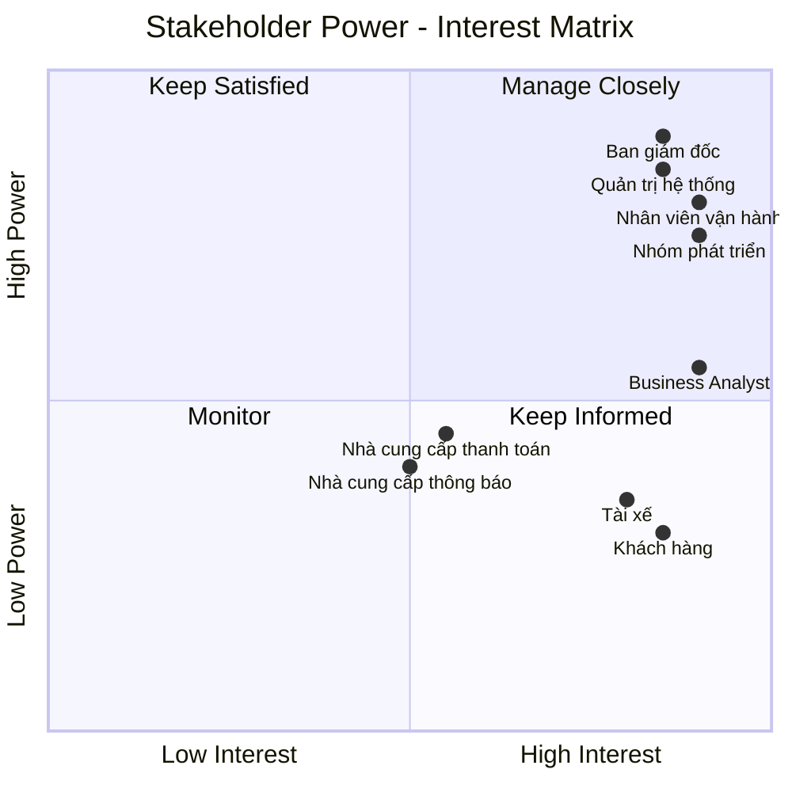
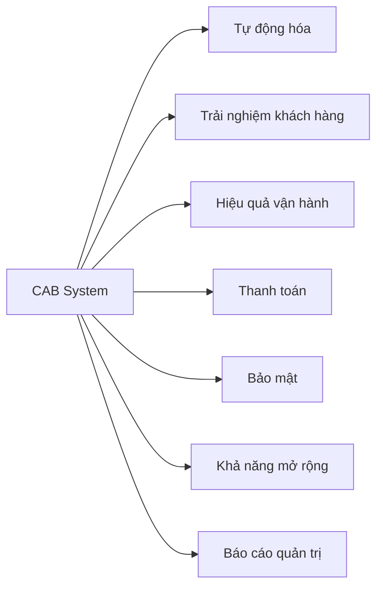
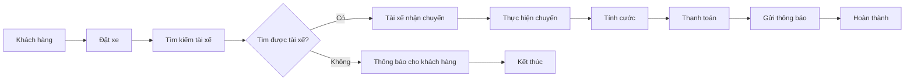
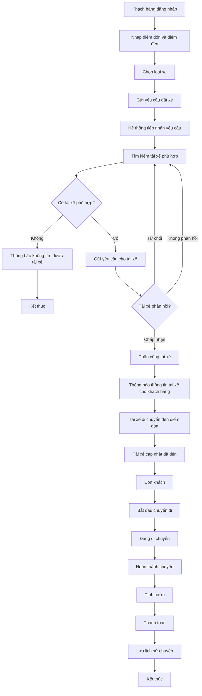
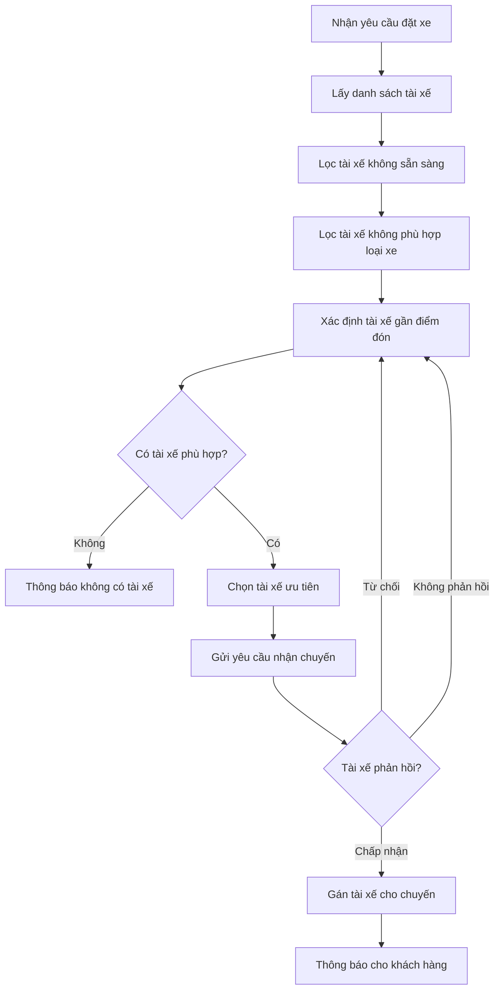
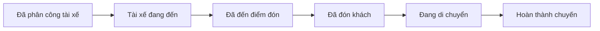
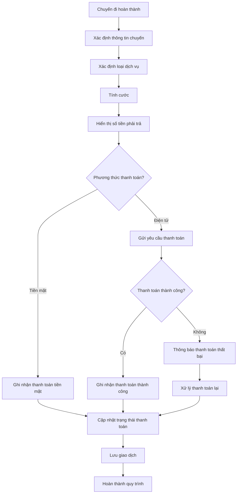
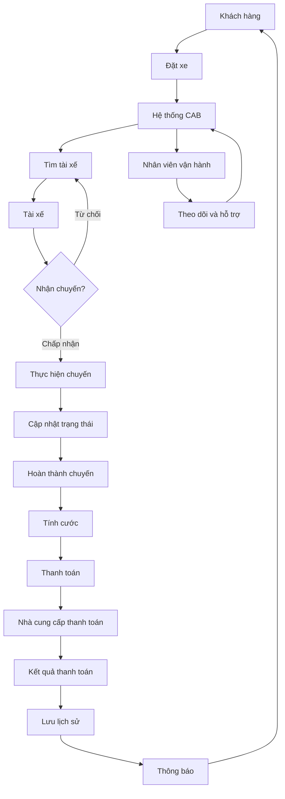
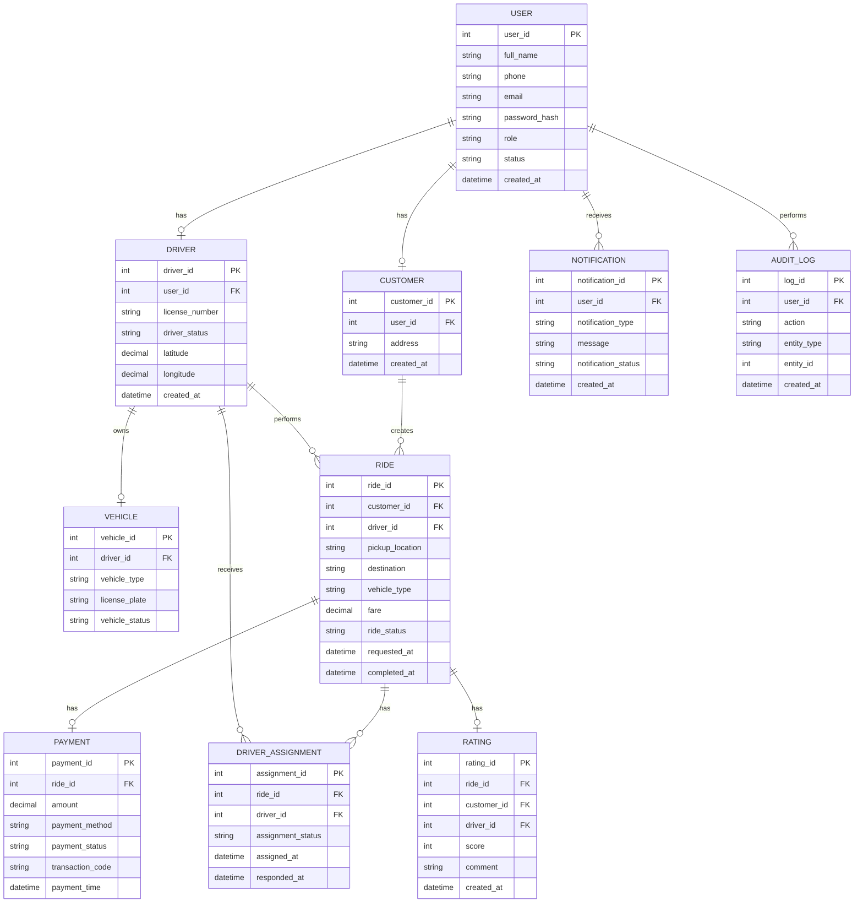
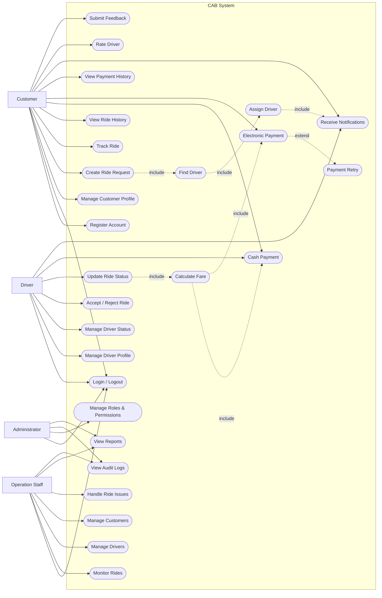

# Software Requirements Specification (SRS) - CAB System
## 1. Stakeholder List & Roles

| STT | Stakeholder | Vai trò | Mối quan tâm / Trách nhiệm chính |
|---|---|---|---|
| 1 | **Khách hàng (Customer)** | Người sử dụng dịch vụ đặt xe | Đăng ký, đăng nhập, đặt xe, theo dõi chuyến đi, thanh toán, xem lịch sử và đánh giá tài xế |
| 2 | **Tài xế (Driver)** | Người cung cấp dịch vụ vận chuyển | Nhận/từ chối chuyến, cập nhật trạng thái chuyến, cập nhật vị trí và thông tin phương tiện |
| 3 | **Nhân viên vận hành (Operation Staff)** | Quản lý hoạt động hằng ngày | Theo dõi chuyến đi, tài xế, khách hàng; hỗ trợ xử lý chuyến lỗi và điều phối khi cần |
| 4 | **Quản trị viên (Administrator)** | Quản trị hệ thống | Quản lý tài khoản, phân quyền, cấu hình hệ thống và kiểm soát các thao tác nhạy cảm |
| 5 | **Ban giám đốc (Management)** | Chủ sở hữu và người ra quyết định | Theo dõi doanh thu, số lượng chuyến, tỷ lệ hoàn thành, tỷ lệ hủy và hiệu quả hoạt động |
| 6 | **Nhà cung cấp thanh toán (Payment Provider)** | Hệ thống bên ngoài | Xử lý thanh toán điện tử và trả kết quả giao dịch thành công hoặc thất bại |
| 7 | **Nhà cung cấp thông báo (Notification Provider)** | Hệ thống bên ngoài | Gửi thông báo cho khách hàng và tài xế qua SMS, Email hoặc Push Notification |
| 8 | **Business Analyst (BA)** | Phân tích nghiệp vụ | Thu thập yêu cầu, xác định phạm vi, quy trình nghiệp vụ, Business Rules và làm rõ các yêu cầu chưa xác định |
| 9 | **Development Team** | Xây dựng hệ thống | Thiết kế, lập trình, kiểm thử và triển khai các chức năng của CAB System |
| 10 | **IT/DevOps Team** | Vận hành hạ tầng kỹ thuật | Đảm bảo hệ thống ổn định, có khả năng mở rộng, giám sát và xử lý sự cố |

## 2. Stakeholder Matrix


## 3. Business Goals (Mục tiêu Kinh doanh)

Các mục tiêu kinh doanh của CAB System được xác định nhằm giải quyết những hạn chế của hệ thống hiện tại và đáp ứng định hướng phát triển lâu dài của doanh nghiệp.

| ID | Business Goal | Mục tiêu |
|---|---|---|
| BG-01 | Tự động hóa điều phối | Giảm công việc phân công tài xế thủ công bằng cách tự động tìm kiếm và đề xuất tài xế phù hợp. |
| BG-02 | Nâng cao trải nghiệm khách hàng | Giúp khách hàng đặt xe, theo dõi trạng thái chuyến đi và nhận thông báo một cách thuận tiện. |
| BG-03 | Tăng hiệu quả vận hành | Hỗ trợ nhân viên vận hành quản lý khách hàng, tài xế, phương tiện và chuyến đi hiệu quả hơn. |
| BG-04 | Tối ưu hóa phân công tài xế | Ưu tiên tài xế phù hợp và gần khách hàng, đồng thời tự động tìm tài xế khác khi tài xế từ chối hoặc không phản hồi. |
| BG-05 | Quản lý thanh toán tập trung | Quản lý thông tin cước và kết quả thanh toán tập trung mà không lưu trực tiếp dữ liệu nhạy cảm của thẻ hoặc tài khoản thanh toán. |
| BG-06 | Đảm bảo tính liên tục của hệ thống | Đảm bảo lỗi ở một thành phần như thanh toán hoặc thông báo không làm toàn bộ hệ thống đặt xe ngừng hoạt động. |
| BG-07 | Khả năng mở rộng | Cho phép hệ thống phục vụ số lượng lớn khách hàng và tài xế, đồng thời có khả năng mở rộng từng thành phần độc lập khi tải tăng. |
| BG-08 | Tăng cường bảo mật | Bảo vệ thông tin cá nhân, thông tin phương tiện, dữ liệu vị trí và dữ liệu giao dịch; kiểm soát quyền truy cập các chức năng quản trị. |
| BG-09 | Hỗ trợ ra quyết định | Cung cấp báo cáo về số lượng chuyến, doanh thu, tỷ lệ hoàn thành, tỷ lệ hủy và hiệu quả hoạt động của tài xế. |
| BG-10 | Khả năng phát triển lâu dài | Cho phép bổ sung loại dịch vụ, phương thức thanh toán, nhà cung cấp thông báo và thay đổi thành phần kỹ thuật mà không phải xây dựng lại toàn bộ hệ thống. |
| BG-11 | Nâng cao khả năng kiểm soát | Lưu vết các thao tác quan trọng để hỗ trợ kiểm tra, truy xuất và xử lý sự cố. |
| BG-12 | Rút ngắn thời gian triển khai tính năng | Hỗ trợ triển khai từng phần các chức năng mới với mức ảnh hưởng tối thiểu đến các chức năng đang hoạt động. |

### 3.1. Business Goals Prioritization

| Priority | Business Goals | Mô tả |
|---|---|---|
| High | BG-01, BG-02, BG-03, BG-04, BG-06, BG-08 | Các mục tiêu cốt lõi ảnh hưởng trực tiếp đến hoạt động và chất lượng dịch vụ CAB. |
| Medium | BG-05, BG-07, BG-09, BG-11 | Các mục tiêu hỗ trợ hiệu quả vận hành, quản lý và phát triển hệ thống. |
| Low | BG-10, BG-12 | Các mục tiêu phục vụ khả năng mở rộng và phát triển lâu dài. |

### 3.2. Business Goal Summary


## 4. Các Module của Sản phẩm Khả dụng Tối thiểu (MVP)

Với thời gian thực hiện 7 tuần và chỉ có 1 thành viên, phạm vi MVP của CAB System được giới hạn vào các chức năng cốt lõi. Mục tiêu là xây dựng được quy trình hoàn chỉnh từ khi khách hàng đặt xe, hệ thống tìm tài xế, thực hiện chuyến đi, tính cước đến khi hoàn thành và ghi nhận thanh toán.

### 4.1. Danh sách các Module MVP

| ID | Module | Chức năng chính | Mức độ ưu tiên |
|---|---|---|---|
| MVP-01 | Quản lý khách hàng | Đăng ký, đăng nhập và cập nhật thông tin khách hàng | Cao |
| MVP-02 | Quản lý tài xế | Quản lý tài khoản, phương tiện và trạng thái tài xế | Cao |
| MVP-03 | Đặt xe | Nhập điểm đón, điểm đến, chọn loại xe và tạo yêu cầu đặt xe | Cao |
| MVP-04 | Tìm kiếm và phân công tài xế | Tìm và phân công tài xế phù hợp cho chuyến đi | Cao |
| MVP-05 | Quản lý chuyến đi | Theo dõi và cập nhật trạng thái chuyến đi | Cao |
| MVP-06 | Tính cước và thanh toán | Tính tiền chuyến đi và ghi nhận thanh toán | Cao |
| MVP-07 | Thông báo | Gửi thông báo về các trạng thái quan trọng của chuyến đi | Trung bình |
| MVP-08 | Quản lý vận hành | Theo dõi chuyến đi, tài xế và hỗ trợ xử lý sự cố | Trung bình |

### 4.2. Mô tả các Module MVP

#### MVP-01: Quản lý khách hàng

- Đăng ký tài khoản.
- Đăng nhập và đăng xuất.
- Cập nhật thông tin cá nhân.
- Xác thực người dùng.
- Quản lý thông tin tài khoản.

#### MVP-02: Quản lý tài xế

- Quản lý thông tin tài xế.
- Quản lý thông tin phương tiện.
- Cập nhật trạng thái hoạt động.
- Chuyển trạng thái:
  - Sẵn sàng nhận chuyến.
  - Không sẵn sàng nhận chuyến.
- Cập nhật vị trí tài xế.

#### MVP-03: Đặt xe

- Nhập điểm đón.
- Nhập điểm đến.
- Lựa chọn loại xe.
- Tạo yêu cầu đặt xe.
- Xem thông tin chuyến đi.
- Hủy chuyến theo chính sách của doanh nghiệp.

#### MVP-04: Tìm kiếm và phân công tài xế

- Tìm các tài xế đang sẵn sàng.
- Xác định tài xế phù hợp dựa trên vị trí.
- Ưu tiên tài xế gần khách hàng.
- Gửi yêu cầu nhận chuyến cho tài xế.
- Cho phép tài xế chấp nhận hoặc từ chối chuyến.
- Tự động tìm tài xế khác khi tài xế từ chối hoặc không phản hồi.
- Thông báo cho khách hàng khi không tìm được tài xế.

#### MVP-05: Quản lý chuyến đi

- Theo dõi trạng thái chuyến đi.
- Tài xế cập nhật trạng thái:
  - Đã nhận chuyến.
  - Đã đến điểm đón.
  - Đã đón khách.
  - Đang di chuyển.
  - Hoàn thành chuyến.
- Khách hàng theo dõi trạng thái chuyến đi.
- Lưu lịch sử chuyến đi.

#### MVP-06: Tính cước và thanh toán

- Tính cước chuyến đi.
- Hiển thị số tiền khách hàng phải trả.
- Hỗ trợ thanh toán bằng tiền mặt.
- Ghi nhận trạng thái thanh toán.
- Mô phỏng thanh toán điện tử trong phiên bản MVP.
- Không lưu thông tin nhạy cảm của thẻ hoặc tài khoản thanh toán.

> Việc tích hợp trực tiếp với nhà cung cấp thanh toán bên ngoài có thể được phát triển ở phiên bản tiếp theo nếu vượt quá phạm vi 7 tuần.

#### MVP-07: Thông báo

- Thông báo khi yêu cầu đặt xe được tiếp nhận.
- Thông báo khi tài xế nhận chuyến.
- Thông báo khi tài xế đến điểm đón.
- Thông báo khi chuyến đi hoàn thành.
- Thông báo kết quả thanh toán.

> Trong MVP, thông báo có thể được triển khai ở mức cơ bản trong hệ thống. Các kênh SMS, Email hoặc thông báo đẩy có thể được bổ sung trong tương lai.

#### MVP-08: Quản lý vận hành

- Xem danh sách chuyến đi.
- Xem trạng thái các chuyến đang diễn ra.
- Xem trạng thái hoạt động của tài xế.
- Tra cứu thông tin khách hàng.
- Tra cứu thông tin tài xế.
- Hỗ trợ xử lý các chuyến bị lỗi.
- Xem lịch sử chuyến đi.

### 4.3. Quy trình hoạt động chính của MVP


## 5. Business Requirements – CAB System MVP (Yêu cầu nghiệp vụ)

Các yêu cầu nghiệp vụ của CAB System MVP được xây dựng dựa trên mục tiêu của doanh nghiệp và phạm vi MVP đã xác định. Hệ thống phải hỗ trợ quy trình cơ bản từ khi khách hàng tạo yêu cầu đặt xe đến khi chuyến đi hoàn thành và thanh toán.

### 5.1. Danh sách yêu cầu nghiệp vụ

| ID | Yêu cầu nghiệp vụ | Mô tả | Ưu tiên |
|---|---|---|---|
| BR-01 | Quản lý tài khoản khách hàng | Hệ thống phải cho phép khách hàng đăng ký, đăng nhập và cập nhật thông tin cá nhân. | Cao |
| BR-02 | Quản lý tài khoản tài xế | Hệ thống phải cho phép quản lý thông tin tài xế, phương tiện và trạng thái hoạt động. | Cao |
| BR-03 | Đặt xe | Khách hàng phải có thể tạo yêu cầu đặt xe bằng cách nhập điểm đón, điểm đến và loại xe. | Cao |
| BR-04 | Tìm kiếm tài xế | Hệ thống phải tự động tìm tài xế phù hợp dựa trên trạng thái sẵn sàng và vị trí. | Cao |
| BR-05 | Phân công tài xế | Hệ thống phải gửi yêu cầu chuyến đi cho tài xế phù hợp và xử lý khi tài xế từ chối hoặc không phản hồi. | Cao |
| BR-06 | Quản lý chuyến đi | Hệ thống phải cho phép theo dõi và cập nhật trạng thái chuyến đi trong suốt quá trình thực hiện. | Cao |
| BR-07 | Tính cước | Hệ thống phải xác định số tiền khách hàng cần thanh toán dựa trên thông tin chuyến đi và loại dịch vụ. | Cao |
| BR-08 | Thanh toán | Hệ thống phải hỗ trợ ghi nhận thanh toán bằng tiền mặt và thanh toán điện tử ở mức phù hợp với MVP. | Cao |
| BR-09 | Thông báo | Hệ thống phải thông báo cho khách hàng và tài xế về các trạng thái quan trọng của chuyến đi. | Trung bình |
| BR-10 | Quản lý vận hành | Nhân viên vận hành phải có thể theo dõi chuyến đi, tài xế và hỗ trợ xử lý các trường hợp bất thường. | Trung bình |
| BR-11 | Lưu lịch sử | Hệ thống phải lưu thông tin các chuyến đi và kết quả thanh toán để có thể tra cứu. | Cao |
| BR-12 | Bảo mật và phân quyền | Hệ thống phải xác thực người dùng và kiểm soát quyền truy cập đối với các chức năng quản trị. | Cao |

### 5.2. Chi tiết yêu cầu nghiệp vụ

#### BR-01: Quản lý tài khoản khách hàng

- Khách hàng có thể đăng ký tài khoản.
- Khách hàng phải đăng nhập trước khi đặt xe.
- Khách hàng có thể cập nhật thông tin cá nhân.
- Hệ thống phải xác thực thông tin đăng nhập.
- Khách hàng có thể đăng xuất khỏi hệ thống.

#### BR-02: Quản lý tài khoản tài xế

- Nhân viên vận hành có thể tạo tài khoản tài xế.
- Tài xế có thể cập nhật thông tin cá nhân.
- Hệ thống phải lưu thông tin phương tiện của tài xế.
- Tài xế có thể cập nhật trạng thái hoạt động.
- Chỉ tài xế ở trạng thái "Sẵn sàng" mới được xem xét để phân công chuyến.

#### BR-03: Đặt xe

- Khách hàng nhập điểm đón.
- Khách hàng nhập điểm đến.
- Khách hàng lựa chọn loại xe.
- Hệ thống tiếp nhận yêu cầu đặt xe.
- Hệ thống tạo mã chuyến cho yêu cầu đặt xe.
- Hệ thống thông báo trạng thái tiếp nhận yêu cầu cho khách hàng.

#### BR-04: Tìm kiếm tài xế

- Sau khi nhận yêu cầu đặt xe, hệ thống phải tìm các tài xế đang sẵn sàng.
- Hệ thống ưu tiên tài xế phù hợp và gần điểm đón.
- Hệ thống không phân công tài xế đang thực hiện chuyến khác.
- Hệ thống phải cập nhật trạng thái tìm kiếm tài xế.
- Nếu không tìm được tài xế, hệ thống phải thông báo cho khách hàng.

#### BR-05: Phân công tài xế

- Hệ thống gửi yêu cầu nhận chuyến đến tài xế được lựa chọn.
- Tài xế có thể chấp nhận hoặc từ chối chuyến.
- Khi tài xế chấp nhận, chuyến đi được gán cho tài xế đó.
- Khi tài xế từ chối, hệ thống tiếp tục tìm tài xế khác.
- Nếu tài xế không phản hồi trong thời gian quy định, hệ thống phải xử lý theo chính sách của doanh nghiệp.
- Khách hàng không phải tạo lại yêu cầu khi tài xế đầu tiên từ chối.

#### BR-06: Quản lý chuyến đi

Chuyến đi phải được quản lý theo các trạng thái cơ bản:

```text
Đã tạo yêu cầu
      ↓
Đang tìm tài xế
      ↓
Đã phân công tài xế
      ↓
Tài xế đã đến
      ↓
Đã đón khách
      ↓
Đang di chuyển
      ↓
Hoàn thành
```
## 6. Business Process Modeling (Mô hình hóa Quy trình Nghiệp vụ)

Mô hình hóa quy trình nghiệp vụ nhằm mô tả cách CAB System xử lý một yêu cầu đặt xe từ khi khách hàng bắt đầu đặt xe cho đến khi chuyến đi hoàn thành và thanh toán.

### 6.1. Quy trình nghiệp vụ tổng thể

Quy trình chính của CAB System MVP gồm các bước:

1. Khách hàng đăng nhập hệ thống.
2. Khách hàng nhập thông tin chuyến đi.
3. Hệ thống tiếp nhận yêu cầu đặt xe.
4. Hệ thống tìm kiếm tài xế phù hợp.
5. Tài xế nhận hoặc từ chối chuyến.
6. Hệ thống tiếp tục tìm tài xế khác nếu bị từ chối hoặc không phản hồi.
7. Tài xế thực hiện chuyến đi.
8. Hệ thống cập nhật trạng thái chuyến.
9. Hệ thống tính cước sau khi hoàn thành chuyến.
10. Khách hàng thực hiện thanh toán.
11. Hệ thống lưu thông tin chuyến đi và thanh toán.
12. Kết thúc quy trình.

### 6.2. Mô hình quy trình đặt xe



### 6.3. Quy trình tìm kiếm và phân công tài xế

Khi khách hàng tạo yêu cầu đặt xe, hệ thống thực hiện tìm kiếm tài xế dựa trên các điều kiện:

- Tài xế đang ở trạng thái sẵn sàng.
- Tài xế không đang thực hiện chuyến khác.
- Tài xế có loại phương tiện phù hợp.
- Tài xế có vị trí phù hợp với điểm đón.
- Ưu tiên tài xế ở gần khách hàng.

Quy trình:



### 6.4. Quy trình thực hiện chuyến đi

Sau khi tài xế chấp nhận chuyến, chuyến đi được chuyển sang trạng thái đang thực hiện.



### 6.5. Quy trình tính cước và thanh toán

Sau khi tài xế hoàn thành chuyến, hệ thống tính số tiền khách hàng cần thanh toán.



> Công thức tính cước và chính sách xử lý thanh toán thất bại cần được xác nhận với khách hàng trước khi triển khai chính thức.

### 6.6. Quy trình thông báo

Hệ thống gửi thông báo cho khách hàng và tài xế tại các sự kiện quan trọng.

| Sự kiện | Người nhận | Nội dung thông báo |
|---|---|---|
| Yêu cầu đặt xe được tiếp nhận | Khách hàng | Hệ thống đã tiếp nhận yêu cầu |
| Tìm được tài xế | Khách hàng | Thông tin tài xế và phương tiện |
| Có chuyến mới | Tài xế | Thông tin chuyến cần nhận |
| Tài xế đến điểm đón | Khách hàng | Tài xế đã đến điểm đón |
| Chuyến hoàn thành | Khách hàng | Chuyến đi đã hoàn thành và số tiền phải trả |
| Thanh toán thành công | Khách hàng | Xác nhận thanh toán |
| Thanh toán thất bại | Khách hàng | Thông báo lỗi và hướng xử lý |

### 6.7. Quy trình xử lý ngoại lệ

CAB System MVP phải xử lý một số trường hợp ngoại lệ cơ bản:

| Trường hợp | Cách xử lý |
|---|---|
| Không tìm được tài xế | Thông báo cho khách hàng và kết thúc yêu cầu |
| Tài xế từ chối chuyến | Hệ thống tiếp tục tìm tài xế khác |
| Tài xế không phản hồi | Hệ thống xử lý theo thời gian phản hồi được quy định và tìm tài xế khác |
| Khách hàng hủy chuyến | Kiểm tra điều kiện hủy và cập nhật trạng thái chuyến |
| Thanh toán điện tử thất bại | Thông báo lỗi và cho phép xử lý lại theo chính sách |
| Tài xế mất kết nối | Cập nhật trạng thái và xử lý theo quy tắc vận hành |
| Khách hàng mất kết nối | Dữ liệu yêu cầu đã tạo phải được lưu và có thể tiếp tục xử lý |
| Hệ thống gặp lỗi | Ghi nhận lỗi và không làm ảnh hưởng đến toàn bộ hệ thống |

### 6.8. Mô hình quy trình nghiệp vụ tổng quát



### 6.9. Phạm vi quy trình trong MVP


| STT | Quy trình | Mức độ ưu tiên |
|---|---|---|
| 1 | Đăng nhập và quản lý tài khoản | Cao |
| 2 | Đặt xe | Cao |
| 3 | Tìm kiếm và phân công tài xế | Cao |
| 4 | Thực hiện và cập nhật trạng thái chuyến | Cao |
| 5 | Tính cước | Cao |
| 6 | Thanh toán | Cao |
| 7 | Thông báo trạng thái | Trung bình |
| 8 | Theo dõi và hỗ trợ vận hành | Trung bình |

# 7. Functional Requirements (Yêu cầu Chức năng)

## 7.1. Module Quản lý Tài khoản

### FR01 – Đăng ký tài khoản Khách hàng
- Hệ thống cho phép Khách hàng đăng ký tài khoản.
- Khách hàng nhập các thông tin cần thiết như họ tên, số điện thoại, email và mật khẩu.
- Hệ thống kiểm tra tính hợp lệ và tính duy nhất của thông tin đăng ký.
- Hệ thống thông báo kết quả đăng ký.

### FR02 – Đăng nhập và Đăng xuất
- Hệ thống cho phép Khách hàng, Tài xế và Nhân viên vận hành đăng nhập.
- Hệ thống xác thực thông tin đăng nhập trước khi cho phép truy cập.
- Hệ thống xác định quyền dựa trên vai trò người dùng.
- Người dùng có thể đăng xuất khỏi hệ thống.

### FR03 – Quản lý hồ sơ Khách hàng
- Khách hàng có thể xem thông tin cá nhân.
- Khách hàng có thể cập nhật thông tin cá nhân.
- Hệ thống lưu thông tin hồ sơ Khách hàng.
- Khách hàng có thể xem lịch sử chuyến đi của mình.

### FR04 – Quản lý hồ sơ Tài xế
- Tài xế có thể xem thông tin cá nhân theo quyền được cấp.
- Nhân viên vận hành có thể thêm và cập nhật thông tin Tài xế.
- Hệ thống lưu thông tin phương tiện của Tài xế.

### FR05 – Quản lý trạng thái Tài xế
- Tài xế có thể chuyển trạng thái giữa:
  - Sẵn sàng nhận chuyến.
  - Không sẵn sàng.
  - Đang thực hiện chuyến.
- Hệ thống cập nhật trạng thái Tài xế.
- Chỉ Tài xế đang sẵn sàng mới được đưa vào quá trình phân công.

---

## 7.2. Module Đặt xe & Phân công Tài xế

### FR06 – Tạo yêu cầu đặt xe
- Khách hàng nhập điểm đón và điểm đến.
- Khách hàng lựa chọn loại xe.
- Hệ thống kiểm tra thông tin trước khi tạo yêu cầu.
- Hệ thống tạo yêu cầu đặt xe.
- Yêu cầu được chuyển sang quá trình tìm kiếm Tài xế.

### FR07 – Tìm kiếm Tài xế phù hợp
- Hệ thống tìm các Tài xế đang sẵn sàng.
- Hệ thống kiểm tra loại xe phù hợp với yêu cầu.
- Hệ thống ưu tiên Tài xế phù hợp và có vị trí gần điểm đón.
- Hệ thống lựa chọn Tài xế phù hợp để gửi yêu cầu.

### FR08 – Gửi yêu cầu nhận chuyến
- Hệ thống gửi thông tin chuyến đi đến Tài xế được lựa chọn.
- Tài xế có thể xem thông tin chuyến.
- Tài xế có thể chấp nhận hoặc từ chối chuyến.

### FR09 – Tự động chuyển tiếp yêu cầu
- Nếu Tài xế từ chối chuyến, hệ thống tìm Tài xế phù hợp khác.
- Nếu Tài xế không phản hồi trong thời gian quy định, hệ thống chuyển yêu cầu cho Tài xế khác.
- Khách hàng không cần tạo lại yêu cầu đặt xe.

### FR10 – Xử lý trường hợp không tìm được Tài xế
- Hệ thống xác định khi không còn Tài xế phù hợp.
- Hệ thống cập nhật trạng thái yêu cầu thành `Failed`.
- Hệ thống thông báo cho Khách hàng.
- Hệ thống lưu thông tin thất bại để phục vụ tra cứu.

## 7.3. Module Quản lý Chuyến đi

### FR11 – Xác nhận chuyến đi
- Khi Tài xế chấp nhận yêu cầu, hệ thống xác nhận chuyến đi.
- Hệ thống cung cấp thông tin Tài xế và phương tiện cho Khách hàng.
- Hệ thống cập nhật trạng thái chuyến thành `Assigned`.

### FR12 – Cập nhật trạng thái chuyến đi
Tài xế có thể cập nhật trạng thái chuyến theo trình tự:
- Hệ thống kiểm tra trạng thái hiện tại trước khi chuyển trạng thái.
- Hệ thống lưu lịch sử thay đổi trạng thái.
  
### FR13 – Theo dõi chuyến đi
- Tài xế được phân công.
- Thông tin phương tiện.
- Điểm đón và điểm đến.
- Trạng thái hiện tại của chuyến.
  
### FR14 – Hoàn thành chuyến đi
- Khi đến điểm kết thúc, Tài xế xác nhận hoàn thành chuyến.
- Hệ thống cập nhật trạng thái chuyến thành Completed.
- Hệ thống chuyển chuyến sang bước tính cước.

### FR15 – Quản lý lịch sử chuyến đi
- Hệ thống lưu thông tin các chuyến đã hoàn thành.
- Khách hàng có thể xem lịch sử chuyến đi của mình.
- Nhân viên vận hành có thể tra cứu thông tin chuyến theo quyền được cấp.

## 7.4. Module Tính cước & Thanh toán

### FR16 – Tính cước chuyến đi
- Hệ thống tự động tính cước sau khi chuyến đi hoàn thành.
- Cước phí được xác định dựa trên loại xe và quy tắc tính cước.
- Hệ thống hiển thị số tiền cần thanh toán.

### FR17 – Thanh toán tiền mặt
- Khách hàng có thể lựa chọn thanh toán bằng tiền mặt.
- Khách hàng thanh toán trực tiếp cho Tài xế.
- Tài xế xác nhận đã nhận tiền.
- Hệ thống cập nhật trạng thái thanh toán thành Success.

### FR18 – Thanh toán điện tử
- Khách hàng có thể lựa chọn thanh toán điện tử.
- Hệ thống gửi yêu cầu đến cổng thanh toán bên ngoài.
- Hệ thống tiếp nhận kết quả giao dịch.
- Hệ thống cập nhật trạng thái thanh toán.
- Hệ thống không lưu thông tin thẻ hoặc thông tin tài khoản thanh toán nhạy cảm.

### FR19 – Xử lý thanh toán thất bại
- Hệ thống thông báo cho Khách hàng khi thanh toán thất bại.
- Hệ thống cập nhật trạng thái giao dịch thành Failed.
- Khách hàng có thể thực hiện lại thanh toán theo chính sách của hệ thống.

### FR20 – Lưu lịch sử thanh toán
Hệ thống lưu:
- Mã giao dịch.
-Mã chuyến.
- Số tiền.
- Phương thức thanh toán.
- Thời gian thanh toán.
- Trạng thái thanh toán.

## 7.5. Module Thông báo

### FR21 – Thông báo cho Khách hàng
Hệ thống gửi thông báo khi:
- Đặt xe thành công.
- Tài xế được phân công.
- Tài xế đã đến điểm đón.
- Chuyến đi bắt đầu.
- Chuyến đi hoàn thành.
- Thanh toán thành công hoặc thất bại.

### FR22 – Thông báo cho Tài xế
Hệ thống gửi thông báo khi:
- Có yêu cầu chuyến mới.
- Yêu cầu chuyến được phân công.
- Chuyến bị hủy hoặc có thay đổi liên quan.

## 7.6. Module Vận hành

### FR23 – Theo dõi chuyến đi
Nhân viên vận hành có thể:
- Xem danh sách chuyến.
- Xem trạng thái chuyến.
- Xem thông tin Khách hàng.
- Xem Tài xế được phân công.
- Tra cứu các chuyến gặp sự cố.

### FR24 – Quản lý Tài xế
Nhân viên vận hành có thể:
- Xem danh sách Tài xế.
- Thêm Tài xế.
- Cập nhật thông tin Tài xế.
- Cập nhật trạng thái Tài xế.
- Xem thông tin phương tiện.

### FR25 – Quản lý Khách hàng
Nhân viên vận hành có thể:
- Xem danh sách Khách hàng.
- Tìm kiếm Khách hàng.
- Xem thông tin tài khoản.
- Khóa hoặc mở khóa tài khoản theo quyền.

### FR26 – Hỗ trợ xử lý chuyến lỗi
- Nhân viên vận hành có thể tra cứu chuyến gặp sự cố.
- Hệ thống hiển thị thông tin liên quan đến chuyến.
- Nhân viên vận hành thực hiện các thao tác hỗ trợ theo quyền.
- Các thao tác quan trọng được ghi nhận vào nhật ký hệ thống.

## 7.7. Module Phân quyền & Bảo mật

### FR27 – Phân quyền người dùng

Hệ thống phân quyền theo các vai trò:

| Vai trò | Chức năng chính |
|---|---|
| Customer | Đăng ký, đặt xe, theo dõi chuyến, thanh toán, xem lịch sử |
| Driver | Quản lý trạng thái, nhận chuyến, cập nhật trạng thái chuyến |
| Operation Staff | Quản lý Khách hàng, Tài xế và chuyến đi |
| Administrator | Quản trị hệ thống và quản lý quyền |

### FR28 – Kiểm soát truy cập

- Hệ thống kiểm tra quyền trước khi cho phép người dùng truy cập chức năng.
- Người dùng chỉ được thực hiện các chức năng phù hợp với vai trò.
- Dữ liệu cá nhân, phương tiện và giao dịch phải được bảo vệ.

### FR29 – Ghi nhật ký hoạt động

- Hệ thống ghi nhận các thao tác quan trọng.
- Nhật ký bao gồm người thực hiện, thời gian và hành động.
- Nhật ký hỗ trợ kiểm tra và xử lý sự cố.

---

## 7.8. Module Đánh giá & Phản hồi

### FR30 – Đánh giá Tài xế

- Sau khi chuyến đi hoàn thành, Khách hàng có thể đánh giá Tài xế.
- Khách hàng có thể gửi điểm đánh giá.
- Khách hàng có thể gửi nhận xét.
- Hệ thống lưu đánh giá gắn với chuyến đi.

### FR31 – Quản lý phản hồi

- Nhân viên vận hành có thể xem các đánh giá và phản hồi.
- Hệ thống liên kết phản hồi với chuyến đi tương ứng.
- Thông tin phản hồi được sử dụng để hỗ trợ đánh giá chất lượng dịch vụ.

---

## 7.9. Module Báo cáo & Thống kê

### FR32 – Báo cáo hoạt động

Hệ thống cung cấp các thông tin cơ bản:

- Tổng số chuyến đi.
- Số chuyến hoàn thành.
- Số chuyến bị hủy hoặc thất bại.
- Tổng doanh thu.
- Số lượng Tài xế đang hoạt động.

### FR33 – Tra cứu báo cáo

- Nhân viên vận hành có quyền tra cứu báo cáo.
- Hệ thống cho phép lọc báo cáo theo khoảng thời gian.
- Kết quả được trình bày dưới dạng bảng hoặc thống kê đơn giản.

## 7.10. Mapping Business Requirements và Functional Requirements

| Business Requirement | Functional Requirements |
|---|---|
| BR01 – Đăng ký & Quản lý Khách hàng | FR01, FR02, FR03 |
| BR02 – Quản lý Tài xế | FR02, FR04, FR05 |
| BR03 – Tạo yêu cầu Đặt xe | FR06 |
| BR04 – Tìm kiếm Tài xế | FR07 |
| BR05 – Phân công Tài xế | FR08, FR09 |
| BR06 – Không tìm thấy Tài xế | FR10 |
| BR07 – Quản lý Chuyến đi | FR11, FR12, FR13, FR14 |
| BR08 – Lịch sử Chuyến đi | FR15 |
| BR09 – Tính cước | FR16 |
| BR10 – Thanh toán | FR17, FR18 |
| BR11 – Xử lý lỗi Thanh toán | FR19, FR20 |
| BR12 – Thông báo | FR21, FR22 |
| BR13 – Quản lý Vận hành | FR23, FR24, FR25, FR26 |
| BR14 – Phân quyền & Bảo mật | FR27, FR28, FR29 |
| BR15 – Đánh giá Dịch vụ | FR30, FR31 |
| BR16 – Báo cáo & Thống kê | FR32, FR33 |

# 8. Business Rules (Quy tắc Nghiệp vụ)

## 8.1. Quy tắc Quản lý Tài khoản

| ID | Business Rule | Mô tả |
|---|---|---|
| **BRULE01** | Tài khoản duy nhất | Mỗi tài khoản phải có thông tin định danh duy nhất trong hệ thống. |
| **BRULE02** | Phân loại tài khoản | Mỗi tài khoản thuộc một vai trò: Khách hàng, Tài xế, Nhân viên vận hành hoặc Administrator. |
| **BRULE03** | Kiểm soát quyền | Người dùng chỉ được thực hiện các chức năng phù hợp với vai trò và quyền được cấp. |
| **BRULE04** | Tài khoản hoạt động | Tài khoản bị khóa không được phép đăng nhập và sử dụng các chức năng của hệ thống. |
| **BRULE05** | Thông tin Tài xế | Tài xế phải có hồ sơ và thông tin phương tiện hợp lệ trước khi được nhận chuyến. |

## 8.2. Quy tắc Đặt xe

| ID | Business Rule | Mô tả |
|---|---|---|
| **BRULE06** | Thông tin đặt xe | Yêu cầu đặt xe phải có điểm đón, điểm đến và loại xe. |
| **BRULE07** | Trạng thái đặt xe | Yêu cầu đặt xe có thể ở các trạng thái: `Searching`, `Assigned`, `In Trip`, `Completed`, `Cancelled`, `Failed`. |
| **BRULE08** | Một chuyến đang thực hiện | Khách hàng không được tạo chuyến mới nếu đang có chuyến chưa hoàn thành. |
| **BRULE09** | Tài xế nhận chuyến | Chỉ Tài xế đang sẵn sàng và chưa thực hiện chuyến khác mới được nhận chuyến. |
| **BRULE10** | Tài xế từ chối | Khi Tài xế từ chối chuyến, hệ thống chuyển yêu cầu sang Tài xế phù hợp tiếp theo. |

## 8.3. Quy tắc Chuyến đi

| ID | Business Rule | Mô tả |
|---|---|---|
| **BRULE11** | Trình tự trạng thái | Trạng thái chuyến phải được cập nhật theo đúng trình tự nghiệp vụ. |
| **BRULE12** | Hoàn thành chuyến | Chỉ Tài xế được phân công mới có quyền xác nhận hoàn thành chuyến. |
| **BRULE13** | Tính cước | Hệ thống chỉ tính cước chính thức sau khi chuyến được xác nhận hoàn thành. |
| **BRULE14** | Lưu lịch sử | Các chuyến đã hoàn thành phải được lưu để Khách hàng và Nhân viên vận hành tra cứu theo quyền. |

## 8.4. Quy tắc Tìm kiếm và Phân công Tài xế

| ID | Business Rule | Mô tả |
|---|---|---|
| **BRULE15** | Tài xế phù hợp | Hệ thống chỉ lựa chọn Tài xế có trạng thái sẵn sàng và loại xe phù hợp. |
| **BRULE16** | Ưu tiên tài xế gần | Trong các Tài xế phù hợp, hệ thống ưu tiên Tài xế có vị trí gần điểm đón. |
| **BRULE17** | Tài xế không phản hồi | Nếu Tài xế không phản hồi trong thời gian quy định, hệ thống chuyển yêu cầu cho Tài xế khác. |
| **BRULE18** | Không có Tài xế | Nếu không còn Tài xế phù hợp, yêu cầu đặt xe được chuyển sang trạng thái `Failed`. |
| **BRULE19** | Không phân công trùng | Một Tài xế không được nhận đồng thời nhiều chuyến đang thực hiện. |

## 8.5. Quy tắc Thanh toán

| ID | Business Rule | Mô tả |
|---|---|---|
| **BRULE20** | Thanh toán | Mỗi chuyến hoàn thành phải có một trạng thái thanh toán tương ứng. |
| **BRULE21** | Phương thức thanh toán | MVP hỗ trợ thanh toán tiền mặt và thanh toán điện tử. |
| **BRULE22** | Thanh toán tiền mặt | Với thanh toán tiền mặt, Tài xế xác nhận đã nhận tiền trước khi hệ thống cập nhật trạng thái thành `Success`. |
| **BRULE23** | Thanh toán điện tử | Thanh toán điện tử phải được xử lý thông qua cổng thanh toán bên ngoài. |
| **BRULE24** | Thanh toán thất bại | Giao dịch thất bại phải được ghi nhận và Khách hàng có thể thực hiện lại theo chính sách hệ thống. |
| **BRULE25** | Dữ liệu thanh toán | Hệ thống không lưu trữ thông tin thẻ hoặc thông tin thanh toán nhạy cảm của Khách hàng. |

## 8.6. Quy tắc Đánh giá

| ID | Business Rule | Mô tả |
|---|---|---|
| **BRULE26** | Đánh giá sau chuyến | Khách hàng chỉ được đánh giá sau khi chuyến đi hoàn thành. |
| **BRULE27** | Đánh giá theo chuyến | Mỗi đánh giá phải được liên kết với chuyến đi tương ứng. |
| **BRULE28** | Một đánh giá cho một chuyến | Khách hàng chỉ được gửi một đánh giá cho mỗi chuyến đi. |

## 8.7. Quy tắc Thông báo

| ID | Business Rule | Mô tả |
|---|---|---|
| **BRULE29** | Thông báo đặt xe | Hệ thống phải thông báo cho Khách hàng khi yêu cầu đặt xe được tiếp nhận. |
| **BRULE30** | Thông báo phân công | Hệ thống thông báo cho Khách hàng khi Tài xế được phân công. |
| **BRULE31** | Thông báo trạng thái | Hệ thống gửi thông báo khi chuyến đi thay đổi trạng thái quan trọng. |
| **BRULE32** | Thông báo thanh toán | Hệ thống thông báo kết quả thanh toán cho Khách hàng. |
| **BRULE33** | Thông báo tài xế | Tài xế phải được thông báo khi có yêu cầu chuyến mới hoặc thay đổi liên quan đến chuyến. |

## 8.8. Quy tắc Vận hành

| ID | Business Rule | Mô tả |
|---|---|---|
| **BRULE34** | Phân quyền vận hành | Nhân viên vận hành chỉ được thực hiện các thao tác trong phạm vi quyền được cấp. |
| **BRULE35** | Quản lý Tài xế | Nhân viên vận hành có quyền quản lý thông tin Tài xế theo chức năng được cấp. |
| **BRULE36** | Quản lý Khách hàng | Nhân viên vận hành có quyền tra cứu và quản lý tài khoản Khách hàng theo quyền. |
| **BRULE37** | Hỗ trợ chuyến lỗi | Nhân viên vận hành được phép tra cứu và xử lý các chuyến gặp sự cố theo quy trình. |
| **BRULE38** | Nhật ký hoạt động | Các thao tác quản trị hoặc can thiệp quan trọng phải được ghi nhận vào nhật ký hệ thống. |

## 8.9. Quy tắc Báo cáo và Dữ liệu

| ID | Business Rule | Mô tả |
|---|---|---|
| **BRULE39** | Dữ liệu báo cáo | Báo cáo phải được tổng hợp từ dữ liệu chuyến đi và giao dịch đã được ghi nhận. |
| **BRULE40** | Phạm vi báo cáo | Nhân viên vận hành chỉ được xem các báo cáo phù hợp với quyền được cấp. |
| **BRULE41** | Lọc dữ liệu | Báo cáo có thể được lọc theo khoảng thời gian. |
| **BRULE42** | Lưu dữ liệu lịch sử | Thông tin chuyến đi, thanh toán và hoạt động quan trọng phải được lưu để phục vụ tra cứu và đối soát. |

## 8.10. Tổng hợp Business Rules

| Nhóm | Business Rules |
|---|---|
| Quản lý Tài khoản | BRULE01 – BRULE05 |
| Đặt xe | BRULE06 – BRULE10 |
| Chuyến đi | BRULE11 – BRULE14 |
| Tìm kiếm & Phân công Tài xế | BRULE15 – BRULE19 |
| Thanh toán | BRULE20 – BRULE25 |
| Đánh giá | BRULE26 – BRULE28 |
| Thông báo | BRULE29 – BRULE33 |
| Vận hành | BRULE34 – BRULE38 |
| Báo cáo & Dữ liệu | BRULE39 – BRULE42 |

# 9. Non-Functional Requirements (Yêu cầu Phi chức năng)

## 9.1. Hiệu năng (Performance)

| ID | Requirement | Mô tả |
|---|---|---|
| **NFR01** | Thời gian phản hồi | Hệ thống phải phản hồi các thao tác thông thường trong thời gian phù hợp, mục tiêu không quá 3 giây trong điều kiện tải bình thường. |
| **NFR02** | Xử lý đặt xe | Yêu cầu đặt xe phải được hệ thống tiếp nhận và chuyển sang quá trình tìm kiếm Tài xế ngay sau khi được tạo thành công. |
| **NFR03** | Xử lý đồng thời | Hệ thống phải có khả năng xử lý nhiều yêu cầu đặt xe và cập nhật trạng thái chuyến mà không làm gián đoạn các chức năng chính. |
| **NFR04** | Tối ưu truy vấn | Các thao tác tra cứu Khách hàng, Tài xế, chuyến đi và giao dịch phải được tối ưu để hạn chế thời gian truy xuất dữ liệu. |

## 9.2. Tính sẵn sàng và Độ tin cậy (Availability & Reliability)

| ID | Requirement | Mô tả |
|---|---|---|
| **NFR05** | Tính sẵn sàng | Các chức năng chính của hệ thống phải hoạt động ổn định trong thời gian cung cấp dịch vụ. |
| **NFR06** | Xử lý lỗi | Lỗi tại một chức năng không được làm dừng toàn bộ hệ thống. |
| **NFR07** | Thanh toán lỗi | Khi thanh toán điện tử thất bại, hệ thống phải ghi nhận trạng thái lỗi và cho phép xử lý lại theo chính sách. |
| **NFR08** | Thông báo lỗi | Khi dịch vụ thông báo gặp lỗi, hệ thống vẫn phải duy trì các chức năng chính như đặt xe và quản lý chuyến đi. |
| **NFR09** | Toàn vẹn dữ liệu | Hệ thống phải đảm bảo dữ liệu chuyến đi, thanh toán và trạng thái người dùng không bị mất hoặc ghi nhận sai trong quá trình xử lý. |

## 9.3. Bảo mật (Security)

| ID | Requirement | Mô tả |
|---|---|---|
| **NFR10** | Xác thực | Người dùng phải đăng nhập trước khi truy cập các chức năng yêu cầu xác thực. |
| **NFR11** | Phân quyền | Hệ thống phải kiểm tra quyền truy cập dựa trên vai trò của người dùng. |
| **NFR12** | Bảo vệ mật khẩu | Mật khẩu người dùng phải được lưu trữ dưới dạng đã mã hóa/băm an toàn và không được lưu dưới dạng văn bản thuần. |
| **NFR13** | Bảo vệ dữ liệu | Thông tin cá nhân, thông tin phương tiện và dữ liệu giao dịch phải được bảo vệ khỏi truy cập trái phép. |
| **NFR14** | Bảo vệ dữ liệu thanh toán | Hệ thống không được lưu trữ thông tin thẻ hoặc thông tin thanh toán nhạy cảm. |
| **NFR15** | Nhật ký bảo mật | Các thao tác quan trọng liên quan đến quản trị và dữ liệu phải được ghi nhận vào nhật ký hệ thống. |
| **NFR16** | Phiên đăng nhập | Hệ thống phải quản lý phiên đăng nhập và kết thúc phiên khi người dùng đăng xuất. |

## 9.4. Khả năng mở rộng (Scalability)

| ID | Requirement | Mô tả |
|---|---|---|
| **NFR17** | Mở rộng người dùng | Kiến trúc hệ thống phải cho phép mở rộng số lượng Khách hàng và Tài xế trong tương lai. |
| **NFR18** | Mở rộng chức năng | Có thể bổ sung các chức năng mới mà không ảnh hưởng lớn đến các chức năng hiện có. |
| **NFR19** | Mở rộng dịch vụ | Các thành phần như thanh toán và thông báo nên được thiết kế tách biệt để có thể thay đổi hoặc mở rộng. |

## 9.5. Khả năng bảo trì (Maintainability)

| ID | Requirement | Mô tả |
|---|---|---|
| **NFR20** | Cấu trúc module | Hệ thống phải được tổ chức theo các module chức năng rõ ràng. |
| **NFR21** | Code dễ bảo trì | Mã nguồn phải có cấu trúc rõ ràng, đặt tên thống nhất và hạn chế mã lặp. |
| **NFR22** | Tài liệu hệ thống | Các thành phần chính của hệ thống phải có tài liệu mô tả để hỗ trợ bảo trì và phát triển. |
| **NFR23** | Xử lý lỗi | Các lỗi phát sinh phải được xử lý rõ ràng và cung cấp thông tin cần thiết cho việc kiểm tra. |

## 9.6. Khả năng sử dụng (Usability)

| ID | Requirement | Mô tả |
|---|---|---|
| **NFR24** | Giao diện dễ sử dụng | Giao diện phải đơn giản và dễ hiểu đối với Khách hàng, Tài xế và Nhân viên vận hành. |
| **NFR25** | Quy trình đặt xe | Khách hàng có thể hoàn thành quy trình đặt xe với số bước hợp lý. |
| **NFR26** | Thông báo rõ ràng | Hệ thống phải hiển thị thông báo rõ ràng khi thao tác thành công hoặc thất bại. |
| **NFR27** | Responsive | Giao diện phải có khả năng hiển thị phù hợp trên máy tính và thiết bị di động. |

## 9.7. Tương thích (Compatibility)

| ID | Requirement | Mô tả |
|---|---|---|
| **NFR28** | Trình duyệt | Hệ thống web phải hoạt động trên các trình duyệt phổ biến như Google Chrome, Microsoft Edge và Mozilla Firefox. |
| **NFR29** | Thiết bị | Hệ thống phải hỗ trợ sử dụng trên máy tính, laptop, tablet và điện thoại thông minh thông qua trình duyệt web. |
| **NFR30** | Cơ sở dữ liệu | Hệ thống phải sử dụng cơ sở dữ liệu có khả năng lưu trữ và truy xuất dữ liệu ổn định. |

## 9.8. Sao lưu và Khôi phục (Backup & Recovery)

| ID | Requirement | Mô tả |
|---|---|---|
| **NFR31** | Sao lưu dữ liệu | Dữ liệu quan trọng phải được sao lưu định kỳ. |
| **NFR32** | Khôi phục dữ liệu | Hệ thống phải có khả năng khôi phục dữ liệu từ bản sao lưu khi xảy ra sự cố. |
| **NFR33** | Giảm mất mát dữ liệu | Cơ chế sao lưu phải hạn chế tối đa nguy cơ mất dữ liệu chuyến đi và giao dịch. |

## 9.9. Khả năng kiểm thử (Testability)

| ID | Requirement | Mô tả |
|---|---|---|
| **NFR34** | Kiểm thử chức năng | Các chức năng chính phải có thể được kiểm thử độc lập. |
| **NFR35** | Kiểm thử tích hợp | Hệ thống phải hỗ trợ kiểm thử sự kết hợp giữa Đặt xe, Phân công, Chuyến đi, Thanh toán và Thông báo. |
| **NFR36** | Kiểm thử lỗi | Các trường hợp lỗi như không tìm thấy Tài xế, Tài xế từ chối và thanh toán thất bại phải có thể kiểm thử. |

## 9.10. Tổng hợp Non-Functional Requirements

| Nhóm | Requirements |
|---|---|
| Hiệu năng | NFR01 – NFR04 |
| Tính sẵn sàng & Độ tin cậy | NFR05 – NFR09 |
| Bảo mật | NFR10 – NFR16 |
| Khả năng mở rộng | NFR17 – NFR19 |
| Khả năng bảo trì | NFR20 – NFR23 |
| Khả năng sử dụng | NFR24 – NFR27 |
| Tương thích | NFR28 – NFR30 |
| Sao lưu & Khôi phục | NFR31 – NFR33 |
| Khả năng kiểm thử | NFR34 – NFR36 |

# 10. Entity Relationship Diagram (Mô hình Dữ liệu ERD)

## 10.1. Tổng quan mô hình dữ liệu

Hệ thống CAB System gồm các thực thể chính:

- **User**: Thông tin tài khoản và vai trò người dùng.
- **Customer**: Thông tin Khách hàng.
- **Driver**: Thông tin Tài xế.
- **Vehicle**: Thông tin phương tiện.
- **Ride**: Thông tin yêu cầu/chuyến đi.
- **Payment**: Thông tin thanh toán.
- **Rating**: Thông tin đánh giá.
- **Notification**: Thông tin thông báo.
- **DriverAssignment**: Thông tin quá trình phân công Tài xế.
- **AuditLog**: Nhật ký hoạt động hệ thống.

## 10.2. Entity Relationship Diagram


## 10.3. Mô tả các Entity

| Entity | Mô tả | Quan hệ chính |
|---|---|---|
| **USER** | Lưu thông tin tài khoản và vai trò người dùng. | Liên kết Customer, Driver, Notification, AuditLog |
| **CUSTOMER** | Lưu thông tin riêng của Khách hàng. | Tạo nhiều Ride |
| **DRIVER** | Lưu thông tin Tài xế, trạng thái và vị trí hiện tại. | Có Vehicle, nhận Ride |
| **VEHICLE** | Lưu thông tin phương tiện của Tài xế. | Thuộc một Driver |
| **RIDE** | Lưu yêu cầu đặt xe và thông tin chuyến đi. | Thuộc Customer, có Driver, Payment, Rating |
| **DRIVER_ASSIGNMENT** | Lưu lịch sử tìm kiếm và phân công Tài xế. | Liên kết Ride và Driver |
| **PAYMENT** | Lưu thông tin giao dịch thanh toán. | Thuộc một Ride |
| **RATING** | Lưu đánh giá của Khách hàng sau chuyến đi. | Liên kết Ride, Customer và Driver |
| **NOTIFICATION** | Lưu các thông báo gửi đến người dùng. | Thuộc một User |
| **AUDIT_LOG** | Lưu các thao tác quan trọng của người dùng trong hệ thống. | Thuộc một User |

## 10.4. Quy tắc quan hệ chính

| Quan hệ | Cardinality | Mô tả |
|---|---|---|
| USER – CUSTOMER | 1 : 0..1 | Một tài khoản có thể là một Khách hàng. |
| USER – DRIVER | 1 : 0..1 | Một tài khoản có thể là một Tài xế. |
| DRIVER – VEHICLE | 1 : 0..1 | Một Tài xế có tối đa một phương tiện trong MVP. |
| CUSTOMER – RIDE | 1 : N | Một Khách hàng có thể tạo nhiều chuyến đi. |
| DRIVER – RIDE | 1 : N | Một Tài xế có thể thực hiện nhiều chuyến theo thời gian. |
| RIDE – DRIVER_ASSIGNMENT | 1 : N | Một chuyến có thể có nhiều lần phân công khi Tài xế từ chối hoặc không phản hồi. |
| DRIVER – DRIVER_ASSIGNMENT | 1 : N | Một Tài xế có thể nhận nhiều yêu cầu phân công theo thời gian. |
| RIDE – PAYMENT | 1 : 0..1 | Một chuyến có tối đa một giao dịch thanh toán chính thức trong MVP. |
| RIDE – RATING | 1 : 0..1 | Một chuyến có tối đa một đánh giá từ Khách hàng. |
| USER – NOTIFICATION | 1 : N | Một người dùng có thể nhận nhiều thông báo. |
| USER – AUDIT_LOG | 1 : N | Một người dùng có thể tạo nhiều bản ghi nhật ký hoạt động. |

## 10.5. Mapping Entity với Functional Requirements

| Entity | Functional Requirements liên quan |
|---|---|
| USER | FR01, FR02, FR27, FR28, FR29 |
| CUSTOMER | FR01, FR03, FR25 |
| DRIVER | FR04, FR05, FR08, FR09, FR24 |
| VEHICLE | FR04, FR13, FR24 |
| RIDE | FR06, FR10, FR11, FR12, FR13, FR14, FR15, FR23 |
| DRIVER_ASSIGNMENT | FR07, FR08, FR09, FR10 |
| PAYMENT | FR16, FR17, FR18, FR19, FR20 |
| RATING | FR30, FR31 |
| NOTIFICATION | FR21, FR22 |
| AUDIT_LOG | FR26, FR29 |

## 10.6. Nguyên tắc thiết kế dữ liệu

- Mỗi Entity có một **Primary Key (PK)** duy nhất.
- Các quan hệ giữa Entity được liên kết thông qua **Foreign Key (FK)**.
- Không lưu mật khẩu dưới dạng văn bản thuần.
- Không lưu thông tin thẻ hoặc thông tin thanh toán nhạy cảm.
- Dữ liệu chuyến đi và thanh toán phải được lưu để phục vụ tra cứu và đối soát.
- Lịch sử phân công Tài xế được lưu trong `DRIVER_ASSIGNMENT`.
- Các thao tác quan trọng được lưu trong `AUDIT_LOG`.
- Thiết kế dữ liệu phải hạn chế trùng lặp và đảm bảo tính toàn vẹn dữ liệu.

# 11. Use Case Diagram (Mô hình Use Case)

## 11.1. Tổng quan Actor

Hệ thống CAB System có 4 Actor chính:

| Actor | Vai trò |
|---|---|
| **Customer** | Đăng ký, đặt xe, theo dõi chuyến, thanh toán, xem lịch sử và đánh giá. |
| **Driver** | Quản lý trạng thái, nhận chuyến và cập nhật trạng thái chuyến đi. |
| **Operation Staff** | Theo dõi chuyến, quản lý Khách hàng, Tài xế và hỗ trợ xử lý sự cố. |
| **Administrator** | Quản trị hệ thống, phân quyền và kiểm soát hoạt động hệ thống. |

## 11.2. Use Case Diagram



## 11.3. Danh sách Use Case

| ID | Use Case | Actor chính | Mô tả |
|---|---|---|---|
| **UC01** | Register Account | Customer | Khách hàng đăng ký tài khoản. |
| **UC02** | Login / Logout | All Actors | Người dùng đăng nhập và đăng xuất hệ thống. |
| **UC03** | Manage Customer Profile | Customer | Khách hàng xem và cập nhật thông tin cá nhân. |
| **UC04** | Create Ride Request | Customer | Khách hàng tạo yêu cầu đặt xe. |
| **UC05** | Find Driver | System | Hệ thống tìm Tài xế phù hợp. |
| **UC06** | Assign Driver | System | Hệ thống gửi yêu cầu và phân công Tài xế. |
| **UC07** | Track Ride | Customer | Khách hàng theo dõi trạng thái chuyến đi. |
| **UC08** | View Ride History | Customer | Khách hàng xem lịch sử chuyến đi. |
| **UC09** | Manage Driver Profile | Driver / Operation Staff | Quản lý thông tin Tài xế và phương tiện. |
| **UC10** | Manage Driver Status | Driver | Tài xế cập nhật trạng thái sẵn sàng. |
| **UC11** | Accept / Reject Ride | Driver | Tài xế chấp nhận hoặc từ chối yêu cầu chuyến. |
| **UC12** | Update Ride Status | Driver | Tài xế cập nhật trạng thái chuyến. |
| **UC13** | Calculate Fare | System | Hệ thống tính cước sau khi chuyến hoàn thành. |
| **UC14** | Cash Payment | Customer / Driver | Xử lý thanh toán bằng tiền mặt. |
| **UC15** | Electronic Payment | Customer | Xử lý thanh toán điện tử thông qua cổng thanh toán. |
| **UC16** | Payment Retry | Customer | Khách hàng thực hiện lại giao dịch thất bại. |
| **UC17** | View Payment History | Customer | Khách hàng xem lịch sử thanh toán. |
| **UC18** | Receive Notifications | Customer / Driver | Người dùng nhận các thông báo từ hệ thống. |
| **UC19** | Rate Driver | Customer | Khách hàng đánh giá Tài xế sau chuyến đi. |
| **UC20** | Submit Feedback | Customer | Khách hàng gửi nhận xét về dịch vụ. |
| **UC21** | Monitor Rides | Operation Staff | Nhân viên vận hành theo dõi các chuyến đi. |
| **UC22** | Manage Drivers | Operation Staff | Nhân viên vận hành quản lý Tài xế. |
| **UC23** | Manage Customers | Operation Staff | Nhân viên vận hành quản lý Khách hàng. |
| **UC24** | Handle Ride Issues | Operation Staff | Nhân viên vận hành hỗ trợ xử lý chuyến gặp sự cố. |
| **UC25** | Manage Roles & Permissions | Administrator | Administrator quản lý vai trò và quyền truy cập. |
| **UC26** | View Audit Logs | Administrator / Operation Staff | Tra cứu nhật ký hoạt động hệ thống. |
| **UC27** | View Reports | Operation Staff / Administrator | Xem báo cáo và thống kê hoạt động. |

## 11.4. Mapping Use Case với Functional Requirements

| Use Case | Functional Requirements |
|---|---|
| UC01 – Register Account | FR01 |
| UC02 – Login / Logout | FR02 |
| UC03 – Manage Customer Profile | FR03 |
| UC04 – Create Ride Request | FR06 |
| UC05 – Find Driver | FR07 |
| UC06 – Assign Driver | FR08, FR09, FR10 |
| UC07 – Track Ride | FR13 |
| UC08 – View Ride History | FR15 |
| UC09 – Manage Driver Profile | FR04 |
| UC10 – Manage Driver Status | FR05 |
| UC11 – Accept / Reject Ride | FR08, FR09 |
| UC12 – Update Ride Status | FR12, FR14 |
| UC13 – Calculate Fare | FR16 |
| UC14 – Cash Payment | FR17 |
| UC15 – Electronic Payment | FR18 |
| UC16 – Payment Retry | FR19 |
| UC17 – View Payment History | FR20 |
| UC18 – Receive Notifications | FR21, FR22 |
| UC19 – Rate Driver | FR30 |
| UC20 – Submit Feedback | FR31 |
| UC21 – Monitor Rides | FR23 |
| UC22 – Manage Drivers | FR24 |
| UC23 – Manage Customers | FR25 |
| UC24 – Handle Ride Issues | FR26 |
| UC25 – Manage Roles & Permissions | FR27, FR28 |
| UC26 – View Audit Logs | FR29 |
| UC27 – View Reports | FR32, FR33 |

# 12. Acceptance Criteria (Tiêu chí Chấp nhận)

## 12.1. Tiêu chí Chấp nhận Tổng quát

| ID | Acceptance Criteria | Điều kiện đạt |
|---|---|---|
| **AC01** | Đúng yêu cầu | Các chức năng được triển khai đúng theo Functional Requirements trong SRS. |
| **AC02** | Không lỗi nghiêm trọng | Hệ thống không còn lỗi nghiêm trọng ảnh hưởng đến các chức năng chính. |
| **AC03** | Phân quyền đúng | Người dùng chỉ được truy cập các chức năng phù hợp với vai trò. |
| **AC04** | Dữ liệu chính xác | Dữ liệu tạo, cập nhật và lưu trữ phải chính xác và nhất quán. |
| **AC05** | Xử lý lỗi | Các trường hợp lỗi chính phải được hệ thống xử lý và thông báo rõ ràng. |

## 12.2. Acceptance Criteria – Quản lý Tài khoản

| ID | Chức năng | Tiêu chí chấp nhận |
|---|---|---|
| **AC06** | Đăng ký | Khách hàng nhập đầy đủ thông tin hợp lệ và đăng ký tài khoản thành công. |
| **AC07** | Kiểm tra tài khoản | Hệ thống không cho phép đăng ký thông tin định danh đã tồn tại. |
| **AC08** | Đăng nhập | Người dùng đăng nhập thành công khi cung cấp thông tin xác thực hợp lệ. |
| **AC09** | Đăng nhập thất bại | Hệ thống từ chối đăng nhập khi thông tin xác thực không hợp lệ và hiển thị thông báo phù hợp. |
| **AC10** | Phân quyền | Người dùng sau khi đăng nhập chỉ nhìn thấy và sử dụng được chức năng thuộc quyền của mình. |
| **AC11** | Cập nhật hồ sơ | Khách hàng có thể xem và cập nhật thông tin cá nhân thành công. |

## 12.3. Acceptance Criteria – Đặt xe & Phân công Tài xế

| ID | Chức năng | Tiêu chí chấp nhận |
|---|---|---|
| **AC12** | Tạo yêu cầu đặt xe | Khách hàng nhập điểm đón, điểm đến và loại xe hợp lệ thì yêu cầu được tạo thành công. |
| **AC13** | Kiểm tra dữ liệu | Hệ thống không tạo yêu cầu khi thiếu thông tin bắt buộc. |
| **AC14** | Tìm Tài xế | Hệ thống chỉ lựa chọn Tài xế đang sẵn sàng và có loại xe phù hợp. |
| **AC15** | Ưu tiên Tài xế | Hệ thống ưu tiên Tài xế phù hợp có vị trí gần điểm đón. |
| **AC16** | Tài xế chấp nhận | Khi Tài xế chấp nhận, chuyến được chuyển sang trạng thái `Assigned`. |
| **AC17** | Tài xế từ chối | Khi Tài xế từ chối, hệ thống tiếp tục tìm Tài xế phù hợp khác. |
| **AC18** | Không phản hồi | Khi Tài xế không phản hồi trong thời gian quy định, yêu cầu được chuyển sang Tài xế khác. |
| **AC19** | Không tìm thấy Tài xế | Khi không còn Tài xế phù hợp, yêu cầu được chuyển sang `Failed` và Khách hàng nhận được thông báo. |

## 12.4. Acceptance Criteria – Quản lý Chuyến đi

| ID | Chức năng | Tiêu chí chấp nhận |
|---|---|---|
| **AC20** | Xác nhận chuyến | Sau khi Tài xế chấp nhận, Khách hàng xem được thông tin Tài xế và phương tiện. |
| **AC21** | Cập nhật trạng thái | Tài xế có thể cập nhật trạng thái chuyến theo đúng trình tự nghiệp vụ. |
| **AC22** | Kiểm tra trạng thái | Hệ thống không cho phép chuyển chuyến sang trạng thái không hợp lệ. |
| **AC23** | Theo dõi chuyến | Khách hàng xem được trạng thái hiện tại của chuyến. |
| **AC24** | Hoàn thành chuyến | Tài xế được phân công có thể xác nhận hoàn thành chuyến. |
| **AC25** | Lịch sử chuyến | Sau khi hoàn thành, chuyến đi được lưu và xuất hiện trong lịch sử của Khách hàng. |

## 12.5. Acceptance Criteria – Tính cước & Thanh toán

| ID | Chức năng | Tiêu chí chấp nhận |
|---|---|---|
| **AC26** | Tính cước | Hệ thống tự động tính và hiển thị số tiền sau khi chuyến hoàn thành. |
| **AC27** | Thanh toán tiền mặt | Tài xế xác nhận nhận tiền và hệ thống cập nhật trạng thái thanh toán thành `Success`. |
| **AC28** | Thanh toán điện tử | Hệ thống gửi yêu cầu đến cổng thanh toán và tiếp nhận kết quả giao dịch. |
| **AC29** | Thanh toán thất bại | Khi giao dịch thất bại, hệ thống cập nhật trạng thái `Failed` và thông báo cho Khách hàng. |
| **AC30** | Thanh toán lại | Khách hàng có thể thực hiện lại giao dịch thất bại theo chính sách hệ thống. |
| **AC31** | Lịch sử thanh toán | Thông tin giao dịch được lưu và có thể tra cứu. |
| **AC32** | Bảo vệ dữ liệu | Hệ thống không lưu thông tin thẻ hoặc dữ liệu thanh toán nhạy cảm. |

## 12.6. Acceptance Criteria – Thông báo

| ID | Chức năng | Tiêu chí chấp nhận |
|---|---|---|
| **AC33** | Thông báo đặt xe | Khách hàng nhận được thông báo khi yêu cầu đặt xe được tiếp nhận. |
| **AC34** | Thông báo phân công | Khách hàng nhận được thông báo khi Tài xế được phân công. |
| **AC35** | Thông báo trạng thái | Người dùng nhận được thông báo khi chuyến thay đổi trạng thái quan trọng. |
| **AC36** | Thông báo thanh toán | Khách hàng nhận được kết quả thanh toán thành công hoặc thất bại. |
| **AC37** | Thông báo Tài xế | Tài xế nhận được thông báo khi có yêu cầu chuyến mới. |

## 12.7. Acceptance Criteria – Vận hành

| ID | Chức năng | Tiêu chí chấp nhận |
|---|---|---|
| **AC38** | Theo dõi chuyến | Nhân viên vận hành có thể xem danh sách và trạng thái các chuyến. |
| **AC39** | Quản lý Tài xế | Nhân viên vận hành có thể thêm, cập nhật và tra cứu thông tin Tài xế theo quyền. |
| **AC40** | Quản lý Khách hàng | Nhân viên vận hành có thể tra cứu và quản lý tài khoản Khách hàng theo quyền. |
| **AC41** | Xử lý chuyến lỗi | Nhân viên vận hành có thể tra cứu các chuyến gặp sự cố và thực hiện thao tác hỗ trợ. |
| **AC42** | Nhật ký hoạt động | Các thao tác quản trị hoặc can thiệp quan trọng được ghi nhận vào Audit Log. |

## 12.8. Acceptance Criteria – Đánh giá & Phản hồi

| ID | Chức năng | Tiêu chí chấp nhận |
|---|---|---|
| **AC43** | Đánh giá Tài xế | Khách hàng chỉ có thể đánh giá sau khi chuyến hoàn thành. |
| **AC44** | Điểm đánh giá | Hệ thống lưu điểm đánh giá hợp lệ gắn với chuyến đi. |
| **AC45** | Nhận xét | Khách hàng có thể gửi nhận xét sau chuyến đi. |
| **AC46** | Một đánh giá | Một chuyến chỉ được ghi nhận tối đa một đánh giá từ Khách hàng. |
| **AC47** | Quản lý phản hồi | Nhân viên vận hành có thể xem các đánh giá và phản hồi theo quyền. |

## 12.9. Acceptance Criteria – Báo cáo & Thống kê

| ID | Chức năng | Tiêu chí chấp nhận |
|---|---|---|
| **AC48** | Báo cáo chuyến đi | Hệ thống hiển thị được tổng số chuyến và số chuyến hoàn thành. |
| **AC49** | Báo cáo thất bại | Hệ thống hiển thị được số chuyến bị hủy hoặc thất bại. |
| **AC50** | Báo cáo doanh thu | Hệ thống tổng hợp được doanh thu từ các giao dịch hợp lệ. |
| **AC51** | Lọc báo cáo | Người có quyền có thể lọc báo cáo theo khoảng thời gian. |
| **AC52** | Phân quyền báo cáo | Chỉ người dùng có quyền mới được xem báo cáo. |

## 12.10. Acceptance Criteria – Phi chức năng

| ID | Nhóm | Tiêu chí chấp nhận |
|---|---|---|
| **AC53** | Performance | Các thao tác thông thường có thời gian phản hồi mục tiêu không quá 3 giây trong điều kiện tải bình thường. |
| **AC54** | Security | Người dùng không thể truy cập chức năng ngoài quyền được cấp. |
| **AC55** | Reliability | Lỗi tại một chức năng không làm dừng toàn bộ hệ thống. |
| **AC56** | Usability | Giao diện rõ ràng, dễ sử dụng và hiển thị phù hợp trên các thiết bị được hỗ trợ. |
| **AC57** | Compatibility | Hệ thống hoạt động trên các trình duyệt phổ biến như Chrome, Edge và Firefox. |
| **AC58** | Data Integrity | Dữ liệu chuyến đi, thanh toán và tài khoản được lưu trữ chính xác và nhất quán. |
| **AC59** | Backup & Recovery | Dữ liệu quan trọng có thể được sao lưu và khôi phục khi xảy ra sự cố. |

## 12.11. Điều kiện nghiệm thu hệ thống

Hệ thống CAB System được xem là đạt yêu cầu khi:

1. Các chức năng chính từ **FR01–FR33** được triển khai và kiểm thử thành công.
2. Các tiêu chí chấp nhận **AC01–AC59** được đáp ứng.
3. Luồng nghiệp vụ chính hoạt động hoàn chỉnh:

```text
Đăng nhập
    ↓
Tạo yêu cầu đặt xe
    ↓
Tìm kiếm Tài xế
    ↓
Phân công Tài xế
    ↓
Tài xế nhận chuyến
    ↓
Thực hiện chuyến
    ↓
Hoàn thành chuyến
    ↓
Tính cước
    ↓
Thanh toán
    ↓
Lưu lịch sử
    ↓
Đánh giá
```
# 13. Traceability Matrix (Bảng Truy vết Nghiệp vụ & Kỹ thuật)

## 13.1. Mục đích

Traceability Matrix được sử dụng để đảm bảo mỗi yêu cầu nghiệp vụ đều được liên kết với:
- Business Goal.
- Business Requirement.
- Functional Requirement.
- Business Rule.
- Use Case.
- Acceptance Criteria.

Bảng truy vết giúp kiểm tra tính đầy đủ, nhất quán của yêu cầu và hỗ trợ quá trình phát triển, kiểm thử và nghiệm thu hệ thống.

## 13.2. Ma trận Truy vết Tổng thể

| Business Goal | Business Requirement | Functional Requirement | Business Rule | Use Case | Acceptance Criteria |
|---|---|---|---|---|---|
| **BG01** – Tự động hóa điều phối | BR04, BR05, BR06 | FR07, FR08, FR09, FR10 | BRULE15–BRULE19 | UC05, UC06 | AC14–AC19 |
| **BG02** – Trải nghiệm khách hàng | BR01, BR03, BR07, BR08, BR12, BR15 | FR01, FR03, FR06, FR13, FR15, FR21, FR30, FR31 | BRULE06–BRULE08, BRULE26–BRULE33 | UC01, UC03, UC04, UC07, UC08, UC18, UC19, UC20 | AC06–AC11, AC12–AC13, AC20–AC25, AC33–AC37, AC43–AC47 |
| **BG03** – Hiệu quả vận hành | BR02, BR04, BR05, BR07, BR13 | FR05, FR07, FR08, FR09, FR12, FR23, FR24, FR26 | BRULE09–BRULE19, BRULE34–BRULE38 | UC10, UC11, UC12, UC21, UC22, UC24 | AC14–AC19, AC21–AC24, AC38–AC42 |
| **BG04** – Tối ưu hóa phân công Tài xế | BR04, BR05, BR06 | FR07, FR08, FR09, FR10 | BRULE15–BRULE19 | UC05, UC06 | AC14–AC19 |
| **BG05** – Quản lý thanh toán tập trung | BR09, BR10, BR11 | FR16–FR20 | BRULE20–BRULE25 | UC13, UC14, UC15, UC16, UC17 | AC26–AC32 |
| **BG06** – Đảm bảo tính liên tục | BR06, BR11, BR12 | FR10, FR19, FR21, FR22 | BRULE18, BRULE24, BRULE29–BRULE33 | UC06, UC16, UC18 | AC19, AC29–AC30, AC33–AC37, AC55 |
| **BG07** – Khả năng mở rộng | BR13, BR16 | FR23–FR26, FR32–FR33 | BRULE34–BRULE42 | UC21–UC27 | AC38–AC42, AC48–AC52 |
| **BG08** – Tăng cường bảo mật | BR01, BR02, BR14 | FR01–FR05, FR27–FR29 | BRULE01–BRULE05, BRULE34, BRULE38 | UC01, UC02, UC09, UC10, UC25, UC26 | AC06–AC11, AC42, AC54 |
| **BG09** – Hỗ trợ ra quyết định | BR13, BR16 | FR23, FR26, FR32, FR33 | BRULE37–BRULE42 | UC21, UC24, UC27 | AC38–AC42, AC48–AC52 |
| **BG10** – Khả năng phát triển lâu dài | BR13, BR14, BR16 | FR23–FR29, FR32–FR33 | BRULE34–BRULE42 | UC21–UC27 | AC38–AC42, AC48–AC52, AC54 |
| **BG11** – Nâng cao khả năng kiểm soát | BR07, BR10, BR11, BR13, BR14 | FR12, FR15, FR20, FR23, FR26, FR29 | BRULE11–BRULE14, BRULE20–BRULE25, BRULE34–BRULE42 | UC12, UC17, UC21, UC24, UC26 | AC21–AC25, AC31, AC38–AC42, AC58 |
| **BG12** – Rút ngắn thời gian triển khai | BR01–BR16 | FR01–FR33 | BRULE01–BRULE42 | UC01–UC27 | AC01–AC59 |

## 13.3. Traceability Matrix – Business Requirement → Functional Requirement

| Business Requirement | Functional Requirements | Use Case |
|---|---|---|
| **BR01** – Đăng ký & Quản lý Khách hàng | FR01, FR02, FR03 | UC01, UC02, UC03 |
| **BR02** – Quản lý Tài xế | FR02, FR04, FR05 | UC02, UC09, UC10 |
| **BR03** – Tạo yêu cầu Đặt xe | FR06 | UC04 |
| **BR04** – Tìm kiếm Tài xế | FR07 | UC05 |
| **BR05** – Phân công Tài xế | FR08, FR09 | UC06 |
| **BR06** – Không tìm thấy Tài xế | FR10 | UC06 |
| **BR07** – Quản lý Chuyến đi | FR11, FR12, FR13, FR14 | UC07, UC12 |
| **BR08** – Lịch sử Chuyến đi | FR15 | UC08 |
| **BR09** – Tính cước | FR16 | UC13 |
| **BR10** – Thanh toán | FR17, FR18 | UC14, UC15 |
| **BR11** – Xử lý lỗi Thanh toán | FR19, FR20 | UC16, UC17 |
| **BR12** – Thông báo | FR21, FR22 | UC18 |
| **BR13** – Quản lý Vận hành | FR23, FR24, FR25, FR26 | UC21, UC22, UC23, UC24 |
| **BR14** – Phân quyền & Bảo mật | FR27, FR28, FR29 | UC25, UC26 |
| **BR15** – Đánh giá Dịch vụ | FR30, FR31 | UC19, UC20 |
| **BR16** – Báo cáo & Thống kê | FR32, FR33 | UC27 |

## 13.4. Traceability Matrix – Functional Requirement → Acceptance Criteria

| Functional Requirement | Acceptance Criteria |
|---|---|
| **FR01** – Đăng ký tài khoản | AC06, AC07 |
| **FR02** – Đăng nhập / Đăng xuất | AC08, AC09, AC10 |
| **FR03** – Quản lý hồ sơ Khách hàng | AC11 |
| **FR04** – Quản lý hồ sơ Tài xế | AC39 |
| **FR05** – Quản lý trạng thái Tài xế | AC14, AC21 |
| **FR06** – Tạo yêu cầu đặt xe | AC12, AC13 |
| **FR07** – Tìm kiếm Tài xế phù hợp | AC14, AC15 |
| **FR08** – Gửi yêu cầu nhận chuyến | AC16, AC37 |
| **FR09** – Tự động chuyển tiếp yêu cầu | AC17, AC18 |
| **FR10** – Không tìm được Tài xế | AC19 |
| **FR11** – Xác nhận chuyến đi | AC20 |
| **FR12** – Cập nhật trạng thái chuyến | AC21, AC22 |
| **FR13** – Theo dõi chuyến đi | AC23 |
| **FR14** – Hoàn thành chuyến đi | AC24 |
| **FR15** – Lịch sử chuyến đi | AC25 |
| **FR16** – Tính cước | AC26 |
| **FR17** – Thanh toán tiền mặt | AC27 |
| **FR18** – Thanh toán điện tử | AC28, AC32 |
| **FR19** – Xử lý thanh toán thất bại | AC29, AC30 |
| **FR20** – Lưu lịch sử thanh toán | AC31 |
| **FR21** – Thông báo Khách hàng | AC33–AC36 |
| **FR22** – Thông báo Tài xế | AC37 |
| **FR23** – Theo dõi chuyến đi | AC38 |
| **FR24** – Quản lý Tài xế | AC39 |
| **FR25** – Quản lý Khách hàng | AC40 |
| **FR26** – Xử lý chuyến lỗi | AC41, AC42 |
| **FR27** – Phân quyền người dùng | AC10, AC54 |
| **FR28** – Kiểm soát truy cập | AC54 |
| **FR29** – Ghi nhật ký hoạt động | AC42 |
| **FR30** – Đánh giá Tài xế | AC43, AC44, AC46 |
| **FR31** – Quản lý phản hồi | AC45, AC47 |
| **FR32** – Báo cáo hoạt động | AC48, AC49, AC50 |
| **FR33** – Tra cứu báo cáo | AC51, AC52 |

## 13.5. Traceability Matrix – Business Rule → Functional Requirement

| Business Rule | Functional Requirements |
|---|---|
| **BRULE01–BRULE05** | FR01–FR05 |
| **BRULE06–BRULE10** | FR06, FR07, FR08, FR09 |
| **BRULE11–BRULE14** | FR12, FR14, FR15, FR16 |
| **BRULE15–BRULE19** | FR07, FR08, FR09, FR10 |
| **BRULE20–BRULE25** | FR16–FR20 |
| **BRULE26–BRULE28** | FR30, FR31 |
| **BRULE29–BRULE33** | FR21, FR22 |
| **BRULE34–BRULE38** | FR23–FR29 |
| **BRULE39–BRULE42** | FR15, FR20, FR23, FR26, FR32, FR33 |

## 13.6. Traceability Matrix – Use Case → Acceptance Criteria

| Use Case | Acceptance Criteria |
|---|---|
| **UC01** – Register Account | AC06, AC07 |
| **UC02** – Login / Logout | AC08, AC09, AC10 |
| **UC03** – Manage Customer Profile | AC11 |
| **UC04** – Create Ride Request | AC12, AC13 |
| **UC05** – Find Driver | AC14, AC15 |
| **UC06** – Assign Driver | AC16–AC19 |
| **UC07** – Track Ride | AC20, AC23 |
| **UC08** – View Ride History | AC25 |
| **UC09** – Manage Driver Profile | AC39 |
| **UC10** – Manage Driver Status | AC14, AC21 |
| **UC11** – Accept / Reject Ride | AC16–AC18 |
| **UC12** – Update Ride Status | AC21, AC22, AC24 |
| **UC13** – Calculate Fare | AC26 |
| **UC14** – Cash Payment | AC27 |
| **UC15** – Electronic Payment | AC28, AC32 |
| **UC16** – Payment Retry | AC29, AC30 |
| **UC17** – View Payment History | AC31 |
| **UC18** – Receive Notifications | AC33–AC37 |
| **UC19** – Rate Driver | AC43, AC44, AC46 |
| **UC20** – Submit Feedback | AC45, AC47 |
| **UC21** – Monitor Rides | AC38 |
| **UC22** – Manage Drivers | AC39 |
| **UC23** – Manage Customers | AC40 |
| **UC24** – Handle Ride Issues | AC41, AC42 |
| **UC25** – Manage Roles & Permissions | AC10, AC54 |
| **UC26** – View Audit Logs | AC42 |
| **UC27** – View Reports | AC48–AC52 |

## 13.7. Kiểm tra Coverage

| Thành phần | Tổng số | Đã truy vết | Coverage |
|---|---:|---:|---:|
| Business Goals | 12 | 12 | 100% |
| Business Requirements | 16 | 16 | 100% |
| Functional Requirements | 33 | 33 | 100% |
| Business Rules | 42 | 42 | 100% |
| Use Cases | 27 | 27 | 100% |
| Acceptance Criteria | 59 | 59 | 100% |

## 13.8. Kết luận

Traceability Matrix đảm bảo:

- Mỗi **Business Goal** được chuyển thành các **Business Requirements** cụ thể.
- Mỗi **Business Requirement** được triển khai thông qua một hoặc nhiều **Functional Requirements**.
- Các **Functional Requirements** được kiểm soát bởi **Business Rules**.
- Các chức năng được mô hình hóa thông qua **Use Cases**.
- Mỗi chức năng đều có **Acceptance Criteria** để kiểm thử và nghiệm thu.
- Đảm bảo không có yêu cầu quan trọng bị bỏ sót trong quá trình phát triển và kiểm thử hệ thống.
