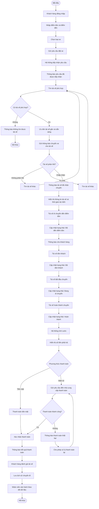

##1. Business Goals

| ID | Business Goal | Mục tiêu |
|---|---|---|
| BG-01 | Tự động hóa | Giảm công việc phân công tài xế thủ công |
| BG-02 | Trải nghiệm khách hàng | Giúp khách hàng đặt và theo dõi xe thuận tiện |
| BG-03 | Hiệu quả vận hành | Giúp nhân viên quản lý chuyến và tài xế hiệu quả |
| BG-04 | Tăng trưởng | Hỗ trợ số lượng lớn khách hàng và tài xế |
| BG-05 | Doanh thu | Quản lý chính xác cước và doanh thu |
| BG-06 | Bảo mật | Bảo vệ dữ liệu người dùng và giao dịch |
| BG-07 | Khả năng mở rộng | Cho phép bổ sung dịch vụ và công nghệ mới |
| BG-08 | Phân tích | Cung cấp dữ liệu phục vụ quản lý và ra quyết định |

## 2. Business Stakeholders

| Stakeholder | Vai trò | Mối quan tâm |
|---|---|---|
| Ban giám đốc | Chủ đầu tư | Doanh thu, hiệu quả, khả năng mở rộng |
| Khách hàng | Người sử dụng dịch vụ | Đặt xe, theo dõi chuyến, thanh toán |
| Tài xế | Người cung cấp dịch vụ | Nhận chuyến, thực hiện chuyến |
| Nhân viên vận hành | Quản lý hoạt động | Theo dõi và xử lý chuyến |
| Quản trị viên | Quản trị hệ thống | Người dùng, phân quyền, bảo mật |
| Nhà cung cấp thanh toán | Đối tác bên ngoài | Xử lý giao dịch điện tử |
| Nhà cung cấp thông báo | Đối tác bên ngoài | Gửi thông báo đến người dùng |

# 3. Business Requirements

## 3.1. Mục tiêu kinh doanh

Công ty ABC cần xây dựng hệ thống CAB System – nền tảng đặt xe trực tuyến nhằm thay thế và cải thiện hệ thống đặt xe hiện tại. Hệ thống mới phải hỗ trợ khách hàng, tài xế và nhân viên vận hành trong toàn bộ quy trình đặt và thực hiện chuyến đi.

Các mục tiêu kinh doanh chính:

- Tự động hóa quy trình đặt xe và phân công tài xế.
- Giảm sự phụ thuộc vào việc phân công tài xế thủ công.
- Cải thiện trải nghiệm đặt xe và theo dõi chuyến đi của khách hàng.
- Quản lý tập trung thông tin khách hàng, tài xế, phương tiện, chuyến đi và thanh toán.
- Hỗ trợ doanh nghiệp quản lý hoạt động vận hành hiệu quả hơn.
- Cung cấp dữ liệu và báo cáo phục vụ việc ra quyết định.
- Đảm bảo hệ thống có khả năng phục vụ số lượng lớn khách hàng và tài xế.
- Xây dựng nền tảng có khả năng mở rộng và bổ sung chức năng trong tương lai.

---

## 3.2. Các yêu cầu kinh doanh

### BR-01 – Tự động hóa đặt xe

Hệ thống phải hỗ trợ khách hàng thực hiện toàn bộ quy trình đặt xe trực tuyến mà không cần phụ thuộc vào tổng đài.

**Kết quả mong muốn:**
- Khách hàng có thể tạo yêu cầu đặt xe.
- Hệ thống tiếp nhận và xử lý yêu cầu tự động.
- Khách hàng có thể theo dõi trạng thái yêu cầu.

---

### BR-02 – Tự động tìm kiếm và phân công tài xế

Hệ thống phải tự động tìm và phân công tài xế phù hợp cho mỗi yêu cầu đặt xe.

**Kết quả mong muốn:**
- Ưu tiên tài xế phù hợp và gần khách hàng.
- Giảm thời gian tìm kiếm tài xế.
- Tự động chuyển sang tài xế khác nếu tài xế được đề xuất từ chối hoặc không phản hồi.
- Không yêu cầu khách hàng tạo lại yêu cầu khi việc phân công tài xế thất bại.

---

### BR-03 – Cải thiện khả năng theo dõi chuyến đi

Hệ thống phải giúp khách hàng và nhân viên vận hành biết được trạng thái hiện tại của chuyến đi.

**Kết quả mong muốn:**
- Biết tài xế đã nhận chuyến hay chưa.
- Biết thời gian dự kiến tài xế đến.
- Theo dõi trạng thái chuyến.
- Hỗ trợ theo dõi vị trí tài xế.
- Nhân viên vận hành có thể theo dõi các chuyến đang diễn ra.

---

### BR-04 – Quản lý thanh toán tập trung

Hệ thống phải quản lý thông tin cước và kết quả thanh toán của các chuyến đi trên một nền tảng thống nhất.

**Kết quả mong muốn:**
- Tính được số tiền khách hàng phải trả.
- Hỗ trợ thanh toán tiền mặt.
- Hỗ trợ thanh toán điện tử.
- Tích hợp với nhà cung cấp thanh toán bên ngoài.
- Không lưu trực tiếp thông tin nhạy cảm của thẻ hoặc tài khoản thanh toán.
- Có khả năng xử lý lại giao dịch khi thanh toán thất bại theo chính sách doanh nghiệp.

---

### BR-05 – Cải thiện hệ thống thông báo

Hệ thống phải cung cấp thông báo kịp thời cho khách hàng và tài xế trong các sự kiện quan trọng.

**Kết quả mong muốn:**
- Khách hàng nhận thông báo khi yêu cầu được tiếp nhận.
- Khách hàng nhận thông báo khi tài xế nhận chuyến.
- Khách hàng nhận thông báo khi tài xế đến điểm đón.
- Khách hàng nhận thông báo khi chuyến hoàn thành.
- Khách hàng nhận thông báo kết quả thanh toán.
- Tài xế nhận thông báo về chuyến mới và các thay đổi của chuyến.

# Sơ đồ quy trình nghiệp vụ CAB System

